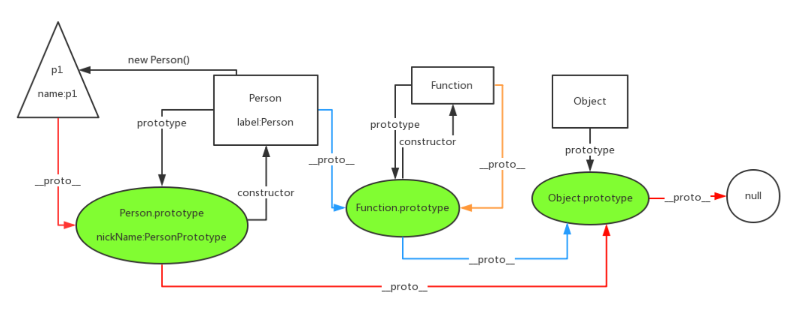

# js对象

## 修改对象的默认属性（双向绑定原理）

```js
 //通过数据劫持实现简单的双向绑定
 let num = 10
 const p = {
	 name: 'zz',
	 say() {
		console.log('nihao')
	 }
 }
 Object.defineProperty(p, 'age', {
	 configurable: true, //是否可以被删除
	 enumerable: true, //是否可以通过for in遍历
	 get() {
		 return num
	 },
	 set(age) {
		num = age
	}
 })
 console.log(p.age) //10
 p.age = 3
 console.log(num, p.age) //3, 3
 ```

```js
 //对象的解析方式
 let p = { name: 'zz' }
 let newName = 'name'
 console.log(p[newName]) //zz
 ```

## 对象的创建方式

```js
 //工厂模式
 function createPerson(name, age) {
	 let p = new Object()
	 p.name = name
	 p.age = age
	 p.say = function(){
		 return this.name
	 }
	 return p
 }
 let p1 = createPerson('wall', 20)
 let p2 = createPerson('zz', 18)
 console.log(p1.say(), p2.say()) //所有的对象实例都是Object的，没有自己的类型
```
 
```js
 //构造函数模式
 function Person(name, age) {
	 this.name = name
	 this.age = age
	 this.getAge = function() {
		 return this.age
	 }
 }
 let p1 = new Person('wall', 11)
 let p2 = new Person('zz', 12)
 console.log(p1.getAge(), p2.getAge()) //11,12,每一个实例的函数都会占用内存，损耗资源
 ```

```js
 //构造函数和原型的混合模式
 function Person(name, age) {
	 this.name = name
	 this.age = name
 }
 //原型对象用于定义实例共享的属性和函数
 Person.prototype.getName = function() {
	 return this.name
 }
 Person.prototype.setName = function(value) {
	 this.name = value
 }
 let p = new Person('wall', 20)
 p.setName('zz')
 console.log(p.getName())//zz
 ```

```js
 //动态的原型模式
 //只在对象生成是设置原型对象，更节省内存空间
 function Person(name, age) {
	 this.name = name
	 this.age = age
	 if(typeof Person._initialized === 'undefined') {
		 Person.prototype.getName = function() {
			 return this.name
		 }
		 Person._initialized = true //js不会自动更改此属性的状态，必须手动设置
	 }
 }
 let p = new Person('wall', 20)
 console.log(p.getName()) //wall
 ```

## 对象的克隆

```js
 //浅克隆
 let originObj = {
	 name: 'wall',
	 arr: [1, 2 ,3]
 }
 function shallowClone(obj) {
	 let res = {}
	 for (let key in obj) {
		 res[key] = obj[key]
	 }
	 return res
 }
 let newObj = shallowClone(originObj)
 console.log(newObj.arr) //[1, 2, 3]
 newObj.arr[0] = 2 //更改新对象中数组的值
 console.log(originObj.arr) //[2, 2, 3] //浅克隆会改变对象中引用类型的值
 ```

```js
 Object.assign({}, obj) //es6：将原始对象中可枚举的属性复制到新对象中了，实现浅克隆
 ```

```js
 //深克隆
 //1.通过序列化和反序列化
 let originObj = {
	 name: 'zz',
	 arr: [1, 2, 3]
 }
 let newObj = JSON.parse(JSON.stringify(originObj))
 newObj.arr[0] = 2
 console.log(originObj.arr) //[1, 2, 3]
 //此方法出现三个问题：
 //1.无法实现对函数，正则等特殊对象的克隆
 //2.构造函数皆指向Object，原型链破裂
 //3.对象中存在循环引用，会抛出异常
 ```

```js
 //自定义实现深克隆并封装
 (function(_) {
 let types = 'Array Object Date RegExp Number Boolean null undefined'.split(' ')
 
 function type() {
	 ...
	 //处理不同类型的克隆
 }
	 
 for(let i = 0; i < types.length; i++) {
	_[`is${types[i]}`] = (function() {
		return function(elem) {
			return type.call(elem)
		}
	})(types[i]) 
 }
 })(_={})
 ```

## 原型对象

```js
 //原型链
 function Person() {}
 let p  = new Person()
 console.log(p.__proto__ === Person.prototype) //true
 console.log(Person.prototype.__proto__ === Object.prototype) // true
 console.log(Object.prototype__proto__) //null
 console.log(String.__proto__ === Function.prototype) //true
 console.log(String.__proto__.__proto__ === Object.prototype) //true
 ```

```js
 //属性查找
 function Person(name) {
	 this.name = name
 }
 Person.prototype.age = 20
 let p = new Person('zz')
 console.log(p.hasOwnProperty('name'), p.hasOwnProperty('age')) //true, false
 ```

```js
 //原型链查找
 Function.prototype.a = 'a'
 Object.prototype.b = 'b'
 function P() {}
 let p = new P()
 console.log(p.a, p.b) //undefined, b
 console.log(P.a, p.b) //a, b
 ```
 


## 继承

```js
 //原型链继承
 function Animal(name) {
	 this.type = 'animal'
	 this.name = name || this.type
	 this.arr = [1, 2, 3]
 }
 Animal.prototype = {
	 eat(food) {
		 console.log(this.name, food)
	 }
 }
 //子类
 function Cat(name) {
	this.name = name
 }
 //继承
 Cat.prototype = new Animal()
 Cat.prototype.constructor = Cat //将Cat的构造函数指向自身
 let cat = new Cat('zz')
 console.log(cat.__proto__) //Animal类
 cat.eat('千层饼') //zz, 千层饼
 console.log(cat.type, cat.name) //animal, zz
 console.log(cat instanceof Cat, cat instanceof Animal) // true true
 //优点：1.只需设置子类的prototype属性为父类实例即可 
 //缺点：1.子类属性将会共享父类所有属性，出现引用数据类型时将会影响其他实例 
 //2.无法向父类构造函数传递参数 
 //3.无法实现多继承 
 //4.为子类添加原型对象上的属性必须放在之后，否则会覆盖
 ```

```js
 //构造继承
 function Cat(name) {
	 Animal.call(this) //不能调用原型上的实例
	 this.name = name || 'Tom'
 }
 let c = new Cat()
 //1.可解决子类共享父类实例的问题 
 //2.可以实现多继承 
 //3.无法服用父类的实例函数，子类生成的每一个实例都有父类函数的引用，造成内存浪费
 ```

```js
 // 复制继承
 function Cat(name) {
	this.name = name || 'Tom'
	 let animal = new Animal('jack')
	 for (key in animal) {
		if (animal.hasOwnProperty(key)) {
			this[key] = animal[key]
		  } else {
				Cat.prototype.key = animal[key]
		  }
	  }
 
 }
 //1.每一次都要复制父类的属性和函数，极大消耗内存 
 //2.实例只是子类的实例，没有通过原型对象将他们串联起来
 ```

```js
 //组合继承
 function Cat(name) {
	 Animal.call(this)
	 this.name = name || 'Tom'
 }
 
 Cat.prototype = Animal.prototype
 Cat.prototype.constructor = Cat
 let c = new Cat('zz')
 let c2 = new Cat('zz')
 c.arr[0] = 2
 c.eat('shit')
 console.log(c.arr, c2.arr) //[2, 2, 3]  [1, 2, 3]
 console.log(c instanceof Cat, c instanceof Animal) //true true 
 ```

## 深入了解new运算符

```js
 //this相当于构造函数中的空对象，而且js的函数默认返回this
 //new的作用1
 let cat = {}//创建一个空对象
 cat.__proto__ = Cat.Prototype//将空对象的__proto__指向Cat对象的Prototype
 Cat.call(cat)//将Cat()函数中的this指向cat
 //new的作用2
 function New() {
	 let obj = {}
	 obj.__proto__ = Cat.prototype
	 let res = Cat.apply(obj, arguments)
	 return typeof res === 'Object' ? res : obj
 }
 console.log(New('zz'))
 ```