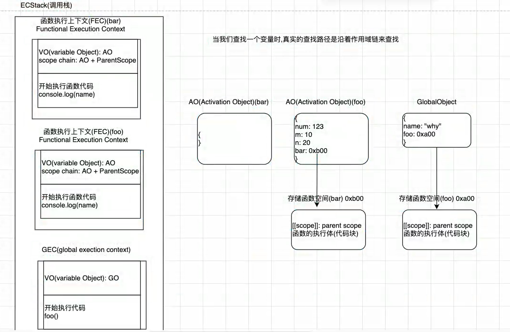
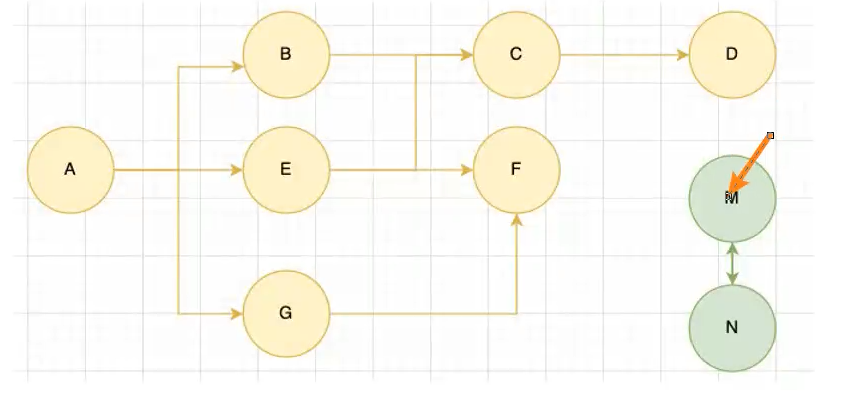
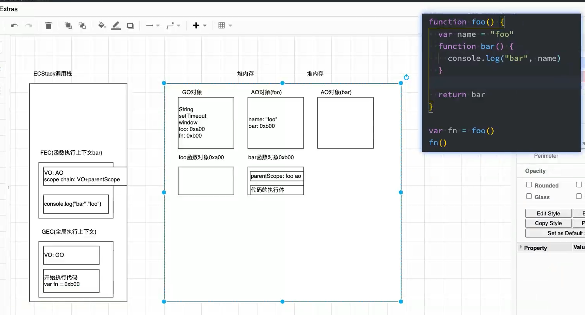
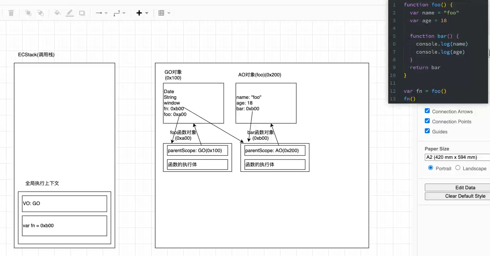
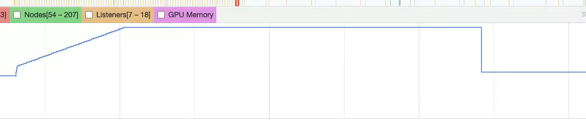

# js-高级语法（一）

## 代码执行过程

1. 全局代码被解析时，v8引擎内部会帮我们创建一个GO（globalObject）对象
2. v8为了执行代码，引擎内部在编译之前创建一个执行上下文（函数调用栈）
3. 创建全局执行上下文（GEC）
	
	* 从上往下执行代码
4. 函数块代码被解析式，GO对象会保存函数的地址
5. 函数被调用时
	* 创建函数执行上下文（FEC）
	* 创建一个AO（Activation Object）活跃对象
	* 将函数的形参及函数体中的变量提升至AO对象上
	* 从上往下执行代码
	* 函数执行上下文弹栈
	* AO销毁
6. 作用域链：
	* 当我们查找一个变量时，真实的查找路径是沿着作用域链查找
	* 作用域链在编译阶段就已经确定，和函数调用位置无关
	* 在最新的ECMA规范中，VO和AO被变量环境和环境记录替代，这意味这这条记录不一定是对象实现的
	 ```js
	var a = 'z'
	
	console.log(b) //undefined
	
	var b = 20
	var c = 30
	var d = b + c 
	
	console.log(d) //50
	
	foo(30)
	function foo(a) {
	   var e = a
	   var f = 20
	   console.log(e + f) //50
	   
	   function bar() {
		   console.log(d) //50
	   }
	   
	   bar()
	}
	
	var GO = {
	   String: 'Class',
	   Date: 'Class',
	   setTimeout: 'Fnc',
	   window: globalObject,
	   a: undefined,
	   b: undefined,
	   c: undefined,
	   d: undefined
	}
	
	var AO = {
	   this: '被调用对象'，
	   argument: '实参'，
	   e: undefined,
	   f: undefined,
	   bar: 0xabe //保存函数在内存的中地址
	}
	 ```


## 内存管理

1. 不管是什么编程语言，代码在执行的过程中都是需要给它分配内存的，不同的是某些编程语言手动或自动管理内存
2. 内存管理的生命周期：
	* 分配申请你需要的内存
	* 使用分配的内存
	* 不需要使用时，释放内存
3. js内存分配机制
	* 对于基本数据类型，直接在栈空间进行分配
	* 对于复杂引用数据类型，会在堆内存开辟一块空间，并将这块空间的内存地址（指针）返回值引用
4. 垃圾回收机制（GC）
	* 对于不再需要使用的对象，称之为垃圾，需要回收以腾出更多内存空间
	* GC算法
		* 引用计数：当一个对象有一个引用指向它时，计数加一；当计数变为0时，该对象就没有被引用，可回收
		* 引用计数的弊端：循环引用，永远不会被回收，会产生内存泄漏
		* 标记清除（js）：设置一个根对象（GO），垃圾回收器会定时从这个根开始，找到所有从根开始引用的对象，对于那些没有引用的对象，就认为是垃圾对象，可回收
		* 这个算法可以很好解决循环引用问题
		 ```js
			//引用计数：循环引用
			const obj1 = { friend: obj2 }
			const obj2 = { friend: obj1 }
		 ```
 

## 闭包
1. 定义一：函数包裹函数，内部函数引用外部变量；闭包由内部函数本身和外部可访问的自由变量组成
2. 定义二：
	* 广义：js中所有函数都是闭包
	* 侠义：js中一个函数访问了外层作用域自由变量，那么它就是一个闭包
3. 在js中函数是一等公民，既可以作为函数参数，又可以作为函数返回值
4. 高阶函数：一个函数接收另一个函数作为参数，或者返回值为一个函数

 ```js
 // 函数作为函数的参数
 function calc(num1, num2, fn) {
	 console.log(fn(num1, num2))
 }
 
 function add(num1, num2) {
	 return num1 + num2
 }
 
 function sub(num1, num2) {
	 return num1 - num2
 }
 
 function mul(num1, num2) {
	 return num1 * num2
 }
 
 calc(3, 2, mul) //6
 
 // 函数作为返回值(闭包)
 function plus(num1) {
	 return function pro(num2) {
		 return num1 + num2
	 }
 }
 
 const plusValue = plus(3)
 const proValue = plusValue(2)
 console.log(proValue) //5
 ```

5. 闭包的实现：

 ```js
 function foo() {
	 const value = 'foo'
	 function bar() {
		 console.log('bar', value)
	 }
	 
	 return bar
 }
 
 const bar = foo()
 bar() //bar foo
 
 //以下为内存图解
 ```



6. 闭包所存在的内存泄漏问题
	* foo函数执行之后，其AO对象仍被bar作用域链引用，所以foo的AO不会被销毁
	* fn执行之后，fn仍指向bar函数的地址，所以bar函数对象不会被销毁
	* 所以如果fn函数不再使用，其内存由于被持续引用不会被销毁，造成内存泄露
	* 为了避免内存泄露，需要手动`fn = null`



7. 闭包内存占用案例测试

 ```js
 // 闭包的内存泄露
 
 function arrayAdd() {
	 const arr = new Array(1024 * 1024).fill(1)
	 return function() {
		 console.log(arr.length)
	 }
 }
 
 // 10000ms 内存峰值
 let newArr = []
 for (let i = 0; i < 100; i++) {
	 setTimeout(() => {
		 newArr.push(arrayAdd())
	 }, 100 * i)
 }
 
 // 堵塞异步，5000ms内存清除一半
 setTimeout(() => {
	 for (let i = 0; i < 100; i++) {
		 setTimeout(() => {
			 newArr.pop()
		 }, 100 * i)
	 }
 }, 2000)
 
 // newArr = null
 ```


     
8. 根据ECMA规范，函数闭包的AO对象所有属性都不会被销毁，但是js引擎会优化，只将被内层函数所引用的属性保留，未被引用的还是会被销毁
   
## 函数中的this指向

1. this在全局中的指向

	* 浏览器：window
	* node：{}  (module -> 加载 -> 编译 -> 放入fun -> 执行fun.apply({}))

2. 在开发中，this通常是在函数中使用

	* 所有函数调用时，都会创建一个执行上下文
	* 这个上下文记录着函数的调用栈，AO对象等
	* this也是其中一条记录

3. this在函数中的指向

	* 在函数调用时，js会给this默认绑定一个值
	* this的绑定和函数定义的位置没有关系
	* this的绑定和调用位置和调用方式有关
	* this是在运行时被绑定的
	```js
	function foo() {
		   console.log(this)
	}
	
	foo() // global or window
	
	const obj = { 
		   foo
	}
	
	obj.foo() // => obj
	
	foo.apply('abc') // => 'abc'
	```
	* this的四种绑定规则
		* 默认绑定：一个独立的函数调用，this指向全局对象window或global
		```js
		// 1.独立调用，默认绑定
		const obj2 = { 
		    name: 'foo',
		    foo() {
		        console.log(this)
		    }
		}
		
		const fnc = obj2.foo
		foo() //global or window
		```

		* 隐式绑定：函数通过某个对象进行调用，this指向当前对象
		```js
		// 2.对象调用，隐式绑定
		function foo3() {
		    console.log(this)
		}
		
		const obj3 = {
		    name: 'foo3',
		    foo3
		}
		
		obj3.foo3() //obj3
		```

		* 显示绑定：call、apply、bind
			* 必须在调用的对象内部有一个对函数的引用（属性），如果没有，在调用时会报找不到函数的错误
			* 正式通过这个引用，间接将this绑定到了这个对象上
		```js
		// 3.call、apply、bind显示绑定
		function foo4(num1, num2) {
		    console.log(num1 + num2, this)
		}
		
		foo4.call('call', 2, 3) //5 [String: 'call']
		foo4.apply('apply', [2, 3]) //5 [String: 'apply']
		const bindFoo4 = foo4.bind('bind')
		bindFoo4(2, 3) //5 [String: 'bind']，此处显示绑定优先级大于默认绑定
		```

     * new绑定：
	* js中的函数可以当作一个类的构造函数来使用，也就是可以使用new关键字
			* 使用new关键字来调用函数，会执行以下操作
				* 创建一个全新对象
				* 这个新对象会执行prototype连接
				* 这个新对象会绑定到函数调用的this上（this的绑定在这个步骤完成）
				* 如果函数没有返回其他对象，表达式会返回这个对象
		```js
		 // 4.new绑定
      function Foo5(name) {
          this.name = name
      }
      
      const p1 = new Foo5('wall')
      const p2 = new Foo5('deep')
      console.log(p1, p2) //Foo5 { name: 'wall' } Foo5 { name: 'deep' }
      // 1. 生成一个新对象obj；2.将此构造函数中的this指向新对象；3.返回新对象
     ```
     
     * 其他函数的绑定
		```js
		/**内置函数this */
		setTimeout(function () {
		    console.log(this) //window
		}, 1000)
		
		/**dom事件的this */
		const _div = document.querySelector('.container')
		_div.onclick = function() {
		    console.log(this) //_div
		}
		// _div.onclick() 隐式绑定
		
		_div.addEventListener('click', function() {
		    console.log(this) //_div
		})
		// callback.call(_div, ...arg) 显示绑定
		
		/**数组方法的this */
		const arr2 = [1, 2, 3, 4, 5]
		arr2.forEach(function(i) {
		    console.log(i, this) //[i], 'arr2'
		}, 'arr2')
		arr2.map(function(i) {
		    console.log(i, this) //[i], window
		})
		```
		
* 绑定规则优先级
		* new > 显示绑定 > 隐式绑定 > 默认绑定
		```js
		/**显示绑定和隐式绑定比较 */
		function foo() {
		    console.log(this)
		}
		
		const obj = {
		    name: 'obj',
		    fn: foo.bind('foo')
		}
		
		obj.fn() //[String: 'foo']
		
		/**new绑定和隐式绑定的比较 */
		function foo2() {
		    console.log(this)
		}
		
		const obj2 = {
		    name: 'obj2',
		    Fn: foo2.bind('foo')
		
		}
		
		const newObj2 = new obj2.Fn() //foo2 {}
		
		/**new和显示绑定比较 */
		function foo3() {
		    console.log(this)
		}
		
		const bar = foo3.bind('foo')
		const newObj3 = new bar() //foo3 {}
		```
	
 * 箭头函数的this
   	* 箭头函数不会绑定this、argument属性
		* 箭头函数不能作为构造函数来使用（new会报错）
		```js
		/**箭头函数this: 箭头函数会自动寻找上层作用域this */
		const obj3 = {
			   name: "obj3",
			   arr: [],
			   success() {
				   setTimeout(() => {
					   this.arr = [1, 2, 3]
				   }, 100)
			   },
		}
		
		obj3.success()
		setTimeout(() => {
			   console.log(obj3.arr) //[1, 2, 3]
		}, 200)
		```
		
## 实现apply、call、bind

```js
// 自定义call函数
Function.prototype.wcall = function(thisArg, ...args) {
   // 获取调用的函数对象
   const fn = this
   const _fn = Symbol('fn')

   // 获取要绑定的this，将thisArg转换为对象类型（防止传入非对象类型: 数字，字符串，null， undefined...）
   thisArg = (thisArg !== undefined && thisArg !== null) ? Object(thisArg) : global

   // 给函数进行显示绑定
   // 1.方式一：直接call绑定
   // fn.call(_this, ...args)
   // 2.方式二：通过对象调用函数隐式绑定
   thisArg[_fn] = fn
   const res = thisArg[_fn](...args)
   delete thisArg._fn

   // 将函数的执行结果返回
   return res
}

// 自定义apply方法
Function.prototype.wapply = function(thisArg, args = []) {
   const fn = this
   const _fn = Symbol('fn')

   thisArg = (thisArg !== undefined && thisArg !== null) ? Object(thisArg) : global

   thisArg[_fn] = fn
   const res = thisArg[_fn](...args)
   delete thisArg._fn

   return res
}


// 自定义bind方法
Function.prototype.wbind = function(thisArg, ...args) {
   // 获取调用的函数
   const fn = this
   const _fn = Symbol('fn')

   // 获取绑定的this，将其转换为对象类型
   thisArg = (thisArg !== undefined && thisArg !== null) ? Object(thisArg) : global

   // 返回绑定后的函数
   return function(...innerArgs) {
	   // 合并参数
	   const newArgs = [...args, ...innerArgs]
	   thisArg[_fn] = fn
	   const res = thisArg[_fn](...newArgs)
	   delete thisArg._fn
	   return res
   }
}

function foo() {
   return this
}

function sum(num1, num2) {
   console.log(this, num1 + num2)
}

console.log(foo.wcall(123)) //[Number: 123] { fn: [Function: foo] }
sum.wcall('wall', 2, 3) //[String: 'wall'] { fn: [Function: sum] } 5

console.log(foo.wcall(123)) //[Number: 123] { fn: [Function: foo] }
sum.wapply({fn: () => 'wall'}, [2, 3]) //{ fn: [Function: fn], [Symbol(fn)]: [Function: sum] } 5

const bar = sum.wbind('bind', 1)
bar(2) //[String: 'bind'] { [Symbol(fn)]: [Function: sum] } 3
```

## arguments分析

```js
function foo() {
   console.log(arguments) //[Arguments] { '0': 1, '1': 2, '2': 3 }
   console.log(arguments.length) //3
   console.log(arguments[0]) //1
   console.log(arguments.callee) //[Function: foo]

   // 将arguments转成数组
   const arr = Array.prototype.slice.call(arguments)
   // const arr = Array.from(arguments)
   // const arr = [...arguments]
   console.log(arr instanceof Array) //true
}
foo(1, 2, 3)

// 自定义一个slice
Array.prototype.wslice = function(start, end) {
   const arr = this
   const newArr = []
   start = start || 0
   end = end || arr.length
   for (let i = start; i < end; i++) {
	   newArr.push(arr[i])
   }
   return newArr
}

const res = [1, 2, 3, 4, 5].wslice(1, 3)
const res2 = [1, 2, 3, 4, 5].slice(1, 3)
console.log(res, res2) // [2, 3]
```

## js函数式编程

1. 纯函数

	* 函数在输入相同的值时，需产生相同的输出
	* 函数的输出和输入以外的其他隐藏信息或状态无关，也和I/O设备产生的外部输出无关
	* 该函数不能有语义上可观察的函数副作用，比如“触发事件”、“输出设备输出”、“更改输出值以外的内容”
	* 总结：“确定的输入，一定会产生确定的输出；函数在执行过程中一定不会产生副作用”

2. 副作用

	* 在执行一个函数时，除了返回函数值之外，还对调用函数产生了附加影响，比如：修改全局变量，修改了参数或者改变外部储存
	* 副作用往往是产生bug的温床
	```js
	let arr = [1, 2, 3, 4, 5, 6, 7, 8]
	
	// 纯函数
	const res1 = arr.slice(1, 3)
	console.log(res1, arr) //[ 2, 3 ] [1, 2, 3, 4, 5, 6, 7, 8]
	
	// 非纯函数
	const res2 = arr.splice(1, 1, 1)
	console.log(res2, arr) // [ 2 ] [1, 1, 3, 4, 5, 6, 7, 8]
	
	// 纯函数
	function sum(num1, num2) {
	    return num1 + num2
	}
	
	// 纯函数：相同输入产生相同输出
	const obj2 = {name: 'test'}
	function test(info) {
	    return {
	        ...info,
	        age: 18
	    }
	}
	
	// 非纯函数：修改全局变量，产生副作用
	let zz = 'wall'
	function foo() {
	    zz = 'foo'
	}
	
	foo()
	console.log(zz) // foo
	
	// 非纯函数：修改参数导致全局变量修改，产生副作用
	const obj = {name: 'bar'}
	function bar(info) {
	    info.age = 18
	}
	
	bar(obj)
	console.log(obj) //{ name: 'bar', age: 18 }
	```

3. 纯函数的优势

	* 写的时候保证纯度，只实现自己的业务逻辑，**不需要关心传入的内容**是如何获得，或者**依赖的其他外部变量是否已经改变**
	* 用的时候**确定输入的内容不会被任意篡改**，**也不会对外界产生副作用**，**并且确定的输入一定哟确定的输出**

4. 函数柯里化

     * 把一个**接受多个参数的函数**，变成一个**接受单一参数的函数**，并且**返回接受余下参数的函数**
     * 总结：“只**传递给函数一部分参数来调用它**，让他**返回一个函数去处理剩余参数**“
	 ```js
	 // 原函数
	 function foo(x, y, z, w) {
	     return x + y + z + w
	 }
	 
	 // 柯里化
	 function foo2(x) {
	     return function(y) {
	         return function(z) {
	             return function(w) {
	                 return x + y + z + w
	             }
	         }
	     }
	 }
	 
	 // 箭头函数写法
	 const foo3 = x => y => z => w => x + y + z + w
	 
	 console.log(foo(1, 2, 3, 4)) //10
	 console.log(foo2(1)(2)(3)(4)) //10
	 console.log(foo3(1)(2)(3)(4)) //10
	 ```

5. 柯里化的作用

	* 在函数式编程中，往往希望**一个函数处理的问题尽量单一**，而**不是将一大堆处理过程交给一个函数处理**
	* 我们可以将**每次传入的参数在单一函数中进行处理**，处理完之后在**下一个函数中再使用处理后的结果**
	 ```js
	// 柯里化作用：对代码逻辑进行复用
	// 案例一
	function makeAdd(count) {
	    return function(num) {
	        return num + count
	    }
	}
	
	const add = makeAdd(5)
	add(1)
	add(2)
	
	// 案例二
	const log = data => (type, msg) => {
	    console.log(`[${data.getHours()}:${data.getMinutes()}] - [${type}] - [${msg}]`)
	}
	const now = log(new Date())
	now('DEBUG', 'ERROR') //[23:12] - [DEBUG] - [ERROR]
	now('FETURE', 'ADD NEW FUTURE') //[23:12] - [FETURE] - [ADD NEW FUTURE]
	 ```

6. 柯里化函数实现

```js
 // 柯里化函数的实现
 function curryingFn(fn) {
	 return function curried(...args) {
		 // 当柯里化后的参数个数大于等于fn.length，直接返回原函数调用结果
		 if (args.length >= fn.length) {
			 // 原函数和柯里化之后的函数this保持一致
			 return fn.apply(this, args)
		 // 当原函数参数和柯里化后参数个数不一致时，需要返回一个新的函数，继续接受剩余参数
		 } else {
			 return function(...args2) {
				 // 参数个数小于fn.length时，拼接参数，递归调用
				 return curried.apply(this, [...args, ...args2])
			 }
		 }
	 }
 }
 
 function foo(x, y, z, w) {
	 return x + y + z + w
 }
 
 const curriedFoo = curryingFn(foo)
 console.log(curriedFoo(1, 2, 3, 4)) //10
 console.log(curriedFoo(1)(2, 3)(4)) //10
```

7. 组合函数

	* 将两个或多个依次调用的函数组合起来，自动依次调用，这个过程就是对函数的组合，我们称之为组合函数
	 ```js
	function double(n) {
	    return n * 2
	}
	
	function square(n) {
	    return n ** 2
	}
	
	function compose(m, n) {
	    return function(count) {
	        return m(n(count))
	    }
	}
	
	const newComposeFn = compose(double, square)
	console.log(newComposeFn(10)) //200
	 ```
	
	* 实现一个组合函数
	 ```js
	// 实现一个组合函数
	function composeFn(...fns) {
	    const len = fns.length
	    for (let i of fns) {
	        // 判断参数是否为函数类型，不是就抛出异常
	        if (typeof i !== 'function') {
	            throw new TypeError('expected arguments are function')
	        }
	    }
	
	    return function(...args) {
	        // 初始化第一个参数调用结果
	        let index = 0
	        let res = len ? fns[index].apply(this, args) : args
	        // 循环依次将上一次结果作为参数传入下一个函数
	        while (++index < len) {
	            res = fns[index].call(this, res)
	        }
	        return res
	    }
	}
	
	function double(n) {
	    return n * 2
	}
	
	function square(n) {
	    return n ** 2
	}
	
	const newComposeFn2 = composeFn(double, square)
	console.log(newComposeFn2(10)) //400
	 ```

## 严格模式（use strict）

1. 一种具有限制的js模式，浏览器检测到开启严格模式，会以更加严格的方式对代码进行检测
2. 检测错误的类型
	* 对“静默错误”抛出异常
	* 对一些特殊语法进行处理
	* 禁用了一下ECMAscript未来版本可能会用的一些语法
3. 严格模式的限制
	* 禁止意外创建全局变量（在函数内定义全局变量）
	* 禁止函数有相同的参数名
	* 禁止“静默错误”（`true.name = 'zz'`）
	* 禁止使用原先的八进制格式
	* 禁止使用with语句
	* eval不会再向上引用变量
	* 自执行函数this指向undefined
