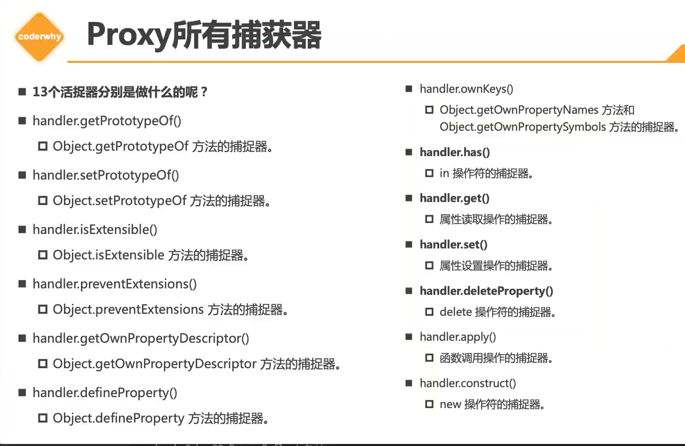
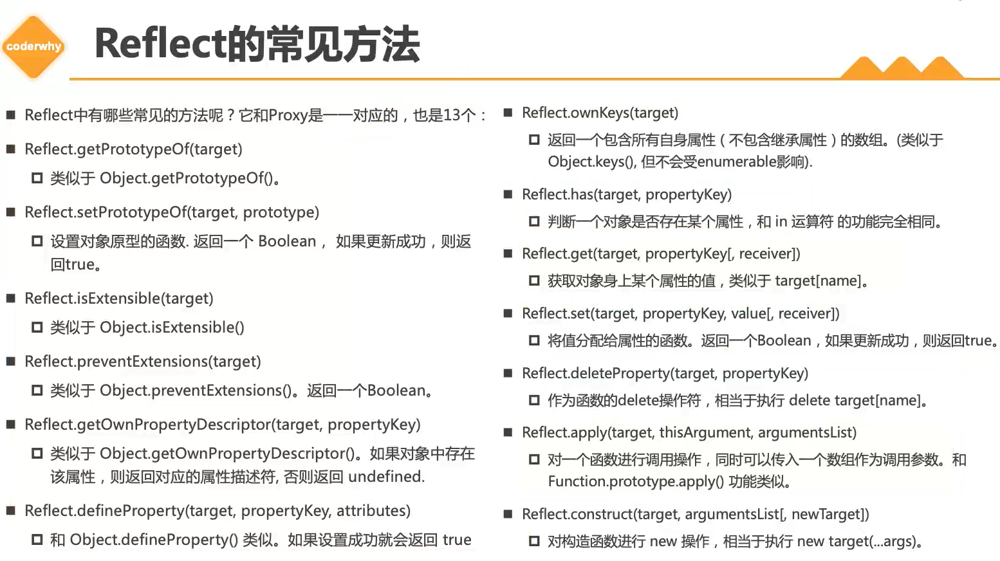

# js-高级语法（三）

## Set、Map的基本使用

1. 在es6之前，我们存储数据结构主要有两种：数组、对象

2. es6中新增了两种数据结构：Set、Map（WeakSet、WeakMap）

   * Set：类似于数组，用来保存数据结构，但和数组的区别是**元素不能重复**

     * Set暂时没有字面量创建方式，只能通过构造函数创建

     * `const set = new Set(1, 2, 2, 3)`

       ```js
       // Set
       
       // 1.传入一个迭代器
       const arr = [1, 2, 2, 3, 3, 4, 5]
       const set = new Set(arr) // 数组去重
       const newArr1 = [...set] // Set支持展开运算符
       const newArr2 = Array.from(set) 
       
       // 2.通过add方法添加元素
       set.add(1)
       set.add(6)
       set.add({})
       console.log(set) // Set(7) { 1, 2, 3, 4, 5, 6, {} }
       console.log(newArr1, newArr2) // [ 1, 2, 3, 4, 5 ] [ 1, 2, 3, 4, 5 ]
       
       // 3.查看个数
       console.log(set.size) // 7
       
       // 4.删除元素
       set.delete(1)
       console.log(set) //Set(6) { 2, 3, 4, 5, 6, {} }
       
       // 5.判断是否包含某个元素
       const isHasValue = set.has(2)
       console.log(isHasValue) //true
       
       // 6.清除所有元素
       // set.clear()
       console.log(set) //Set(0) {}
       
       // 7.对set进行遍历
       set.forEach(i => {
           console.log(i) // 2, 3, 4, 5, 6, {}
       })
       
       for (let i of set) {
           console.log(i) // 2, 3, 4, 5, 6, {}
       }
       ```

   * WeakSet：同Set一样内部元素不能重复，但有区别

     * 区别一：WeakSet只能存放对象类型，不能存放基本数据类型

     * 区别二：WeakSet对元素的引用是弱引用，如果没有其他引用对某个对象进行引用，那么GC可将该对象回收

     * 区别三：WeakSet不能遍历和获取，因为WeakSet是弱引用，如果遍历到其中元素，那可能造成对象不能正常销毁

       ```js
       // WeakSet
       
       const obj = { name: 'wall' }
       
       const newSet = new Set()
       newSet.add(obj) // 对对象建立强引用
       
       const weak = new WeakSet()
       weak.add(obj) // 对对象建立弱引用，如果对象没有被其他变量引用，则该引用断开，对象被销毁
       
       console.log(newSet, weak) // Set(1) { { name: 'wall' } } WeakSet { <items unknown> }
       
       // WeakSet应用场景
       
       const weakset = new WeakSet()
       class Person {
           constructor(name) {
               weakset.add(this)
               this.name = name
           }
       
           running() {
               if (!weakset.has(this)) {
                   throw new Error('不能通过其他对象调用running方法')
               }
               console.log(this.name + ' running')
           }
       }
       
       const p1 = new Person('wall')
       const p2 = { name: 'zz' }
       p1.running() // wall running
       p1.running.call(p2) // Error: 不能通过其他对象调用running方法
       ```

   * Map：用于存储映射关系

     * 和对象的区别：对象只能用字符串和Symbol作为属性名，其他数据类型也会隐式转换为字符串

       ```js
       const obj1 = { name: 'obj1' }
       const obj2 = { name: 'obj2' }
       
       const obj3 = { 
           [obj1]: 'aaa',
           [obj2]: 'bbb'
       }
       
       console.log(obj3) //{ '[object Object]': 'bbb' }， 对象会被转化为[object Object]字符串类型
       ```

     * Map的使用

       ```js
       // Map
       
       // 1. 任意数据类型（包括对象）可以作为key
       const map1 = new Map()
       map1.set(obj1, 'aaa')
       map1.set(obj2, 'bbb')
       map1.set(1, 'ccc')
       console.log(map1) // Map(2) { { name: 'obj1' } => 'aaa', { name: 'obj2' } => 'bbb', 1 => 'ccc' }
       
       // 2.Map构造函数创建方式，传入一个entries
       const map2 = new Map([['a', 1], [2, 'b'], [map1, 'c']])
       console.log(map2)
       /**
        * Map(3) {
         'a' => 1,
          2 => 'b',
         Map(3) {
         	{ name: 'obj1' } => 'aaa',
           { name: 'obj2' } => 'bbb',
           1 => 'ccc'} 
           => 'c'
         }
        */
       
       // 3.get(key)、has(key)、delete(key)、clear()等方法
       console.log(map2.get(map1)) // c
       console.log(map2.has(map1)) // true
       map2.delete(map1)
       console.log(map2) // Map(2) { 'a' => 1, 2 => 'b' }
       map2.clear()
       console.log(map2) // Map(0) {}
       
       // 4.遍历Map
       map1.forEach((item, idx) => {
           console.log(item, idx)
           /**
            * aaa { name: 'obj1' }
              bbb { name: 'obj2' }
              ccc 1
            */
       })
       
       for (const [key, value] of map1) {
           console.log({ key, value })
           /**
            * { key: { name: 'obj1' }, value: 'aaa' }
              { key: { name: 'obj2' }, value: 'bbb' }
              { key: 1, value: 'ccc' }
            */
       }
       ```

   * WeakMap：和Map一样存储映射关系，但有区别

     * 区别一：WeakMap只能使用对象类型作为key

     * 区别二：WeakMap对对象的引用时弱引用，如果没有其他引用指向该对象，则GC会回收该对象

     * 区别三：不能遍历

       ```js
       // WeakMap
       
       const obj4 = { name: 'wall' }
       
       const map3 = new Map([[obj4, 1]]) // Map(1) { { name: 'wall' } => 1 }, 强引用 
       const weakmap = new WeakMap([[obj4, 2]]) // WeakMap { <items unknown> }, 弱引用
       
       console.log(map3, weakmap)
       
       // 1.常见方法get(key), has(key), detele(key)
       console.log(weakmap.get(obj4)) //2
       console.log(weakmap.has(obj4)) //true
       weakmap.delete(obj4)
       console.log(weakmap.has(obj4)) //false
       
       
       // 2.应用场景: Vue3响应式原理（后边实现）
       ```


## es7 新增

1. `Array includes`：判断数组中是否存在某个元素

   ```js
   const arr = [1, 2, 3, 4, 5, NaN]
   
   console.log(arr.includes(NaN)) //true
   console.log(arr.indexOf(NaN) !== -1) //false, indexOf无法判断数组中NaN
   ```

2. `**`：指数运算符

   ```js
   const res1 = Math.pow(3, 3) //9
   const res2 = 3 ** 3 //9
   ```

## es8 新增

1. `Object.values()`：获取一个对象所有value

   ```js
   const obj = {
       name: 'wall',
       age: 18
   }
   
   console.log(Object.values(obj)) // [ 'wall', 18 ]
   console.log(Object.values([1, 2, 3, 4, 5])) // [ 1, 2, 3, 4, 5 ]
   console.log(Object.values('12345')) // [ '1', '2', '3', '4', '5' ]
   ```

2. `Object.entries()`：获取一个数组，数组中存放着可枚举属性的键值对数组

   ```js
   const obj1 = {
       name: 'wall',
       age: 18
   }
   
   console.log(Object.entries(obj1)) // [ [ 'name', 'wall' ], [ 'age', 18 ] ]
   ```

3. `padStart padEnd`：字符串首尾添加内容

   ```js
   const str = 'hello world'
   console.log(str.padStart(15, '*').padEnd(19, '*')) // ****hello world****
   
   // 案例: 隐藏手机号前7位
   const phoneNum = '18379238027'
   const lastNum = phoneNum.slice(-4)
   const newPhoneNum = lastNum.padStart(11, '*')
   console.log(newPhoneNum) // *******8027
   ```

## es10 新增

1. `flat() 数组扁平化`：方法会按照一个可指定的深度递归遍历数组，并将所有元素与遍历到子数组中的元素合并为一个新数组

   ```js
   const arr1 = [1, 2, [3, 4], [[5, 6], [7, 8]]]
   
   console.log(arr1.flat(1)) // [ 1, 2, 3, 4, [ 5, 6 ], [ 7, 8 ] ], 一次降维
   console.log(arr1.flat(2)) //[1, 2, 3, 4,5, 6, 7, 8], 二次降维
   ```

2. `flatMap(callback) 数组映射扁平化`： 先映射每一个元素，然后将结果压缩成一个新数组，即先map再flat

   ```js
   const arr2 = ['hello world', 'hello coder', 'hello wall']
   
   const newArr1 = arr2.flatMap(i => {
       return i.split(' ')
   })
   // 等价于
   const newArr2 = arr2.map(i => i.split(' ')).flat(1)
   
   console.log(newArr1, newArr2)
   /**
    * [ 'hello', 'world', 'hello', 'coder', 'hello', 'wall' ] 
    * [ 'hello', 'world', 'hello', 'coder', 'hello', 'wall' ]
    */
   ```

3. `Object.fromEntries()`：将entries转换为对象

   ```js
   const queryString = 'name=wall&id=114514'
   const queryParams = new URLSearchParams(queryString) // URLSearchParams { 'name' => 'wall', 'id' => '114514' }
   const queryObj = Object.fromEntries(queryParams)
   const obj4 = { name: 'wall', id: 18 }
   const res = Object.fromEntries(Object.entries(obj4))
   console.log(queryObj) // { name: 'wall', id: '114514' }
   console.log(res) // { name: 'wall', id: 18 }
   ```

4. `trim trimStart trimEnd`：去除首尾空格

## es 11 新增

1. `bigInt`：大数字数据类型，数字后面+n

   ```js
   const bigNum = Number.MAX_SAFE_INTEGER
   const newNum = bigNum + 10 //不能相加
   const newBigNum = bigNum + 10n //可以相加
   ```

2. `??`：空值合并运算符

   ```js
   const bol = '' || 0
   const isRight = bol ?? 'default value' // 只有当bol为undefined和null时，才会取右边值
   console.log(isRight) // default value
   ```

3. `globalThis`：不同环境下的全局对象，浏览器是window，node是this

   ```js
   console.log(globalThis) // node: global
   console.log(globalThis) // 浏览器: window
   ```

4. `for...in`：遍历对象中的key

   ```js
   const obj = {
       name: 'wall',
       age: 3600
   }
   
   for (const key in obj) {
       console.log(i) //name, age
   }
   ```

## es12 新增

1. `FinalizationRegistry 类` ：监听对象内存是否被销毁

   ```js
   const obj = { name: 'wall', age: 18 }
   const finalRegister = new FinalizationRegister((value) => console.log(`注册的对象${value}内存被销毁`))
   finalRegister.register(obj, 'obj') // 注册一个对象
   obj = null
   ```

2. `WeakRef 类 `：创建弱引用对象

   ```js
   const obj = { name: 'wall', age: 18 }
   const weakObj = new WeakRef(obj)
   const isDistory = weakObj.deref().name // 如果没有被销毁返回原对象，如果被销毁返回undefined
   ```

## Proxy Reflect

1. 传统监听对象操作

    * 使用对象属性描述符`Object.defineProperty(obj, key, {})`

    * 该描述符被设计的初衷并不是为了监听对象操作，只是为了定义属性

    * 新增属性、删除属性等操作，该方法没办法监听

    ```js
    // 1.通过对象属性描述符
    const obj = { name: 'wall', age: 18 }
    Object.keys(obj).forEach(key => {
        let value = obj[key]
        Object.defineProperty(obj, key, {
            get() {
                return value //此处不能直接返回对象的属性obj[key]，循环调用
            },
            set(newValue) {
                value = newValue
            }
        })
    })
    
    obj.name = 'zz'
    obj.age = 20
    
    console.log(obj) //{ name: [Getter/Setter], age: [Getter/Setter] }
    console.log(obj.name, obj.age) //zz 20
    ```

2. 通过Proxy类创建代理对象，通过代理对象监听对象所有操作

    * 先创建一个代理对象，之后对该原对象的操作都由代理对象完成，代理对象可以监听我们想要对原对象的操作

    ```js
    // 2.通过代理对象
    const obj2 = { name: 'wall', age: 20 }
    const proxyObj2 = new Proxy(obj2, {
        // get捕获器
        get(target, key) {
            // target: 正在被代理的原始对象
            console.log(target, key) // { name: 'wall', age: 30 } name
            return target[key]
        },
        // set捕获器
        set(target, key, newValue) {
            target[key] = newValue
            console.log(target, key, newValue) // { name: 'wall', age: 30 } age 30
        },
        // in捕获器
        has(target, key) {
            console.log(`监听到${key}属性in操作`) // 监听到name属性in操作
            return key in target
        },
        // delete捕获器
        deleteProperty(target, key) {
            delete target[key]
            console.log(`监听到${key}属性被删除`) // 监听到age属性被删除
        }
    })
    
    proxyObj2.age = 30
    proxyObj2.name
    
    if ('name' in proxyObj2) {
        console.log('存在name属性') // 存在name属性
    }
    
    delete proxyObj2.age
    
    console.log(obj2, proxyObj2) //{ name: 'wall' } { name: 'wall' }
    ```

3. Proxy其他捕获器

    

4. Proxy函数对象捕获器

    ```js
    // 函数式对象捕获器
    function foo() {}
    const proxyFoo = new Proxy(foo, {
        // apply捕获器
        apply(target, thisArg, argArr) {
            console.log(`监听到了函数${target}apply操作`) //监听到了函数function foo() {}apply操作
            return target.apply(thisArg, argArr)
        },
        // constructor捕获器
        construct(target, argArr, newTarget) {
            console.log(`监听到了函数${target}通过new操作符调用`) //监听到了函数function foo() {}通过new操作符调用
            return new target(...argArr)
        }
    })

    proxyFoo.apply({}, ['wall', 'zz'])
    new proxyFoo('wall', 'zz')
    ```

5. Reflect的作用

    * Reflect是一个对象，字面意思是反射

    * 该对象提供了很多操作对象的方法，类似于Object中操作对象的方法

      * 比如`Reflect.getPrototypeOf(target)`类似于`Object.getPrototypeOf()`
      * 比如`Reflect.defineProperty(target, propertyKey, attributes)`类似于`Object.defineProperty()`

    * 为什么要存在Reflect这样的对象

      * 早期ECMA没有考虑到将操作对象的方法如何设计更规范，所以都放到了Object构造函数上
      * 类似于in、delete等操作符让js看起来不美观

    * Proxy的常用方法

      

    * 对于代理对象的操作，不应该操作原对象，所以Reflect的用处就是避免对原对象进行操作

      ```js
      // Reflect的作用
      const obj4 = { name: 'wall', age: 30 }
      const obj4Proxy = new Proxy(obj4, {
          get(target, key, receiver) {
              // 返回代理对象的属性
              return Reflect.get(target, key)
          },
          set(target, key, newValue, receiver) {
              // 给代理对象设置新属性
              Reflect.set(target, key, newValue)
          }
      })
      
      obj4Proxy.name = 'zz'
      console.log(obj4Proxy.name) // zz
      ```

    * recevier参数的作用
    
      ```js
      // get和set方法中参数receiver作用
      const obj5 = {
          _name: 'zz',
          get name() {
              //此处this默认指向obj5，若想拦截_name属性，需要将this指向代理对象
              return this._name
          },
          set name(name) {
              this._name = name
          }
      }
      let count = 0
      
      const obj5Proxy = new Proxy(obj5, {
          get(target, key, receiver) {
              count ++
              // receiver就是代理对象，此处将get方法中的this指向recevier
              return Reflect.get(target, key, receiver)
          },
          set(target, key, newValue, receiver) {
              Reflect.set(target, key, newValue, receiver)
          }
      })
      
      obj5Proxy.name = 'wall'
      obj5Proxy.name
      console.log(obj5Proxy, obj5) 
      // { _name: 'wall', name: [Getter/Setter] } { _name: 'wall', name: [Getter/Setter] }
      console.log(count) //2 调用了两次get方法
      ```
    
    * Reflect.construct的作用
    
      ```js
      // Reflect.construct()的作用: 改变对象的constructor
      function Person(name, age) {
          this.name = name
          this.age = age
      }
      
      function P() {}
      
      const p = Reflect.construct(Person, ['wall', 18], P)
      console.log(p) // P { name: 'wall', age: 18 }
      console.log(p.__proto__ == P.prototype) // true
      ```
    
6. 响应式原理

    * 响应式的含义：m有一个初始的值，有一段代码使用了这个值，如果m改变了，那么这段代码会重新执行
    
    * 代码实现：
    
      ```js
      // 响应式原理
      
      // 1.创建一个全局变量保存依赖
      let activeReactiveFn = null
      
      // 2.创建副作用函数储存类
      class Depend {
          constructor() {
              this.reactiveFns = new Set() //使用Set防止添加重复依赖
          }
      
          // 自动添加依赖
          depend() {
              if (activeReactiveFn) {
                  this.reactiveFns.add(activeReactiveFn)
                  console.log(this.reactiveFns)
              }
          }
      
          // 执行副作用函数
          notify() {
              this.reactiveFns.forEach(fn => fn())
          }
      }
      
      
      // 3.封装一个副作用函数
      function watchEffect(fn) {
          // 将依赖赋值给全局变量
          activeReactiveFn = fn
          // 执行依赖
          fn()
          // 将依赖置为空
          activeReactiveFn = null
      }
      
      // 4.封装一个依赖管理函数，每个对象的每个key映射一个depend对象: WeakMap ==> Map ==> depend
      const targetMap = new WeakMap()
      function getDepend(target, key) {
          // 根据target对象获取map，如果不存在就创建map
          let map = targetMap.get(target)
          if (!map) {
              map = new Map()
              targetMap.set(target, map)
          }
      
          // 根据key获取depend，如果不存在就创建depend
          let depend = map.get(key)
          if (!depend) {
              depend = new Depend()
              map.set(key, depend)
          }
      
          return depend
      }
      
      // 5.1封装一个响应式对象，监听对象响应式变化（vue3）
      function reactiveObject3(obj) {
          return new Proxy(obj, {
              get(target, key, receiver) {
                  // 依赖收集，获取属性对应的depend对象
                  const dep = getDepend(target, key)
                  dep.depend(activeReactiveFn)
      
                  return Reflect.get(target, key, receiver)
              },
              set(target, key, newValue, receiver) {
                  Reflect.set(target, key, newValue, receiver)
                  // 依赖遍历调用
                  const dep = getDepend(target, key)
                  dep.notify()
              }
          })
      }
      
      // 5.2封装一个响应式对象，监听对象响应式变化（vue2）
      function reactiveObject2(obj) {
          Object.keys(obj).forEach(key => {
              let value = obj[key]
              Object.defineProperty(obj, key, {
                  get() {
                      // 依赖收集，获取属性对应的depend对象
                      const dep = getDepend(obj, key)
                      dep.depend(activeReactiveFn)
      
                      return value
                  },
                  set(newValue) {
                      value = newValue
      
                      // 依赖遍历调用
                      const dep = getDepend(obj, key)
                      dep.notify()
                  }
              })
          })
          return obj
      }
      
      const proxyObj = reactiveObject3({
          name: 'a',
          age: 18
      })
      
      const proxyInfo = reactiveObject3({
          name: 'b',
          age: 20
      })
      
      const obj = reactiveObject2({
          name: 'c',
          age: 22
      })
      
      
      // 6.副作用函数执行
      /**obj */
      watchEffect(function() {
          console.log(`改变了proxyObj name属性: ${proxyObj.name}`)
      })
      
      /**info */
      watchEffect(function() {
          console.log(`改变了proxyInfo name属性: ${proxyInfo.name}`)
      })
      
      /**obj */
      watchEffect(function() {
          console.log(`改变了obj name属性: ${obj.name}`)
      })
      
      
      // 7.代理对象属性改变
      proxyObj.name = 'aa'
      proxyInfo.name = 'bb'
      obj.name = 'cc'
      ```

## Promise

1. Promise是一个类，翻译为承诺

   ```js
   // 异步操作处理
   
   /**
    * 回调函数：
    * 弊端：
    * 1.需要设计回调函数，回调函数的额名称，回调函数的使用
    * 2.需要去理解别人封装好的函数如何使用
    */
   
   // requestByCallback
   function requestByCallback(url, successCallback, errorCallback) {
       // 模拟异步请求
       setTimeout(() => {
           if (url === 'ok') {
               successCallback(url)
           } else {
               errorCallback(url)
           }
       }, 1000)
   }
   
   /**
    * Promise
    */
   
   
   //requestByPromise
   function requestByPromise(url) {
       return new Promise((resolve, reject) => {
           setTimeout(() => {
               if (url === 'ok') {
                   resolve(url)
               } else {
                   reject(url)
               }
           }, 2000)
       })
   }
   
   
   requestByCallback('err', (res) => {
       console.log(res)
   }, (err) => {
       console.log(err) // err, 3
   })
   
   requestByPromise('ok')
                       .then(res => console.log(res)) // ok, 4
                       .catch(err => console.log(err))
                       .finally(() => console.log('done')) // done, 5,无论状态成功还是失败都会执行
   
   
   // 当resolve传入一个新的Promise对象,该Promise的状态由新的Promise对象状态决定
   const p = new Promise((resolve, reject) => {
       reject('err')
   })
   
   new Promise((resolve, reject) => {
       resolve(p)
   }).then(res => console.log(res))
     .catch(err => console.log(err)) // err, 2
   
   // 当resolve传入一个普通对象,该对象实现了then方法,那么也会执行then方法,并且由该对象决定后续状态(该对象实现了thenable)
   new Promise((resolve, reject) => {
       resolve({
           err: 'err',
           then: function(resolve, reject) {
               reject(this.err)
           }
       })
   }).then(res => console.log(res)) 
     .catch(err => console.log(err)) //err, 1
   ```

2. 通过new创建Promise对象时，需要传入一个回调函数，称之为executor
   * 这个函数会立即执行，并且传入另外两个回调函数resolve，reject
   * 当调用resolve函数时，会执行Promise对象的then方法传入的回调函数
   * 当调用reject函数时，会执行Promise对象的catch方法传入的回调函数

3. 使用Promise过程中，可以将其划分为三个状态
   * pending：初始状态，当执行executor中代码时
   * fulfilled：成功状态，执行了executor中的resolve函数
   * rejected：失败状态，执行了executor中的rejected函数
   * Promise的状态一旦锁定（成功/失败），就不可更改

4. Promise对象的链式调用

   ```js
   // Promised的链式调用：返回的值会放到一个Promise对象的resolve中
   
   const p = new Promise((resolve, reject) => {
       resolve('1')
   })
   
   p.then((res) => {
       console.log(res) // 1
       return '2' // then方法返回一个普通值，被包装成一个resolve(2)的Promise对象
   }).then((res) => {
       console.log(res) // 2
       // then返回一个Promise对象，该Promise会替代原Promise状态
       return new Promise((resolve, reject) => {
           setTimeout(() => resolve('3'), 3000) 
       })
   }).then((res) => {
       console.log(res) // 3, 三秒后打印
       return {
           // 返回一个实现了thenable的对象，由该对象决定后续状态
           then: (resolve, reject) => resolve('4')
       }
   }).then((res) => {
       console.log(res) // 4
   })
   ```

5. Promise异常捕获

   ```js
   // Promise的异常处理
   const p2 = new Promise((resolve, reject) => {
       // resolve('ok')
       reject('err')
       // throw new Error('err')
   })
   
   p2.then(undefined, (err) => {
       console.log(err) // err
   })
   
   // p2.catch(err => {
   //     console.log(err) // err
   // })
   
   p2.then((res) => {
       // 不管then有没有返回值，catch优先捕获原Promise
       // 如果then有返回值，且原Promise状态成功，则catch捕获返回值Promise
       return new Promise((resolve, reject) => {
           reject('errp2')
       })
   }).catch((err) => {
       console.log(err) //errp2 
   })
   ```

6. finally方法：无论Promise是什么状态，finally都会执行

   ```js
   const p3 = new Promise((resolve, reject) => {
       resolve('ok')
   })
   
   p3.then((res) => {
       console.log(res) // ok
   }).catch((err) => {
       console.log(err) 
   }).finally(() => {
       console.log('finally') // finally
   })
   ```

7. Promise类方法

   ```js
   // Promise类方法
   
   // 1.Promise.resolve() 返回一个fulfilled状态Promise对象，也可以实现传入Promise对象和thenable对象
   const p = Promise.resolve(
       { name: 'wall', age: 18 }
   )
   // 等价于
   const p1 = new Promise((resolve) => {
       resolve({ name: 'wall', age: 19 })
   })
   
   p.then((res) => {
       console.log(res)// { name: 'wall', age: 18 }
   })
   p1.then((res) => {
       console.log(res) // { name: 'wall', age: 19 }
   })
   
   // 2.Promise.reject() 返回一个rejected状态的Promise对象，但不能实现传入Promise对象和thenable对象
   const p2 = Promise.reject('rejected err')
   const p3 = Promise.reject({
       then: (res) => console.log(res)
   })
   
   p2.then((res) => {
       console.log(res)
   }).catch((err) => {
       console.log(err) // rejected err
   })
   
   p3.then(() => { }).catch(err => console.log(err)) // { then: [Function: then] }
   
   // 3. Promise.all([]) 传入一个Promise对象的数组，当数组内所有Promise都fulfilled时，再拿到结果，结果是一个存放着所有Promise结果的数组
   // 如果数组内有一个Promise状态是rejected，那么整个Promise都是rejected
   const pAll = Promise.all([p, p1, 'wall'])
   pAll
       .then(res => console.log(res)) //[ { name: 'wall', age: 18 }, { name: 'wall', age: 18 }, 'wall' ]
       .catch(err => console.log(err))
   
   // 4.Promise.allSettled([]) 传入一个Promise对象的数组，当数组内所有Promise状态都敲定，再拿到结果，结果是一个存放着所有Promise结果的数组
   // 此方法不论是fulfilled还是rejected都会将结果存放至数组
   const pAllSettled = Promise.allSettled([p, p1, p2, 'wall'])
   pAllSettled
       .then((res) => console.log(res))
       .catch((err) => console.log(err))
   /**
    * [
       { status: 'fulfilled', value: { name: 'wall', age: 18 } },
       { status: 'fulfilled', value: { name: 'wall', age: 18 } },
       { status: 'rejected', reason: 'rejected err' },
       { status: 'fulfilled', value: 'wall' }
      ]
    */
   
   // 5.Promise.race([]) 只要有一个Promise对象状态先变成了fulfilled,那么就结束
   const p4 = new Promise((resolve, reject) => {
       setTimeout(() => resolve('1s'), 1000)
   })
   
   const p5 = new Promise((resolve, reject) => {
       setTimeout(() => resolve('2s'), 2000)
   })
   
   const pRace = Promise.race([p4, p5])
   pRace.then((res) => console.log(res)) // 1s
   
   // 6.Promise.any([]) 至少有一个Promise状态是fulfilled才会返回该状态的结果,如果全是rejected状态,那么执行catch
   const p6 = Promise.reject('err')
   
   const pAny = Promise.any([p5, p6])
   pAny
       .then(res => console.log(res)) // 2s
       .catch(err => console.log(err))
   ```

8. Promise类的实现

   ```js
   // 实现一个简单的Promise类
   
   const PENDING = 'pending'
   const FULFILLED = 'fullfilled'
   const REJECTED = 'rejected'
   
   // 用于捕获异常工具函数
   const execFooWithCatchError = (execFn, value, resolve, reject) => {
       try {
           const res = execFn(value)
           // 此处应该判断res是一个Promise还是thenable对象，从而决定下一步操作
           resolve(res)
       } catch (e) {
           reject(e)
       }
   }
   
   class WPromise {
       constructor(executor) {
           this.status = PENDING
           this.value = null
           this.reason = null
           this.onFulfilledFns = []
           this.onRejectedFns = []
   
           const resolve = (res) => {
               if (this.status === PENDING) {
                   // 利用微任务队列将then回调函数延后调用
                   queueMicrotask(() => {
                       if (this.status !== PENDING) return
                       this.status = FULFILLED
                       this.value = res
                       this.onFulfilledFns.forEach(fn => fn())
                       // console.log('resolve')
                   })
               }
   
           }
   
           const reject = (err) => {
               if (this.status === PENDING) {
                   // 利用微任务队列将catch回调函数延后调用
                   queueMicrotask(() => {
                       if (this.status !== PENDING) return
                       this.status = REJECTED
                       this.reason = err
                       this.onRejectedFns.forEach(fn => fn())
                       // console.log('rejected')
                   })
               }
           }
   
           // 捕获executor内部执行异常
           try {
               executor(resolve, reject)
           } catch (e) {
               reject(e)
           }
       }
   
       then(onFulfilled, onRejected) {
           // 每次调then方法之前判断是否有传onRejected回调，如果无，则需抛出异常
           onRejected = onRejected || (err => { throw err })
           // 每次调then方法之前判断是否有传onFulfilled回调，如果无，则返回final回调
           onFulfilled = onFulfilled || (value => { return value })
   
           return new WPromise((resolve, reject) => {
               // 1.如果调用then方法时，状态已经确定下来，则直接调用
               if (this.status === FULFILLED && onFulfilled) {
                   execFooWithCatchError(onFulfilled, this.value, resolve, reject)
               }
   
               if (this.status === REJECTED && onRejected) {
                   execFooWithCatchError(onRejected, this.reason, resolve, reject)
               }
   
               // 2.将then方法回调加入数组
               if (this.status === PENDING) {
                   this.onFulfilledFns.push(() => {
                       // 取到第一次then的返回值，判断返回值类型是否为异常
                       execFooWithCatchError(onFulfilled, this.value, resolve, reject)
                   })
                   this.onRejectedFns.push(() => {
                       // 取到第一次catch的返回值，判断返回值类型是否为异常
                       execFooWithCatchError(onRejected, this.reason, resolve, reject)
                   })
               }
           })
       }
   
       catch(onRejected) {
           return this.then(undefined, onRejected)
       }
   
       finally(final) {
           this.then(() => final(), () => final())
       }
   
       // 类方法
       static resolve(value) {
           return new WPromise(resolve => resolve(value))
       }
   
       static reject(reason) {
           return new WPromise((resolve, reject) => reject(reason))
       }
   
       static all(promiseArr) {
           return new WPromise((resolve, reject) => {
               const values = []
               promiseArr.forEach(p => {
                   p.then(res => {
                       values.push(res)
                       if (promiseArr.length === values.length) {
                           // 当所有的promise数组的长度等于values数组的长度，表示所有promise都是fulfilled状态
                           resolve(values)
                       }
                   }, err => {
                       reject(err)
                   })
               })
           })
       }
   
       static allSettled(promiseArr) {
           return new WPromise((resolve, reject) => {
               const result = []
               promiseArr.forEach(p => {
                   // 无论promise状态时fulfilled还是rejected，都将结果添加到result数组
                   p.then(res => {
                       result.push({ status: FULFILLED, value: res })
                       if (promiseArr.length === result.length) {
                           resolve(result)
                       }
                   }, err => {
                       result.push({ status: REJECTED, reason: err })
                       if (promiseArr.length === result.length) {
                           reject(result)
                       }
                   })
               })
           })
       }
   
       static race(promiseArr) {
           return new WPromise((resolve, reject) => {
               promiseArr.forEach(p => {
                   p.then(resolve, reject)
               })
           })
       }
   
       static any(promiseArr) {
           // resolve必须等到有一个成功的结果
           // reject所有的都失败才执行reject
           return new WPromise((resolve, reject) => {
               const result = []
               promiseArr.forEach(p => {
                   p.then(resolve, err => {
                       reason.push(err)
                       if (reason.length === p.length) {
                           reject(new Error(reason))
                       }
                   })
               })
           })
       }
   }
   
   const p1 = new WPromise((resolve, reject) => {
       resolve('ok')
       // reject('err')   
       // throw new Error('err0')
   })
   
   const p2 = new WPromise((resolve, reject) => {
       setTimeout(() => resolve('p2'), 1000)
   })
   
   // then多次调用
   p1.then(res => console.log(res), err => console.log(err)) // ok
   p1.then(res => console.log(res, '2'), err => console.log(err)) // ok 2
   
   // then链式调用
   p1
       .then(res => {
           console.log('res1', res) // res1 ok
           return '1'
       }, err => {
           console.log('err1', err) 
           throw new Error('err1')
       })
       .then(res => {
           console.log('res2', res) // res2 1
       }, err => {
           console.log(err)
       })
   
   // catch方法实现
   p1
       .then(res => console.log(res))
       .catch(err => console.log('err1', err)) // err1 err
   
   // finally方法的实现
   p1
       .then(res => console.log(res))
       .catch(err => console.log(err))
       .finally(() => console.log('final')) // final
   
   // WPromise.all([])类方法的实现
   const wp1 = WPromise.all([p1, p2])
   wp1.then(res => console.log(res))
   
   // WPromise.allSettled([])类方法实现
   const wp2 = WPromise.allSettled([p1, p2])
   wp2.then(res => console.log(res))
   /**
    * [
       { status: 'fullfilled', value: 'ok' },
       { status: 'fullfilled', value: 'p2' }
      ]
    */
   
   // WPromise.race([])类方法的实现
   const wp3 = WPromise.race([p1, p2])
   wp3.then(res => console.log(res)) // ok
   ```

9. Promise类实现总结

   * 构造函数的规划

     ```js
     class WPromise {
         constructor(executor) {
             // 定义状态
             // 定义resolve，reject回调
             // resolve执行微任务队列：改变状态、获取value、执行then传入回调
             // reject执行微任务队列：改变状态、获取reason、执行then传入回调
             
             // try...catch
             executor(resolve, reject)
         }
     }
     ```

   * then方法的实现

     ```js
     class WPromise {
         constructor(executor) {
             then(onFulfilled, onRejected) {
                 // 1.onFulfilled、onRejected 添加默认值
                 
                 // 2.返回一个WPromise resolve/reject
                 
                 // 3.判断之前的promise状态是否确定
                 // onFulfilled、onRejected直接执行，获取返回值调用resolve，捕获异常调用reject
                 
                 // 4.添加到数组中push(() => { onFulfulled()/onRejected() })
             }
         }
     }
     ```

   * catch方法的实现

     ```js
     class WPromise {
     	constructor(executor) {
             catch(onRejected) {
                 return this.then(undefined, onRejected)
             }		
     	}
     }
     ```

   * finally方法的实现

     ```js
     class WPromise {
         constructor(executor) {
             finally(final) {
                 this.then(() => final(), () => final())
             }
         }
     }
     ```

   * all/allSettled类方法的实现

     ```js
     //重点在于确定new Promise的resolve、reject在什么时候执行
     
     // all：所有的promise都有结果/有一个由reject
     // allSettled：所有都有结果，并不一定执行resolve
     ```

   * race/any类方法的实现

     ```js
     //race：只要一个有结果就resolve
     //any：必须等到一个resolve/都没有则reject
     ```

     

