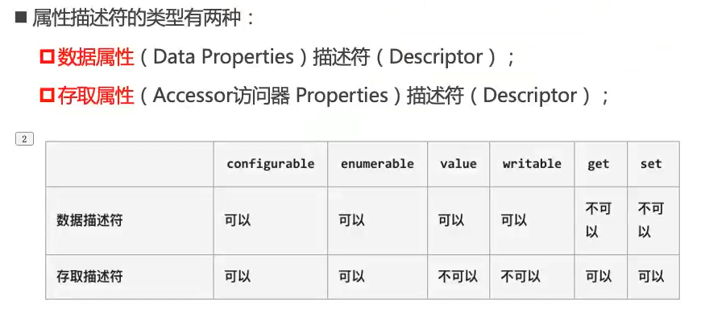
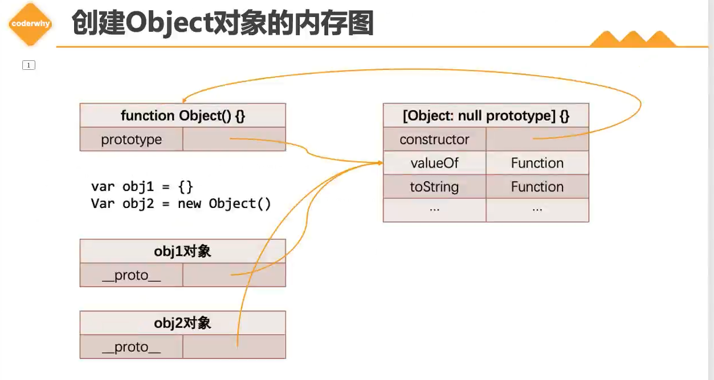
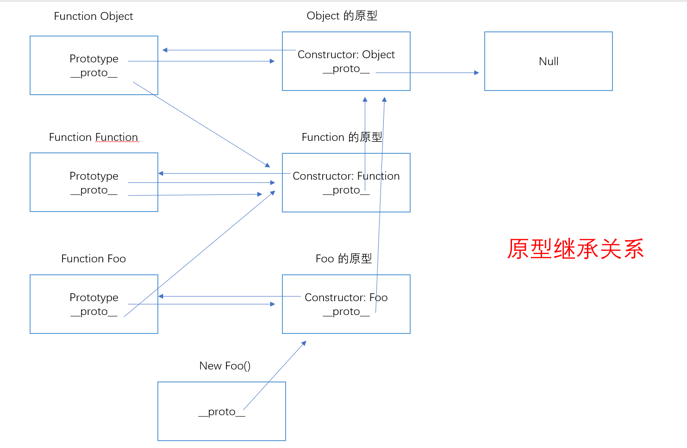

# js-高级语法（二）

## 深入理解面向对象

1. js中的对象被设计成一组属性的无序集合，像是一个哈希表，由key和value组成
2. key是一个标识符名称，value可以是任意数据类型
3. 如果value是一个函数，那把他成为对象的方法
4. 创建对象的两种方式
 ```js
 // 通过Object类创建
 const obj = new Object()
 obj.name = 'wall'
 obj.age = 18
 
 // 通过对象字面量创建
 const obj2 = { name: 'wall', age: 18 }
 ```

5. 属性描述符：在严格模式可以通过`Object.defineProperty(obj, 'attribute', {options})`创建一个属性描述符
	* 数据属性描述符
		* [[Configurable]]：表示属性是否可以通过delete删除，重新定义，或者是否可以被修改成存取属性描述符
			* 对象上默认的属性，[[Configurable]]默认为true
			* 通过描述符定义的属性，[Configurable]默认为false
		* [[Enumerable]]：表示属性是否可枚举，即是否可以通过`for in/Object.keys()`返回该属性
			* 对象上默认的属性，[[Enumerable]]默认为true
			* 通过描述符定义的属性，[Enumerable]默认为false
		* [[Writeable]]：表示是否可修改属性的值
			* 对象上默认的属性，[[Writeable]]默认为true
			* 通过描述符定义的属性，[Writeable]默认为false
		* [[value]]：属性的值
			* 默认为undefined

	* 数据存储描述符
		* get()：`obj.key`调用该方法
		* set()：`obj.key = val`调用该方法

```js
//描述符作用
'use strict'

const obj = {
   name: 'wall',
   age: 18,
   _address: 'China',
   foo() {
	   console.log('foo')
   }
}

// 数据属性描述符
Object.defineProperty(obj, 'name', {
   // 不可删除/重新定义
   configurable: false,
   // 不可被枚举
   enumerable: false,
   // 不可修改或赋值
   writable: false,
})

Object.defineProperty(obj, 'height', {
   value: 180,
   enumerable: true
})
// obj.name = 'zz' //err
// console.log(obj) //{ age: 18, _address: 'China', foo: [Function: foo], height: 180 }


// 存取属性描述符
// 作用一：隐藏私有属性不希望直接被外界使用或赋值
// 作用二：截获一个属性的访问和设置操作
let getCount = 0
let setCount = 0

Object.defineProperty(obj, '_address', {
   enumerable: false
})

Object.defineProperty(obj, 'address', {
   enumerable: true,
   configurable: true,
   get() {
	   getCount ++
	   return this._address
   },
   set(val) {
	   setCount ++
	   this._address = val
   }
})

obj.address = 'USA'
console.log(obj.address, getCount, setCount) //USA 1 1
```



 ```js
 // 属性描述符其他方法
 // 定义多个属性描述符
 const obj = {
	 name: 'wall',
	 _age: 18
 }
 
 Object.defineProperties(obj, {
	 name: {
		 configurable: false,
		 enumerable: false,
		 writable:false
	 },
	 _age: {
		 enumerable: false
	 },
	 age: {
		 configurable: true,
		 enumerable: true,
		 get() {
			 return this._age
		 },
		 set(val) {
			 this._age = val
		 }
	 }
 })
 
 console.log(obj.age) //18
 
 // 获取一个特有属性描述符
 console.log(Object.getOwnPropertyDescriptor(obj, 'age'))
 /**{
   get: [Function: get],
   set: [Function: set],
   enumerable: true,
   configurable: true
 } */
 // 获取对象所有属性描述符
 console.log(Object.getOwnPropertyDescriptors(obj))
 /** {
	 name: {
	   value: 'wall',
	   writable: false,
	   enumerable: false,
	   configurable: false
	 },
	 _age: { value: 18, writable: true, enumerable: false, configurable: true },
	 age: {
	   get: [Function: get],
	   set: [Function: set],
	   enumerable: true,
	   configurable: true
	 }
   } */
 ```

6. 限制Object对象其他方法

 ```js
 // 禁止对象继续添加新的属性
 Object.preventExtensions(obj)
 
 // 对象所有属性都设置configurable: false
 Object.seal(obj)
 
 // 对象所有属性都设置writeable: false
 Object.freeze(obj)
 ```

7. 定义对象属性访问器

 ```js
 const obj = {
	 _name: 'wall',
	 get name() {
		 return this._name
	 },
	 set name(newVal) {
		 this._name = newVal
	 }
 }
 ```

8. 工程模式创建对象

 ```js
 // 1.工程模式
 // 缺点：1.获取不到对象的真实类型
 function createObjectFactory(name, age, foo) {
	 return {name, age, foo}
 }
 
 console.log(createObjectFactory('wall', 18, function() {console.log(this.name)}).foo()) 
 //wall { name: 'wall', age: 18 }
 console.log(createObjectFactory('zz', 19, function() {console.log(this.name)})) 
 //{ name: 'zz', age: 19, foo: [Function (anonymous)] }
 ```

9. 构造函数创建对象
	* 构造函数也称构造器（constructor），通常在创建对象时会调用构造函数
	* 在Class中构造函数是位于类中的一个方法，成为构造方法
	* js中的构造函数从表现形式来看和普通函数没有区别，但如果使用new操作符来调用，那么这个函数就是构造函数
	* new操作符的作用
		* 在内存中创建一个新的空对象
		* 该对象内部[[prototype]]属性会被赋值为该构造函数的prototype属性（构造函数连接）
		* 构造函数this指向创建出来的新对象
		* 执行构造函数内部代码
		* 如果构造函数没有返回非空对象，则返回创建出来的新对象
 ```js
 // 2.构造函数模式
 // 缺点：每创建一个对象，都会重复创建构造函数内部的函数对象
 function Person(name, age) {
	 this.name = name
	 this.age = age
 
	 this.foo = function() {
		 console.log(this)
	 }
 }
 
 const obj = new Person('wall', 18)
 const obj2 = new Person
 const objType = obj.__proto__.constructor
 console.log(obj, objType) //Person { name: 'wall', age: 18, foo: [Function (anonymous)] } [Function: Person]
 console.log(obj.foo === obj2.foo) //false
 ```

10. 对象的原型
	* js中每个对象都有一个特殊的内置属性[[prototype]]，该属性指向另外一个对象，即原型对象
	* 当通过引用对象的key来获取一个value时，会触发[[get]]操作
	* 此操作会先检查对象是否有此属性，如果没有会访问对象[[prototype]]内置属性指向的原型对象上的属性
```js
const obj3 = { name: 'wall', age: '18'}
console.log(Object.getPrototypeOf(obj3), obj3.__proto__)
// [Object: null prototype] {} [Object: null prototype] {}
```
11. 函数的原型

```js
function Foo() {}

// 函数的隐式原型：函数作为对象  new Function()
console.log(Foo.__proto__) //{}

// 函数的显示原型：函数作为构造函数
const foo = new Foo
const foo2 = new Foo
Foo.prototype.name = 'wall'
console.log(Foo.prototype) //{} 
console.log(Object.getOwnPropertyDescriptors(Foo.prototype)) //constructor属性不可枚举
/** 
* constructor: {
   value: [Function: Foo],
   writable: true,
   enumerable: false,
   configurable: true
 }
*/
console.log(foo2.name == foo.name) // true
console.log(foo.__proto__ === Foo.prototype) // true
console.log(foo2.__proto__ == Foo.prototype) // true
```

```js
// 直接修改整个原型对象
function Foo2() {}
Foo2.prototype = {
	name: 'Foo2',
	get() {
	   console.log(this)
	}
}

Object.defineProperty(Foo2.prototype, 'constructor', {
	configurable: true,
	writable: true,
	enumerable: false,
	value: Foo2
})

const f2 = new Foo2
f2.get() //Foo2 {}
console.log(f2.__proto__.constructor) //[Function: Foo2]
```

12. 构造函数-原型创建对象

```js
// 构造函数-原型模式
// 优点：创建对象不会重复创建原型对象上的函数，每个对象都具备具体类型
function Foo3(name, age) {
	this.name = name
	this.age = age
}

Foo3.prototype.getName = function() {
	console.log(this.name)
}

const foo3 = new Foo3('wall', 18)
const foo4 = new Foo3('zz', 19)
foo3.getName() //wall
foo4.getName() //zz
 ```

## 面向对象的特性

1. 封装：将属性和方法封装到一个类中，可以称为封装的过程
2. 继承：子类继承父类属性和方法，复用代码，是多态的前提
3. 多态：不同对象在执行表现出不同的形态
4. 原型与原型链及其继承
5. Object的原型

```js
const obj = {
   name: 'wall',
   age: 18
}
// const obj = {} 等于 const obj = new Object()

const allKeys = Object.getOwnPropertyDescriptors(obj.__proto__)
console.log(obj.__proto__)// [Object: null prototype] {}  最顶层原型
console.log(obj.__proto__ === Object.prototype) //true
console.log(obj.__proto__.__proto__) // null
console.log(allKeys)
/** 
* {
 constructor: {
   value: [Function: Object],
   writable: true,
   enumerable: false,
   configurable: true
 },
 toString: {
   value: [Function: toString],
   writable: true,
   enumerable: false,
   configurable: true
 },
 valueOf: {
   value: [Function: valueOf],
   writable: true,
   enumerable: false,
   configurable: true
 },
 ['__proto__']: {
   get: [Function: get __proto__],
   set: [Function: set __proto__],
   enumerable: false,
   configurable: true
 }
 ...
}
*/
```

6. 内存图



7. 构造函数的原型

```js
// 构造函数的原型
function Person(name, age) {
   this.name = name
   this.age = age
}

const p1 = new Person('wall', 18)
console.log(Person.prototype.__proto__) // [Object: null prototype] {} 
console.log(Function.prototype.__proto__) // [Object: null prototype] {} 
console.log(Array.prototype.__proto__) // [Object: null prototype] {} 
console.log(String.prototype.__proto__) // [Object: null prototype] {} 
// 结论一：所有构造函数的prototype的原型对象都指向顶层原型对象
console.log(Person.prototype.__proto__ === Object.prototype) //true
// 结论二: 所有构造函数都是Object的子类
console.log(Person.__proto__ === Function.prototype) //true
console.log(Object.__proto__ === Function.prototype) //true
console.log(Function.__proto__ === Function.prototype) //true
// 结论三: 所有构造函数是Function构造函数的实例
```

8. 构造函数通过原型链实现继承（寄生组合式继承）：
	* 通过原型链会逐级向上查找的特性，将子类原型指向父类原型，实现继承父类公共方法
	* 通过借用父类构造函数，实现继承父类公共属性
```js
// 构造函数利用原型链实现继承(寄生-组合式继承)
function Animal(name, age) {
 this.name = name
 this.age = age
 this.arr = []
}

Animal.prototype.run = function() {
 console.log(this.name + 'run')
}

// 封装一个继承函数
function inheritedPrototype(child, parent) {
 // 将子类原型指向父类实例
 // 缺点：父类构造函数会重复调用，会给父类实例添加不必要的属性
 // Cat.prototype = new Animal
 // 解决方案: 创建一个新对象,新对象拥有父类原型,将子类原型指向新对象   子类原型->新对象->父类原型
 child.prototype = Object.create(parent.prototype)
 // 将子类原型的构造函数属性指向子类
 // Cat.prototype.constructor = Cat
 Object.defineProperty(child.prototype, 'constructor', {
   enumerable: false,
   configurable: true,
   writable: true,
   value: child
 })
 // cat.__proto__ === new Animal
 // cat.__proto__.__proto__ === Animal.prototype
}

// 实现继承
inheritedPrototype(Cat, Animal)

function Cat(hobby, ...arg) {
 Animal.apply(this, arg) // 借用父类构造函数的调用给子类实例赋值（借用构造函数继承）
 this.hobby = hobby
}

Cat.prototype.miao = function() {
console.log(this.name + 'miao')
}

const cat1 = new Cat('eat', 'lihua', 18)
const cat2 = new Cat('fish', 'meiduan', 19)
cat1.arr.push('wall')
cat2.arr.push('zz')
cat1.miao() //lihuamiao
cat1.run()  //lihuarun
console.log(cat1, cat2) 
// Cat { name: 'lihua', age: 18, arr: [ 'wall' ], hobby: 'eat' } 
// Cat { name: 'meiduan', age: 19, arr: [ 'zz' ], hobby: 'fish' }
// console.log(Object.getOwnPropertyDescriptors(cat1.__proto__.__proto__))
```
     
9. 原型式继承函数和寄生式继承函数
     
```js
// 原型式继承
const o1 = {
 name: 'wall',
 age: 18
}

// 将o1对象作为info对象的原型对象
const info1 = Object.create(o1)
console.log(info1.__proto__)  //{ name: 'wall', age: 18 }

// 寄生式继承(工厂函数+原型式继承)
const o2 = {
 name: 'zz',
 age: 20
}

// 封装一个工厂函数,每创建一个新对象,都将他的原型对象赋值为o2
function createInfo(name) {
 const info = Object.create(o2)
 info.name = name
 info.getName = function() {
   console.log(info.name)
 }
 return info
}

const info2 = createInfo('zz1')
console.log(info2.__proto__)  //{ name: 'zz', age: 20 }
```
   
## Object其他方法补充

1. `Object.create(obj, {})`，创建并返回一个新对象将，将传入的对象作为新对象的原型
2. `obj.hasOwnProperty('key')`，判断一个属性是属于对象还是属于对象原型
3. `'key' in obj`，判断一个属性是否在对象及其原型上
4. `stu instanceof Student`，检测某个构造函数的原型是否出现在某个对象的原型链上
5. `obj.isPrototypeOf(obj2)`，用于检测某个对象，是否出现在某个实例对象的原型链上

```js
// 举例一
const obj = { name: 'wall', age: 18 }
const newObj = Object.create(obj, {
 height: {
	 enumerable: true,
	 configurable: true,
	 writable: true,
	 value: 180
 }
})
console.log(newObj) //{ height: 180 }
console.log(Object.getPrototypeOf(newObj)) //{ name: 'wall', age: 18 }
console.log(newObj.hasOwnProperty('height')) //true
console.log(newObj.hasOwnProperty('name')) //false
console.log('height' in newObj) //true
console.log('name' in newObj) //true
console.log(obj.isPrototypeOf(newObj)) //true

//举例二
function Person() {}

function Student() {}

function inheritedPrototype(child, parent) {
 child.prototype = Object.create(parent.prototype)
 child.prototype.constructor = child
}

inheritedPrototype(Student, Person)

const stu = new Student()

console.log(stu instanceof Student) //true
console.log(stu instanceof Person) //true
console.log(stu instanceof Object) //true
```

## 原型继承关系

1. `Function Foo()`作为一个函数，拥有显示原型，`Foo.prototype`
2. `Function Foo()`作为一个函数对象，拥有隐式原型，`Foo.__proto__`
3. `Function.__proto__ === Function.prototype`，Function的显示原型和隐式原型相等，因为Function是它自身的实例
4. `Function.prototype.__proto__ === Object.prototype`，所有构造函数的**原型**都是Object的实例
5. `Object.__proto__ === Function.prototype`，Object是Function的实例



## Class类实现面向对象编程

1. 本质是构造函数‘原型链的语法糖

2.  类的构造函数

	* 每个类都有一个独立固定的额构造函数constructor
	* 通过new操作符，操作类的时候会调用这个类的构造函数constructor
	* 每个类只能有一个构造函数，定义多个会抛异常

3. new关键字操作类的时候，执行的操作（同new调用构造函数）

	* 在内存中创建一个新对象
	* 将这个对象内部[[prototype]]属性赋值为该类的prototype属性
	* 构造函数constructor内部的this会被指向创建的新对象
	* 执行构造函数内部代码
	* 如果没有返回非空对象，则返回创建出来的对象

4. super关键字

	* 在子类构造函数中使用this或者返回默认对象之前，必须先通过super()调用父类构造函数
	* super的使用位置：子类构造函数，实例方法，静态方法

```js
const names = ['dog', 'cat', 'duck']

// 父类
class Animal {
 // 构造函数
 constructor(name, age) {
	 this.name = name
	 this.age = age
	 Object.defineProperty(this, '_sex', {
		 enumerable: false,
		 writable: true,
		 configurable: true,
		 value: 'male'
	 })
 }

 // 普通实例方法
 run() {
	 console.log(this.name + 'run')
 }

 swin() {
	 return 'swin'
 }

 // 类的访问器方法
 get sex() {
	 //拦截操作
	 return this._sex
 }

 set sex(sex) {
	 //拦截操作
	 this._sex = sex
 }

 // 类的静态方法（类方法）
 /**
  * 随机创建Animal实例对象
  * @returns new Animal
  */
 static createAnimal() {
	 const nameIdx = Math.floor(Math.random() * names.length)
	 const age = Math.floor(Math.random() * 10)
	 const name = names[nameIdx]
	 return new Animal(name, age)
 }

 static parentFoo() {
	 console.log(this)
 }
}

// 子类
class Person extends Animal {
 constructor(name, age, height) {
	 // js引擎在解析子类的时候要求,那么在子类的构造函数中,在使用this之前必须调用super()
	 super(name, age)
	 this.height = height
 }

 // 重写父类实例方法
 pSwin() {
	 console.log(this.name + 'fast' + super.swin())
 }

 // 重写父类静态方法
 static parentFoo() {
	 super.parentFoo()
 }
}


const a1 = new Animal('cat', 3)
const a2 = new Animal('dog', 8)
a1.run() //catrun
a2.run() //dogrun
console.log(a1.sex) //male

const a3 = Animal.createAnimal()
const a4 = Animal.createAnimal()
Animal.parentFoo() //[class Animal]
console.log(a3, a4)

const p1 = new Person('wall', 18, 188)
p1.pSwin() //wallfastswin
console.log(p1) //Person { name: 'wall', age: 18, height: 188 }

Person.parentFoo() //[class Person extends Animal]
```

## 继承内置类和mixin类的混入

```js
 // 继承内置类
 class Arr extends Array {
	 firstItem() {
		 return this[0]
	 }
 
	 lastItem() {
		 return this[this.length - 1]
	 }
 }
 
 const arr = new Arr(1, 2, 3, 4)
 console.log(arr.firstItem(), arr.lastItem()) //1 4
 
 // mixin类的混入（用于对类进行扩展）
 // 在js种类是单继承，只能有一个父类
 function mixinRunning(BaseClass) {
	 return class extends BaseClass {
		 running() {
			 console.log(this.name + 'running')
		 }
	 } 
 }
 
 class Person {
	 constructor(name, age) {
		 this.name = name
		 this.age = age
	 }
 }
 class Student extends Person {}
 
 const NewStudent = mixinRunning(Student)
 const student = new NewStudent('wall', 18)
 student.running() //student running
 console.log(student) //Student { name: 'wall', age: 18 }
 ```

## 面向对象的多态

1. 维基百科：为不同的数据类型实体提供统一接口，或使用一个单一的符号来表示多个不同类型
2. 不同数据类型进行同一操作，表现出不同的行为，这就是多态的体现
3. 多态的三个前提
	* 必须有继承
	* 必须有子类重写父类方法
	* 必须有父类引用执行子类对象

```typescript
 // 面向对象的多态
 class Shape {
	 name: string
	 constructor(name: string) {
		 this.name = name
	 }
 
	 getArea() {}
 }
 
 // 1.必须要有继承
 class Rectangle extends Shape {
	 // 2.必须要有子类重写父类方法
	 getArea(): number {
		 return 100
	 }
 }
 
 class Circle extends Shape {
	 getArea(): number {
		 return 500
	 }
 }
 
 // 3.必须要有父类引用指向子类实例
 function shapeArea(shape: Shape): any {
	 return shape.getArea()
 }
 
 const r = new Rectangle('r')
 const c = new Circle('c')
 
 console.log(shapeArea(c)) //500
 console.log(shapeArea(r)) //100
 ```

   

