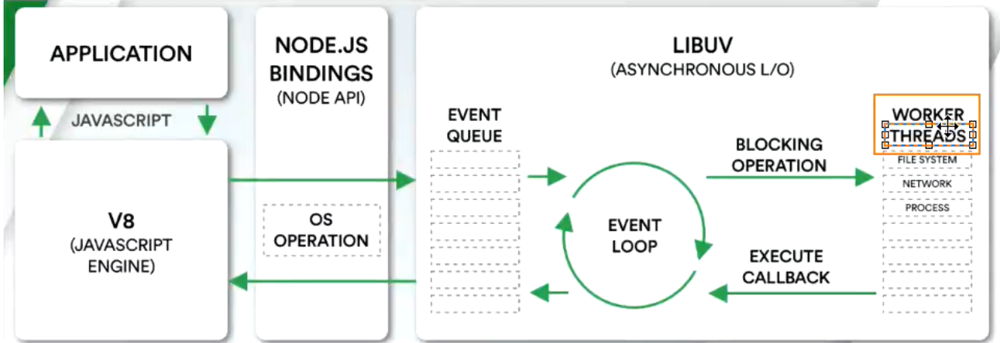

# js-高级语法（四）

## 迭代器iterator

1. 概念：是确使用户可在容器对象（container，链表或数组）上遍访的对象，使用该接口无需关心对象的内部实现细节

2. 解释：迭代器就是帮助我们对某个数据结构进行遍历

3. 在js中，迭代器是一个具体的对象，这个对象需要符合迭代器协议（iterator protocol）

   * 迭代器协议定义了产生一系列值（无论是优先还是无限个）的标准方式
   * 这个标准就是一个特定的next方法

4. next有如下要求

   * 一个无参函数，返回一个应当有以下两个属性的对象
   * done(boolean)：
     * 如果迭代器可以产生序列中的下一个值，则为false。（这等价于没有指定done这个属性）
     * 如果迭代器已将序列迭代完毕，则为true。这种请情况下，value是可选的，如果他依然存在，即为迭代结束之后的默认返回值
   * value：
     * 迭代器返回的任何js值，done为true时可省略

5. 数组迭代器

   ```js
   // 迭代器iterator
   const arr = ['kobe', 'bob', 'wall']
   
   let index = 0
   const arrIterator = {
       next() {
           if (index < arr.length) {
               return { done: false, value: arr[index ++] }
           } else {
               return { done: true, value: undefined }
           }
       }
   }
   
   console.log(arrIterator.next())
   console.log(arrIterator.next())
   console.log(arrIterator.next())
   console.log(arrIterator.next())
   /**
    *  { done: false, value: 'kobe' }
       { done: false, value: 'bob' }
       { done: false, value: 'wall' }
       { done: true, value: undefined }
    */
   ```

6. 生成迭代器函数

   ```js
   // 生成迭代器函数
   
   const createArrayIterator = (arr) => {
       let index = 0
       return {
           next() {
               if (index < arr.length) {
                   return { done: false, value: arr[index ++] }
               } else {
                   return { done: true, value: undefined }
               }
           }
       }
   }
   
   const nums = [1, 2, 3, 4, 5]
   const numsIterator = createArrayIterator(nums)
   console.log(numsIterator.next())
   console.log(numsIterator.next())
   console.log(numsIterator.next())
   console.log(numsIterator.next())
   console.log(numsIterator.next())
   console.log(numsIterator.next())
   /**
    *  { done: false, value: 1 }
       { done: false, value: 2 }
       { done: false, value: 3 }
       { done: false, value: 4 }
       { done: false, value: 5 }
       { done: true, value: undefined }
    */
   ```

## 可迭代对象

1. 当一个对象它实现了iterator protocol协议时，它就是一个可迭代对象

2. 这个对象的要求是必须实现@@iterator方法，在代码中我们使用Symbol.iterator访问该属性

3. 当一个对象变成可迭代对象，进行for...of时就会调用@@iterator方法

4. 可迭代对象实现

   ```js
   / 创建一个可迭代对象
   
   const iteratorObj = {
       arr: ['a', 'b', 'c', 'd'],
       [Symbol.iterator]: function() {
           let index = 0
           return {
               next: () => {
                   if (index < this.arr.length) {
                       return { done: false, value: this.arr[index ++] }
                   } else {
                       return { done: true, value: undefined }
                   }
               }
           }
       }
   }
   
   const iterator = iteratorObj[Symbol.iterator]()
   console.log(iteratorObj[Symbol.iterator]) // [Function: [Symbol.iterator]]
   console.log(iterator.next())
   console.log(iterator.next())
   console.log(iterator.next())
   console.log(iterator.next())
   console.log(iterator.next())
   /**
    *  { done: false, value: 'a' }
       { done: false, value: 'b' }
       { done: false, value: 'c' }
       { done: false, value: 'd' }
       { done: true, value: undefined }
    */
   
   // for...of必须是一个可迭代对象：是迭代器的语法糖，当next函数中的done为false，继续迭代；当done为false时，停止迭代
   for(const i of iteratorObj) {
       console.log(i) // a, b, c, d
   }
   ```

5. 原生迭代对象：默认已经实现了可迭代协议

   * String、Array、Map、Set、argument、NodeList集合

   * ```js
     // 原生可迭代对象：数组
     const names = ['wall', 'zz', 'aa']
     const namesIterator = names[Symbol.iterator]()
     console.log(namesIterator.next())
     console.log(namesIterator.next())
     console.log(namesIterator.next())
     console.log(namesIterator.next())
     /** 
      *  { value: 'wall', done: false }
         { value: 'zz', done: false }
         { value: 'aa', done: false }
         { value: undefined, done: true }
      */
     ```

6. 可迭代对象的用处

   * js语法：for...of、展开语法（spread syntax）、yield*、解构赋值（Destructuring_assignment）

   * 创建一些对象时：new Map([Iterable])、new WeakMap([Iterable])、new Set([iterable])、new WeakSet([iterable])

   * 一些方法的调用：Promise.all(iterable)、Promise.all(iterable)、Array.from(iterable)

   * 注意：正对于对象展开和解构进行了特殊处理，而非迭代器

     ```js
     const obj = { name: 'wall', age: 19 }
     const { name, age } = { ...obj }
     ```

7. 封装一个可迭代对象类

   ```js
   // 创建一个类，该类创建出来的对象都是可迭代对象
   class Room {
       constructor(name, address, stu) {
           this.name = name
           this.address = address
           this.stu = stu
       }
   
       entry(stu) {
           if (!stu) return 
           this.stu.push(stu)
       }
   
       [Symbol.iterator]() {
           let index = 0
           return {
               next: () => {
                   if (index < this.stu.length) {
                       return { done: false, value: this.stu[index ++] }
                   } else {
                       return { done: true, value: undefined }
                   }
               },
               return: () => {
                   return { done: true, value: undefined }
               }
           }
       }
   }
   
   const room = new Room('A room', '301', ['wall'])
   room.entry('zz')
   
   for (const stu of room) {
       // 终端迭代器
       if (stu === 'zz') {
           break
       }
       console.log(stu) // wall
   }
   ```

8. 迭代器的中断：迭代器在某些情况下会在没有完全迭代的情况下中断

   * 比如遍历过程中通过break、continue、return、throw中断了循环
   * 比如在解构时，没有解构所有的值

## 生成器 generator

1. 概念：生成器时es6中新增的一种函数控制和使用方案，它可以让我们更加灵活的控制函数什么时候能继续执行、暂停执行等

2. 生成器函数

   * 首先生成器函数需要在function的后面加一个符号*
   * 其次生成器函数可以通过yield关键字来控制函数的执行流程
   * 最后生成器函数的返回值是一个Generator（生成器）
   * 生成器其实是一种特殊的迭代器

3. 生成器函数实现

   ```js
   // 生成器
   // 该函数返回一个生成器（一个特殊的迭代器），调用一次next方法，执行到yield暂停，yield后面跟每次next返回对象的value值
   // 下一次next方法的参数会作为上一次yield的返回值
   function* foo(i) {
       console.log('foo is running')
   
       const value1 = i
       console.log(value1)
       const n = yield value1
   
       const value2 = n
       console.log(value2)
       const m = yield value2
   
       const value3 = m
       console.log(value3)
       yield value3
   
       console.log('foo is end')
       return 'over'
   }
   
   const generatorFoo = foo('one')
   console.log('return 1', generatorFoo.next())
   // foo is running
   // one
   // return 1 { value: one, done: false }
   
   console.log('return 2', generatorFoo.next('two'))
   // return 1 { value: two, done: false }
   // two
   
   
   console.log('return 3', generatorFoo.next('three')) 
   // three
   // return 3 { value: three, done: false }
   
   console.log('return 4', generatorFoo.next())
   // foo is end
   // return 4 { value: over, done: true }
   ```

4. 生成器函数return和throw

   ```js
   function* generator(n) {
       console.log(n)
       const m = yield n
   
       console.log(m)
       const k = yield m
   
       console.log(k)
       const v = yield k
   
       return 'over'
   }
   
   const fn = generator(1)
   
   console.log(fn.next())
   console.log(fn.return(2))
   // 相当于在第一段代码后面加上了return，会提前终止生成器函数代码继续执行
   // console.log(fn.throw(2))
   // 第二段代码会抛出异常，可捕获
   console.log(fn.next(3))
   console.log(fn.next())
   /** 
    *  1
       { value: 1, done: false }
       { value: 2, done: true }
       { value: undefined, done: true }
       { value: undefined, done: true }
    */
   ```

5. 生成器替代迭代器函数

   ```js
   // 生成器替代迭代器
   function* createArrayIterator(arr) {
       // 写法一
       // for (const i of arr) {
       //     yield i
       // }
   
       // 写法二：yield* 后面跟可迭代对象
       yield* arr
   }
   
   const names = ['wall', 'zz', 'kobe']
   const namesIterator = createArrayIterator(names)
   console.log(namesIterator.next())
   console.log(namesIterator.next())
   console.log(namesIterator.next())
   console.log(namesIterator.next())
   /**
    *  { value: 'wall', done: false }
       { value: 'zz', done: false }
       { value: 'kobe', done: false }
       { value: undefined, done: true }
    */
   
   // 创建一个函数，这个函数可以迭代一个范围内的数字
   function* createRangesIterator(start, end) {
       let index = start
       while (index < end) {
           yield index++
       }
   }
   
   const ranges = createRangesIterator(10, 15)
   for (let i = 0; i < 5; i ++) {
       console.log(ranges.next())
   }
   /**
    *  { value: 10, done: false }
       { value: 11, done: false }
       { value: 12, done: false }
       { value: 13, done: false }
       { value: 14, done: false }
    */
   
   // class案例
   class Room {
       constructor(name, address, rooms) {
           this.name = name
           this.address = address
           this.rooms = rooms
       }
   
       entry(room) {
           this.rooms.push(room)
       }
   
       *[Symbol.iterator]() {
           yield* this.rooms
       }
       // 相当于
       // [Symbol.iterator]() {
       //     const _this = this
       //     let index = 0
       //     return {
       //         next() {
       //             if (index < _this.rooms.length) {
       //                 return { done: false, value: _this.rooms[index++] }
       //             } else {
       //                 return { done: true, value: undefined }
       //             }
       //         }
       //     }
       // }
   }
   
   const room = new Room('A', '201', ['wall', 'zz'])
   room.entry('kobe')
   
   for (const r of room) {
       console.log(r) // wall, zz, kobe
   }
   ```

6. 异步代码的处理方案

   ```js
   const co = require('co')
   
   // 异步代码的处理方案
   function requestData(url) {
       return new Promise((resolve, reject) => {
           setTimeout(() => {
               if (url && url !== 'err') {
                   resolve(url)
               } else if (url === 'err') {
                   reject('err')
               }
           }, 0)
       })
   }
   
   // 需求
   // 1. url: ok -> res: ok
   // 2. url: res + 'a' -> ok + 'a'
   // 3. url: res + 'b' -> ok + 'ab'
   
   // 方式一：回调地狱
   requestData('ok').then(res => {
       requestData(res + 'a').then(res => {
           requestData(res + 'b').then(res => {
               console.log(res) // okab
           })
       })
   })
   
   // 方案二：Promise中then的返回值
   requestData('ok')
                   .then(res => requestData(res + 'a'))  
                   .then(res => requestData(res + 'b'))
                   .then(res => console.log(res)) // okab
   
   // 方式三：Promise + generator
   function* getData(url) {
       const res1 = yield requestData(url)
       const res2 = yield requestData(res1 + 'a')
       const res3 = yield requestData(res2 + 'b')
       const res4 = yield requestData(res3 + 'c')
       console.log(res4) // okabc, okabc
   }
   
   
   // 手动执行生成器函数
   const generator = getData('ok')
   generator.next().value.then(res => {
       generator.next(res).value.then(res => {
           generator.next(res).value.then(res => {
               generator.next(res).value.then(res => {
                   generator.next(res)
               })
           })
       })
   })
   
   // 自动执行生成器函数
   function execGenerator(genFn) {
       const generator = genFn('ok')
       // 记录该生成器迭代次数
       let count = 0
       
       function exec(res) {
           const result = generator.next(res)
           // 如果done为true，迭代结束，返回value
           if (result.done) {
               console.log(count) // 4
               return result.value
           }
           result.value.then(res => {
               count ++
               exec(res)
           })
       }
   
       exec()
   }
   
   execGenerator(getData)
   
   // 使用co库自动执行生成器函数
   co(getData('ok')) // okabc
   
   // 方式四：async/await
   async function getDataByAsync(url) {
       const res1 = await requestData(url)
       const res2 = await requestData(res1 + 'a')
       const res3 = await requestData(res2 + 'b')
       const res4 = await requestData(res3 + 'c')
       console.log(res4) // okabc
   } 
   
   getDataByAsync('ok')
   ```

## 异步函数 async function

1. async 关键字用于声明一个异步函数

2. 异步函数的执行流程

   * 异步函数内部如果没有异步操作，执行流程与同步代码一致

3. 异步函数同普通函数的区别

   * 异步函数的返回值一定是一个promise

   * ```js
     // 异步函数返回一个promise
     async function foo(type) { return type }
     
     foo('wall').then(res => console.log(res)) // wall
     
     foo({
         then: function(resolve, reject) {
             resolve('thenable')
         }
     }).then(res => console.log(res)) // thenable
     
     foo(new Promise((resolve, reject) => {
         resolve('promise')
     })).then(res => console.log(res)) // promise
     ```

   * 异步函数内部抛出异常

     ```js
     async function bar() {
         // 异步函数中的异常，会被作为异步函数返回的Promise的reject值
         console.log('bar start')
         throw new Error('err msg')
     }
     
     bar().catch(err => console.log(err.toString())) //
     
     console.log('bar end')
     ```

4. 异步函数中使用await关键字

   ```js
   // 异步函数中使用关键字
   
   // 1.返回值为promise(thenable)
   function request(url) {
       return new Promise((resolve, reject) => {
           setTimeout(() => {
               if (url !== 'err') {
                   resolve(url)
               } else {
                   reject(url)
               }
           }, 1000)
       })
   }
   
   async function getData() {
       // await后边跟promise对象，返回值即该promise的resolve值
       // 每次执行到await，会等待该promise状态改变成fulfilled，堵塞后边代码执行
       const res1 = await request('ok')
       // promis后边的同步代码即then的回调
       console.log(res1) // ok
   
       const res2 = await request('okk')
       console.log(res2) // okk
   
       // 对于promise调用reject或抛出异常，需要捕获异常，防止代码执行中断
       try {
           const res3 = await request('err')
       } catch (err) {
           console.log(err) // err
       }
   }
   
   getData()
   ```


## 事件循环

1. 进程和线程
   * 进程：计算机已运行的应用程序，是操作系统管理程序的一种方式
   * 线程：操作系统能够运行运算调度的最小单元，通常情况下他被包含在进程中
   
2. 操作系统的工作方式：操作系统是如何在多个进程中同时工作呢
   * 这是因为CPU的运算速度非常快，它可以快速的在多个进程之间迅速切换
   * 当我们进程中的线程获取到时间片时，就可以快速执行我们的代码
   * 对于用户来说是感受不到这种速度的
   
3. 浏览器中的JavaScript线程
   * JavaScript是单线程的，他的进程容器一般是：浏览器或者nodejs
   * 多数浏览器都是多进程的，每开一个tab页面就会开启一个新的进程，这是防止页面卡死造成所有页面无法响应
   * 每个进程又有很多线程，其中包括执行JavaScript代码的线程、渲染页面线程...
   
4. JavaScript代码的执行
   * 由于JavaScript代码是在一个线程里执行的，同一时刻只能做一件事
   * 如果这件事非常耗时，那么就会堵塞当前线程
   
5. 对于真正耗时的操作，实际上并不是由JavaScript线程在执行
   * 因为每个tab页面是多线程的，那么就可以由**其他线程来完成这些耗时操作**
   * 比如**网络请求、定时器**，我们只需要**在特定的时候执行相应的回调**
   
6. 宏任务队列和微任务队列
   * 宏任务：ajax、setTimeout、setInterval、dom监听、ui rending等
   * 微任务：Promise的then回调、Mutation Observer API、queueMicrotask()等
   
7. 事件循环顺序

   * main script中的代码优先执行
   * 在执行**宏任务（不是红任务队列，是宏任务）**之前会先清空微任务队列

8. 面试题

   ```js
   // 事件循环面试题
   Promise.resolve().then(() => {
       console.log(0)
   
       // 1.直接return一个值，相当于resolve(4)
       // return 4 //0142356
   
       // 2.return thenable，多加一层微任务
       // return {
       //     then: (resolve, reject) => resolve(4) //0124356
       // }
   
       // 3.return Promise Promise.resolve
       // 一共多加两次微任务
       return Promise.resolve(4) // 0123456
   }).then(res => console.log(res))
   
   Promise.resolve().then(() => {
       console.log(1)
   }).then(() => console.log(2))
     .then(() => console.log(3))
     .then(() => console.log(5))
     .then(() => console.log(6))
   ```

9. nodejs中的事件循环

   * 概念：**事件循环就像一个桥梁**，连接着应用程序的**JavaScript和系统调用**之间的通道
     * 无论是文件io、数据库、网络io、定时器、子进程，在完成对应的操作后，都会将**对应的结果和回调函数**放到事件循环（任务队列）中
     * 事件循环会不断的从**任务队列中取出对应的事件（回调函数）**来执行

   * 执行流程
     * 先开启一个node进程
     * node进程是多线程
     * js线程执行同步代码
     * setTimeout、文件读取（IO）、网络请求等由其他线程执行
     * 通过任务队列将回调函数加入到主线程中
   * libuv
     * libuv是一个多平台专注于异步io的库，最初是为node开发的
     * libuv主要维护了一个EventLoop和Worker threads（线程池）
     * EventLoop负责调用系统的一些其他操作：文件io、Network、child-process等
     * 
   * node一次完整的事件循环tick分成很多阶段
     * 定时器（Timers）：本阶段执行已经被setTimeout、setInterval调度的回调函数
     * 待定回调（pending callback）：对某些系统操作（如tcp错误类型）执行回调，比如tcp连接时收到ECONNREFUSED
     * idle，prepare：仅系统内部使用
     * 轮询（Poll）：检索新的io事件、执行与io相关回调
     * 检测（check）：setImmediate回调在这里执行
     * 关闭回调函数：一些关闭的回调函数，如socket.io('close', ...)
   * 宏任务队列
     * timer queue：setTimeout、setInterval
     * poll queue：io事件
     * check queue：setImmediate
     * close queue：close事件
   * 微任务队列
     * next tick queue：process.nextTick
     * other queue：Promise的then回调、queueMicrotask

10. node和浏览器时间循环的区别

    * node中事件循环是由libuv这个库实现的，浏览器是基于HTML5定义的规范来实现的

## 错误处理方案

1. 错误的类型：通常使用Error类创建一个实例抛出

   ```js
   function foo() {
   	throw new Error('err')
   }
   ```

2. Error包含三个属性

   * message：创建Error对象传入的message
   * name：Error名称，通常和类的名称一致
   * stack：整个Error的错误信息，包含函数的调用栈

3. Error的一些子类

   * RangeError：下标越界时使用的错误类型
   * SyntaxError：解析语法错误时使用的错误类型
   * TypeError：出现类型错误时，使用的错误类型

4. 异常的处理方式

   * 不处理，异常会一层一层抛出直至最顶层的调用，如果在最顶层也没有对该异常处理，程序会终止并报错

     ```js
     function bar() {
         throw new Error('err')
     }
     
     function foo() {
         bar()
     }
     
     function demo() {
         foo()
     }
     
     demo()
     // 报错信息及调用栈
     /**
      * Error: err
         at bar (D:\workspace\demo\js\src\Day-32.js:15:11)
         at foo (D:\workspace\demo\js\src\Day-32.js:19:5)
         at demo (D:\workspace\demo\js\src\Day-32.js:23:5)
         at Object.<anonymous> (D:\workspace\demo\js\src\Day-32.js:26:1)
      */
     ```

   * 处理异常，通过try...catch语句进行处理，不会终止后面代码执行

     ```js
     // 异常捕获处理
     const p = Promise.reject('err')
     
     async function getData() {
         try {
             const res = await p
         } catch (err) {
             console.log(err)
         } finally {
             // 无论是否发生异常，都会执行
             console.log('ok')
         }
         console.log('end')
     }
     getData()
     ```

## 模块化开发

1. 模块化开发概念
   * 模块化开发最终目的是将程序划分成一个个小的结构
   * 在这个结构中编写属于自己的逻辑代码，有自己的作用域，不会影响到其他结构
   * 这个结构可以将自己希望暴露的变量、函数、对象等导出给其他结构使用
   * 也可以通过某种方式，导入另外结构中的变量、函数、对象等
2. CommonJs
   * CommonJs是一个规范，最初提出来是在浏览器之外的地方使用
   * Node是CommonJs在服务器端一个具有代表性的实现
   * Browserify是CommonJs在浏览器中的一种实现
   * webpack打包工具具备对CommonJs的支持
3. Node中对Commonjs进行了支持和实现，方便进行模块化开发
   * 在node中每一个js文件都是一个单独的模块
   * 这个模块中包含CommonJs规范的核心变量：exports、module.exports、require
   * 我们可以使用这些变量来进行模块化开发
4. CommonJs的导入和导出
   * 
