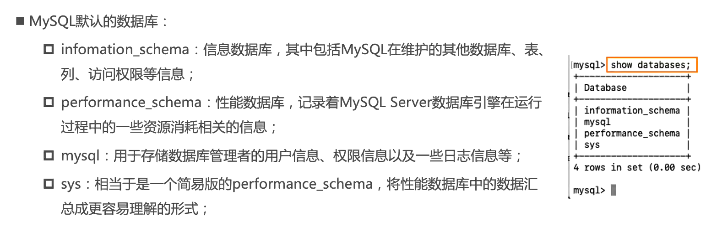
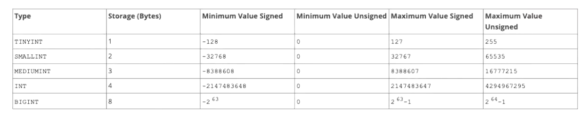
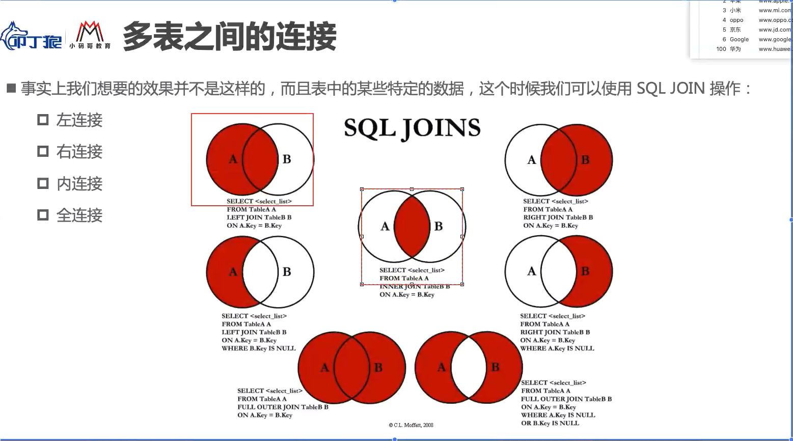

## MySQL总结

1. 文件系统的缺点
   * 很难以合适的方式组织数据（多张表之间的关系合理组织）
   * 很难对数据进行增删改查的复杂操作，并且保证操作的原子性
   * 很难进行很好的数据共享，比如一个数据库要为多个程序服务
   * 很难高效的进行数据备份、迁移、恢复
   
2. 数据库通俗来讲就是一个储存数据的仓库，本质是一个程序

3. 数据库的分类：
   * 关系型数据库：MySQL、Oracle、SQL Server等
     * 关系型数据库通常会建立很多个二维表
     * 数据表之间关联，形成一对一、一对多、多对多
     * 利用SQL语句在多张表中查询我们所需的数据
     * 支持事务，对数据的访问更加安全
   * 非关系型数据库：MongoDB、Redis等
     * 非关系型数据库储存相对简单自由（甚至可以直接将一个json塞入数据库中）
     * 基于key-value对应关系，查询过程中不需要经过SQL解析，性能更高
     * 不支持事物，需要在自己的程序中保证一些原子性的操作
   
4. 数据库的选择：
   * 进行后端开发选择关系型
   * 网络爬虫选择非关系型
   
5. mysql默认的数据库
   
* 
  
6. sql语句：

   * 常用规范：

     * 通常关键字是大写的，比如CREATE、TABLE、SHOW等等
     * 一条语句结束要以；结尾
     * 遇到关键字作为表明或者字段名称，可以用''包裹

   * sql语句的分类：

     * DDL：数据定义语言，可以通过DDL语句对数据库或者表进行创建，删除，修改等操作
     * DML：数据操作语言，可以通过DML语句对表进行添加、删除、修改等操作
     * DQL：数据查询语言，可以通过DQL语句从数据库中查询记录（重点）
     * DCL：数据控制语句：对数据库、表格进行相关访问控制

   * sql的数据类型：支持的类型有数字类型、日期和时间类型、字符串（字符字节）类型，空间类型和JSON数据类型

     * 数字类型：
       * 整数数字类型：INTEGER、**INT**、SMALLINT、TINYINT、MEDIUMIT、BIGINT
       * 
       * 浮点数据类型：FLOAT、DOUBLE（FLOAT是四个字节，DOUBLE是8个字节）
       * 精确数据类型：DECIMAL、NUMERIC（DECIMAL是NUMERIC的实现形式）
     * 日期类型：
       * YEAR以YYYY格式显示值：范围1901到2155，和0000
       * DATE用于显示日期但不包括时间：以YYYY-MM-DD格式显示，支持范围1001-01-01到9999-12-31
       * DATETIME类型用于包含日期和时间部分的值：以YYYY-DD-MM hh:mm:ss格式显示，支持范围1000-01-01 00:00:00到9999-12-31 23:59:59
       * **TIMESTAMP**数据类型被用于同时包含日期和时间部分的值：以YYYY-DD-MM hh:mm:ss格式显示，但支持范围1970-01-01 00:00:01到2038-01-19 03:14:07
       * 另外DATETIME和TIMESTAMP值可以包括在高达微妙（6位）精度的后小数秒一部分，1001-01-01 00:00:00.000000
     * 字符串类型：
       * CHAR类型在创建表时为固定长度，长度可以是0-255之间任何值（被查询会删除后边空格）
       * **VARCHAR**类型的值是可变长度的字符串，长度可以指定为0-65535之间任何值（被查询不会删除后边空格）
       * BINARY和VARBINARY类型用于存储二进制字符串，存储的是字节字符串（数据库一般不会直接存储二进制数据）
       * BOLB用于存储大的二进制类型
       * TEXT用于存储大的字符串类型

   * 表约束：

     * 主键（PRIMARY KEY）：一张表中为了区分每一条记录的唯一性，必须有一个字段是不允许重复的，且不会为空，这个字段通常会将它设为主键
       * 主键是表中唯一的索引
       * 并且必须是NOT NULL的，如果没有设置NOT NULL，那么MySQL也会隐式设置为NOT NULL
       * 主键可以是多列索引，PRIMARY KEY(key_part)，我们一般称之为联合主键
       * 建议：开发中主键字段应该是和业务无关的，尽量不要使用业务字段来作为主键
     * 唯一（UNIQUE）
       * 开发中某些字段希望是唯一不会重复的，比如手机号码、身份证号等，可以用UNIQUE约束
       * 使用UNIQUE约束的字段在表中必须是不同的
       * 对于所有引擎，UNIQUE索引允许NULL包含的列具有多个值NULL
     * 不能为空（NOT NULL）：某些字段要求必须插入值，可以用NOT NULL约束
     * 默认值（DEFAULT）：某些字段希望在没有设置值的时候给予一个默认值，可以用DEFAULT来完成
     * 自动递增（AUTO_INCREMENT）：某些字段希望不设置值可以自动递增，比如用户id，可以用AUTO_INCREMENT完成，一般用于INT类型
     * 外联约束...

   * DDL数据库的简单操作：

     ```sql
     //查看所有数据库
     SHOW DATABASES;
     //选择某个数据库
     USE node_study;
     //查看当前正在使用数据库
     SELECT DATABASE();
     //新建一个数据库
     CREATE DATABASE IF NOT EXISTS zz;
     //删除一个数据库
     DROP DATABASE IF EXISTS zz;
     //修改数据库的编码
     ALTER DATABASE zz CHARACTER SET = utf8
     				COLLATE = utf8_unicode_ci;
     ```

   * DDL数据表的简单操作：

     ```sql
     //查看所有表
     SHOW TABLES;
     
     //新建表
     CREATE TABLE IF NOT EXISTS `students` (
     	`id` INT PRIMARY KEY AUTO_INCREMENT,
     	`name` VARCHAR(20) NOT NULL,
     	`age` INT DEFAULT 0,
     	`phoneNum` VARCHAR(20) UNIQUE DEFAULT '',
     	`createTime` TIMESTAMP
     );
     
     //修改表
     //1.修改表的名称
     ALTER TABLE `students` RENAME TO `childs`;
     //2.添加一个新列
     ALTER TABLE `childs` ADD `updateTime` TIMESTAMP;
     //3.修改字段名称
     ALTER TABLE `childs` CHANGE `tel` `phoneNum` VARCHAR(20)
     	DEFAULT '';
     //4.修改字段类型
     ALTER TABLE `childs` MODIFY `name` VARCHAR(30); 
     //5.删除某个字段
     ALTER TABLE `childs` DROP `age`;
     
     //删除表
     DROP TABLE IF EXISTS `students`;
     
     //查询表的结构
     DESC `users`;
     
     //根据一个表结构去创建另一个表
     CREATE TABLE `students` LIKE `childs`;
     
     //根据表的所有内容，创建一个新的表
     CREATE TABLE `childs1` (SELECT * FROM `childs`);
     ```

   * DML数据表记录的增删改操作

     ```sql
    //给createTime、updateTime自动设置值
     ALTER TABLE `childs` MODIFY `createTime` TIMESTAMP DEFAULT CURRENT_TIMESTAMP;
    ALTER TABLE `childs` MODIFY `updateTime` TIMESTAMP DEFAULT CURRENT_TIMESTAMP
     																									 ON UPDATE CURRENT_TIMESTAMP;
    //插入数据
     INSERT INTO `childs` (name, phoneNum)
    			 VALUES ('aa', '1112223333333');
     						
     //删除所有数据
     DELETE FROM `childs`;
     //删除符合条件的数据
     DELETE FROM `childs` WHERE id = 115;
     //更新所有数据
     UPDATE `childs` SET name = 'aa', phoneNum = '111111';
     //更新符合条件的数据
     UPDATE `childs` SET name = 'aa', phoneNum = '1122222' WHERE id = 1;
     ```
     
   * DQL数据表的查询操作

     ```sql
     //创建一张要查询的数据表
     CREATE TABLE IF NOT EXISTS `products` (
     	id INT PRIMARY KEY AUTO_INCREMENT,
     	brand VARCHAR(20),
     	title VARCHAR(100) NOT NULL,
     	price DOUBLE NOT NULL,
     	score DECIMAL(2,1),
     	voteCnt INT,
     	url VARCHAR(100),
     	pid INT
     );
     
     //基本查询
     SELECT * FROM `products`;
     //查询指定字符
     SELECT title, price FROM `products`;
     //给查询的字段起别名
     SELECT title as phoneNum, price as currentPrice FROM `products`;
     
     //WHREE条件查询
     SELECT * FROM `products` WHERE price = 999;
     SELECT * FROM `products` WHERE price != 999;
     //逻辑运算查询
     SELECT * FROM `products` WHERE price > 1000 && price < 2000;
     SELECT * FROM `products` WHERE price = 1000 || price < 2000;
     //包含等于
     SELECT * FROM `products` WHERE price BETWEEN 1099 AND 2000;
     
     -- UPDATE `products` SET url = NULL WHERE id BETWEEN 85 AND 88;
     //查询某一个值为NULL
     SELECT * FROM `products` WHERE url IS NULL;
     
     //模糊查询
     //1.%表示匹配任意个任意字符
     SELECT * FROM `products` WHERE title LIKE '%M%';
     //2._表示匹配一个的任意字符
     SELECT * FROM `products` WHERE title LIKE '_P%';
     
     
     //IN表示取多个值中的其中一个即可
     SELECT * FROM `products` WHERE brand IN ('华为', '小米', '苹果');
     
     //结果排序(先根据前者进行排序，前者相同参考后者）
     SELECT * FROM `products` WHERE brand IN ('华为', '小米', '苹果') 
     								     ORDER BY price ASC, score DESC;
     																		 
     //分页查询
     SELECT * FROM `products` LIMIT 20 OFFSET 0;
     SELECT * FROM `products` LIMIT 0, 20;
     ```
     
   * 聚合函数和Group By的使用：表示对值集合进行操作的函数

     ```sql
     //聚合函数的使用
     //1.求和、平均、最值、总数
     SELECT SUM(price) totalPrice FROM `products` WHERE brand = '华为';
     SELECT AVG(price) avgPrice FROM `products` WHERE brand = '华为';
     SELECT MAX(price) FROM `products`;
     SELECT MIN(price) FROM `products`;
     SELECT COUNT(*) FROM `products` WHERE brand = '苹果';
     //去除重复计数
     SELECT COUNT(DISTINCT price) FROM `products` WHERE brand = '华为';
     
     //GROUPBY分组使用
     //1.按brand字段进行分组,并对每个分组进行聚合函数求值
     SELECT brand, AVG(price), COUNT(*), AVG(score) FROM `products` GROUP BY brand;
     //2.HAVING对分组之后的结果行进筛选
     SELECT brand, AVG(price) avgPrice, COUNT(*), AVG(score) FROM `products` GROUP BY brand HAVING avgPrice > 2000;
     //需求一：求出所有大于7.5分的每一个品牌的平均价格
     SELECT brand, AVG(price) FROM `products` WHERE score > 7.5 GROUP BY brand;
     ```

   * 多表查询（单表存在很多冗余空间，占用空间，而且数据量巨大，难以维护）

     * 外键一般情况下要和主键对应
     * 默认情况下不能修改已经被引用的外键id
     * 

     ```sql
     //建立一张新表
     CREATE TABLE IF NOT EXISTS `brand` (
     	id INT PRIMARY KEY AUTO_INCREMENT,
     	name VARCHAR(20) NOT NULL,
     	website VARCHAR(100),
     	phoneRank INT
     )
     
     //给新创建的表插入数值（更改更新时和删除时外键的action）
     INSERT INTO `brand` (name, website, phoneRank) VALUES ('华为', 'www.huawei.com', 2);
     INSERT INTO `brand` (name, website, phoneRank) VALUES ('小米', 'www.huawei.com', 10);
     INSERT INTO `brand` (name, website, phoneRank) VALUES ('苹果', 'www.huawei.com', 5);
     INSERT INTO `brand` (name, website, phoneRank) VALUES ('OPPO', 'www.huawei.com', 3);
     INSERT INTO `brand` (name, website, phoneRank) VALUES ('VIVO', 'www.huawei.com', 6);
     INSERT INTO `brand` (name, website, phoneRank) VALUES ('京东', 'www.huawei.com', 15);
     INSERT INTO `brand` (name, website, phoneRank) VALUES ('谷歌', 'www.huawei.com', 1);
     
     //主表添加一个brand_id字段并设为外键(外键约束）
     ALTER TABLE `products` ADD `brand_id` INT;
     ALTER TABLE `products` ADD FOREIGN KEY(brand_id) REFERENCES brand(id);
     UPDATE `products` SET `brand_id` = 1 WHERE brand = '华为';
     UPDATE `products` SET `brand_id` = 2 WHERE brand = '小米';
     UPDATE `products` SET `brand_id` = 3 WHERE brand = '苹果';
     UPDATE `products` SET `brand_id` = 4 WHERE brand = 'OPPO';
     UPDATE `products` SET `brand_id` = 5 WHERE brand = 'VIVO';
     
     
     //1.找到外键名称
     SHOW CREATE TABLE `products`;
     //2.删除外键
     ALTER TABLE `products` DROP FOREIGN KEY products_ibfk_1;
     //3.重新添加外键约束(更改action）
     ALTER TABLE `products` ADD FOREIGN KEY(brand_id) REFERENCES brand(id)
     												 ON UPDATE CASCADE
     											     ON DELETE RESTRICT;
     //4.更新副表id，主表外键值也会变化
     UPDATE `brand` SET id = 100 WHERE id = 1;
     
     
     //多表查询
     //1.左连接
     //1.1主表中查询所有手机，副表中找到对应的信息
     SELECT * FROM `products` LEFT JOIN `brand` ON products.brand_id = brand.id;
     //1.2主表中查询副表中没有对应的信息
     SELECT * FROM `products` LEFT JOIN `brand` ON products.brand_id = brand.id WHERE brand.id IS NULL;
     
     //2.右连接
     //2.1查询副表中所有手机，主表找到对应的信息
     SELECT * FROM `products` RIGHT JOIN `brand` ON products.brand_id = brand.id;
     //2.2副表中查询主表中没有对应的信息
     SELECT * FROM `products` RIGHT JOIN `brand` ON products.brand_id = brand.id WHERE products.brand_id IS NULL;
     
     //3.内连接
     SELECT * FROM `products` JOIN `brand` ON products.brand_id = brand.id;
     
     //4.全连接（左连接+右连接）
     (SELECT * FROM `products` LEFT JOIN `brand` ON products.brand_id = brand.id)
     UNION
     (SELECT * FROM `products` RIGHT JOIN `brand` ON products.brand_id = brand.id);
     (SELECT * FROM `products` LEFT JOIN `brand` ON products.brand_id = brand.id WHERE brand.id IS NULL )
     UNION
     (SELECT * FROM `products` RIGHT JOIN `brand` ON products.brand_id = brand.id WHERE products.brand_id IS NULL);
     ```
     
   * 多对多关系查询
     
     * 通常建立一张关系表，表中包含对应两张表的id
     
     * 多表查询的结果，副表一般当作一个单独的对象
     
       ```sql
       //建立两张表
       CREATE TABLE IF NOT EXISTS students (
       	id INT PRIMARY KEY AUTO_INCREMENT,
       	name VARCHAR(20) NOT NULL,
       	age INT
       );
       
       CREATE TABLE IF NOT EXISTS courses (
       	id INT PRIMARY KEY AUTO_INCREMENT,
       	name VARCHAR(20) NOT NULL,
       	price DOUBLE
       );
       
       //插入部分数据
       INSERT INTO `students` (name, age) VALUES('wall', 16);
       INSERT INTO `students` (name, age) VALUES('zz', 17);
       INSERT INTO `students` (name, age) VALUES('aa', 18);
       INSERT INTO `students` (name, age) VALUES('bb', 19);
       INSERT INTO `students` (name, age) VALUES('cc', 20);
       
       INSERT INTO `courses` (name, price) VALUES('语文', 100);
       INSERT INTO `courses` (name, price) VALUES('数学', 500);
       INSERT INTO `courses` (name, price) VALUES('英语', 300);
       INSERT INTO `courses` (name, price) VALUES('物理', 400);
       
       //建立关系表
       CREATE TABLE IF NOT EXISTS `students_courses` (
       	id INT PRIMARY KEY AUTO_INCREMENT,
       	students_id INT NOT NULL,
       	courses_id INT NOT NULL,
       	FOREIGN KEY(students_id) REFERENCES students(id) ON UPDATE CASCADE,
       	FOREIGN KEY(courses_id) REFERENCES courses(id) ON UPDATE CASCADE
       );
       
       
       //开始选择
       //1.wall选择了语文、数学、物理
       INSERT INTO `students_courses` (students_id, courses_id) VALUES(1,1);
       INSERT INTO `students_courses` (students_id, courses_id) VALUES(1,2);
       INSERT INTO `students_courses` (students_id, courses_id) VALUES(1,4);
       INSERT INTO `students_courses` (students_id, courses_id) VALUES(3,4);
       INSERT INTO `students_courses` (students_id, courses_id) VALUES(4,4);
       
       //1.1内连接查询所有有选课的学生，选了那些课（先主表和关系表并集，再关系表和副表并集）
       SELECT stu.id id, stu.name name, stu.age age, cs.id csId, cs.name csName, cs.price csPrice
       	FROM `students` stu
       	JOIN `students_courses` ss ON stu.id = ss.students_id
       	JOIN `courses` cs ON ss.courses_id = cs.id;
       
       //1.2左连接查询所有学生选课情况
       SELECT stu.id id, stu.name name, stu.age age, cs.id csId, cs.name csName, cs.price csPrice
       	FROM `students` stu
       	LEFT JOIN `students_courses` ss ON stu.id = ss.students_id
       	LEFT JOIN `courses` cs ON ss.courses_id = cs.id;
       	
       //1.3左连接查询哪些学生没有选课
       SELECT stu.id id, stu.name name, stu.age age, cs.id csId, cs.name csName, cs.price csPrice
       	FROM `students` stu
       	LEFT JOIN `students_courses` ss ON stu.id = ss.students_id
       	LEFT JOIN `courses` cs ON ss.courses_id = cs.id
       	WHERE cs.id IS NULL;
       	
       //1.4右连接查询哪些课程没有被选择
       SELECT stu.id id, stu.name name, stu.age age, cs.id csId, cs.name csName, cs.price csPrice
       	FROM `students` stu
       	RIGHT JOIN `students_courses` ss ON stu.id = ss.students_id
       	RIGHT JOIN `courses` cs ON ss.courses_id = cs.id
       	WHERE stu.id IS NULL;
       
       //1.5查询某个学生选课情况
       SELECT stu.id id, stu.name name, stu.age age, cs.id csId, cs.name csName, cs.price csPrice
       	FROM `students` stu
       	RIGHT JOIN `students_courses` ss ON stu.id = ss.students_id
       	RIGHT JOIN `courses` cs ON ss.courses_id = cs.id   
       	WHERE stu.id = 1;
       ```
     
   * 一对多关系
   
     ```sql
     //将联合查询的数据转成对对象（一对多）
     SELECT
     	products.id id, products.title title, products.price price,
     	JSON_OBJECT('id', brand.id, 'name', brand.name, 'website', brand.website)
     FROM `products`
     LEFT JOIN `brand` on products.brand_id = brand.id;
     
     //将查询到的多条数据，组成对象，放到数组里
     SELECT stu.id id, stu.name name, stu.age age,
     	JSON_ARRAYAGG(JSON_OBJECT('id', cs.id, 'name', cs.name, 'price', cs.price)) courses
     	FROM `students` stu
     	JOIN `students_courses` ss ON stu.id = ss.students_id
     	JOIN `courses` cs ON ss.courses_id = cs.id
     	GROUP BY stu.id;
     ```
   
   * 认识mysql2
   
     * 预编译语句
       * 提高性能：将创建的语句模块发送给MySQL，然后MySQL（解析、优化、转换）语句模块，并储存它但不执行，之后当我们提供真正的参数才会执行，就算多次执行也只会编译一次，性能可靠
       
       * 防止sql注入：之后传入的模块不会像模块引擎那样就编译，那么一些sql注入的内容不会被执行；or 1 = 1不会执行
       
         ```js
         const statement = `SELECT * FROM products WHERE price > ? and brand > ?`;
         connection.execute(statement, [1000, '华为'], (err, res) => console.log(res))
         ```
       
     * 支持promise
     
     * Connection Pools连接池
     
       * 对于多个数据库连接请求，数据库连接被占用问题，mysql2提供了连接池
       * 连接池在我们需要时自动创建连接，并且创建的连接不会被销毁，会放到连接池中，后续可由继续使用
       * 我们可以在创建连接池的时候设置LIMIT，也就是最大创建个数
     
   * 认识ORM：对象映射关系
   
     * 效果上来说，建立一个类和表之间的关系，达到虚拟对象数据库的效果
     * node中的ORM库通常使用sequelize，支持多种数据库