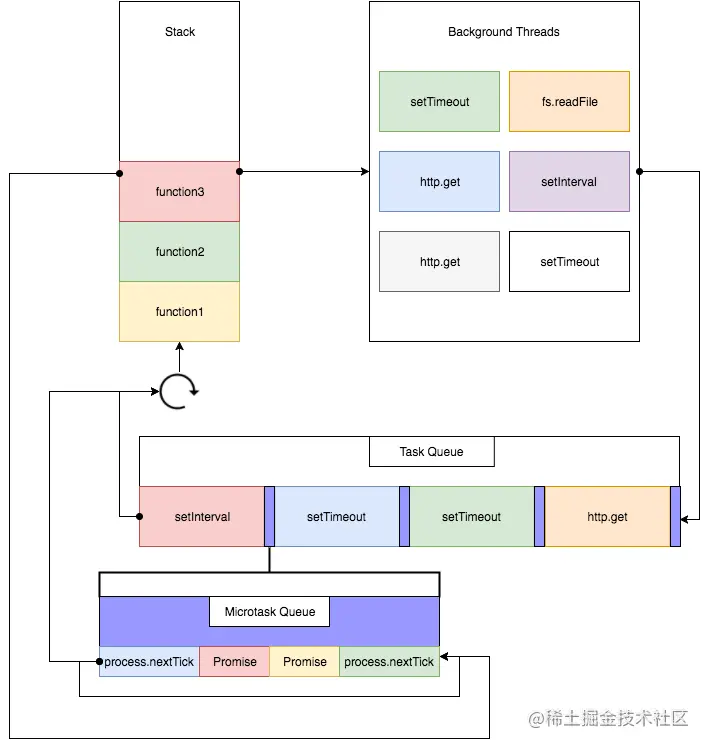

# Nodejs-基础

## nodejs中特殊的全局对象
1. 这些全局对象实际上是模块中的变量，只是每个模块都有，看起来像全局变量
2. 在命令行交互中是不可使用的
3. 包含：`__dirname、__filename、export、module、require()`
   
## nodejs中常见的全局对象
1. process：process提供了nodejs中相关信息，比如运行环境、参数信息
2. console：提供简单的调试控制台
3. 定时器函数：
  ```js
  setTimeout(callback, delay[,...args])
  setInterval(callback, delay[,...args])
  setImmediate(callback[,...args])
  process.nextTick(callback[,...args])
  ```
4. global：类似于浏览器中window，但区别在于定义一个全局变量，浏览器会默认添加到window中，而node则是在当前模块中
   
## JavaScript的模块化
1. 定义：将程序划分成一个个小结构、有自己的作用域、可以暴露变量、函数、对象等导出给其他模块使用、也可导入其他模块
2. 分类：AMD、CMD、**CommonJs**、***ES* module**
3. 没有模块化带来的问题：命名变量冲突...
4. 没有模块化解决措施：使用立即函数调用表达式（IIFE）
    * 缺点一：必须记住每个模块返回对象的命名，才能在其他模块中使用
    * 缺点二：代码混乱，每个模块都要包裹在一个匿名函数中
    * 缺点三：没有合适的规范，容易出现模块重名
5. CommonJs（本质是module.export对象的导出）：
    * export：将要导出的变量作为全局对象export的属性`export.name = name`
    * require：将要导入的模块通过require()函数（返回值为export对象）引入`const { name } = require('./a') `
    * module：nodejs中每一个模块都是一个Module的实例module，而且源码做了引用赋值`module.export = export`
    ```js
    //可以给module.export赋值新的变量，作为最终导出对象
    module.export = { name: 'zz' }
    ```
    * 每次加载都会运行一次引入的模块，模块加载后会被缓存，加载时同步的，只有等到对应模块加载完毕才会运行当前模块
    * 模块的加载过程：nodejs采用采用深度优先搜索
     
6. ES module（es6内置模块化）：
    * 导出、导入(named export用法)
    ```js
    //1、导出
    //方式一
    export const a = 1
    export const b = () => {}
    //方式二
    export {a, b} //导出变量的引用
    a = 2 //报错，变量的引用被定义为常量
    //方式三
    export {a as A, b as B}
    //2、导入
    //方式一
    import {a, b} from './xx.js'
    //方式二
    import {a as A, b as B} from './xx.js'
    //方式三
    import * as Foo from './xx.js'
    Foo.a //1
    ```
    * 默认导出（default 用法）
    ```js
    //导出
    export default function() {return const a = 1}
    //导入
    import A from './xx.js'
    A() //1
    //tips：默认导出可以不指定变量名，而且一个模块中只能有一个默认导出
    ```
    * import函数：
      * `import A from './xx.js'`必须进行js引擎静态分析
      * 可以通过import函数来异步引入模块：`const A = await import('./xx.js')`
    
  ## 常见的内置模块：

  1. path：用于对路径文件进行处理
  ```js
  //引入内置path模块
  const path = require('path')

  const basePath = '../user/wall'
  const filename = 'abc.txt'
  //1.路径拼接
  const filepath = path.resolve(basePath, filename) //path.resolve() 从右往左将path片段拼成绝对路径
  const filepath2 = path.join(basePath, filename) //path.join()从左往右，将传入的path片段拼接成一个完成的地址console.log(filepath, filepath2) //D:\user\wall\abc.txt \user\wall\abc.txt
  //2.获取路径信息(路径、文件名、文件后缀)
  console.log(path.dirname(filepath), path.basename(filename), path.extname(filename)) 
  //D:\user\wall abc.txt .txt
  ```    
  2. fs：文件系统(提供同步和异步回调、异步promise三种操作方式)
  ```js
  //引入内置fs模块
  const fs = require('fs')

  const filepath = './word.txt'
  const dirname = './word'
  //1、读取文件状态信息
  //方式一：同步操作
  const info = fs.statSync(filepath)
  //方式二：异步操作
  fs.stat(filepath, (err, info) => {
      if (err) {
          console.log(err)
          return 
      }
      console.log(info)
  })
  //方式三：promise
  async function A() {
      try {
          const info = await fs.promises.stat(filepath)
          console.log(info)
      }catch (err) {
          console.log(err)
      }
  }
  A()
  
  //2、文件描述符获取文件信息
  fs.open(filepath, (err, fd) => {
      if(err) {
          console.log(err)
          return 
      }
      fs.fstat(fd, (err, info) => {
          console.log(info)
      })
  })
  
  //3、文件读写
  //options的属性
  //flag: 写入的方式 
  //w打开文件写入，默认值 w+打开文件进行读写，不存在则创建 
  //r+打开文件读写，不存在抛异常 r打开文件读取，默认值 
  //a打开文件读写，将流放在末尾 a+打开文件读写，将流放在末尾，不存在则创建
  //encoding: 字符的编码
  
  //写入
  fs.writeFile(filepath, 'zz', {flag: 'a+', encoding: 'utf-8'}, err => {
      if(err) console.log(err)
  })
  
  //读取
  fs.readFile(filepath, {encoding: 'utf8'}, (err, info) => {
      if(err){
          console.log(err)
          return
      }
      console.log(info)
  })
  
  //创建文件夹
  if(!fs.existsSync(dirname)) {
      fs.mkdir(dirname, err => console.log(err))
  }
  
  //读取文件夹中所有文件
  fs.readdir(dirname, (err, info) => {
      for(let f of info) {
          console.log(f)
      }
  })
  
  //重命名文件夹
  fs.rename(dirname, './words', err => console.log(err))
  ```
     
3. events：事件监听模块（监听事件，传入回调函数）
```js
//引入内置events模块
const EventEmitter = require('events')
//创建发射器
const emitter = new EventEmitter()
//监听某一个事件
emitter.once('click', args => console.log(args))  //只监听一次
emitter.on('click', args => console.log(args))  //也可以用addListener
emitter.prependListener('click', args => console.log(args))  //将本次监听放到最前面
const listener = args => console.log(args) //给监听的回调定义变量
emitter.on('add', listener)
setTimeout(() => {
    //注册一个事件
    emitter.emit('click', ['wall', 'zz'])
    emitter.emit('add', ['wall'])
    //移除一个事件
    emitter.off('add', listener) //必须传入移除事件的回调函数
    //移除所有事件
    emitter.removeAllListeners('click')
    //获取注册的事件
    console.log(emitter.eventNames())
}, 2000)
```
   
## 包管理工具：

1. package.json的常用属性：name项目名称（必填）、version版本号（必填）、description项目基本描述、author作者、license开源协议、private是否私有、main入口文件、script用于配置一些脚本命令`"start": "node index.js"`、dependences所需要的依赖、devDependences开发环境所需要的依赖
2. 包的版本问题：`^x.y.z `  
    * x主版本；y此版本向下兼容；z修订号向下兼容兼问题修正
    * ^代表x不变，y、z永远安装最新版本；~代表x、y不变，z永远安装最新版本
3. 包的安装：
    * 全局安装npm install xx -g、局部安装npm install xx、卸载 npm uninstall xx、 强制重新build npm rebuild、清缓存 npm cache clean
    * 开发和生产依赖npm install xx 、开发依赖npm install xx  -D、 根据packge.json中安装依赖 npm install
    * 一般全局安装的都是一些工具包：yarn、webpack、vue-cli等
    * package-lock.json：第一次安装生成lock文件，当版本号发生改变时，检测依赖的一致性、查找缓存
   
## Buffer：
1. 计算机通常会将8位二进制合成一个单元，这个单位称为字节，1byte == 8bit
2. Buffer可以看作是一个存储字节的数组，数组中每一项可以保存8位二进制
3. `const buffer = new Buffer('wall') //<Buffer 77 61 6c 6c>`

## 事件循环和异步IO：
1. 浏览器的事件循环是js代码和浏览器api（setTimeout/ajax/监听事件等）调用的一个桥梁，桥梁之间通过回调函数进行沟通
2. node的事件循环是js代码和系统调用（fs/network等）调用的一个桥梁，桥梁之间通过回调函数进行沟通
3. 进程和线程：
    * 进程：启动一个程序，就会默认启动一个进程（也可能多个）
    * 线程：每一个进程，都会启动一个线程来执行程序中的代码、这个线程称之为主线程，进程是线程的容器
    * 工厂（操作系统）——车间（进程）——工人（线程）
    * js是单线程的，如果有耗时任务，就会堵塞线程
4. 当给定时器传入了一个callback函数：
    * 定时器函数实际上是调用了web api，在合适的时机（定时器结束）将callback加入到一个事件队列中
    * 事件队列中的函数会加入调用栈，在调用栈中执行
5. 宏任务和微任务：
    * 宏任务队列：ajax、setTimeout、setInterval、DOM监听、UI rendering等
    * 微任务队列：Promise.then回调、Mutation Observer API、queueMicrotask()等
    * 在执行宏任务之前，必须保证微任务队列是空的，如果不为空，会优先执行微任务队列中的任务
    * 注意： 由于在执行microtask任务的时候，只有当microtask队列为空的时候，它才会进入下一个事件循环，因此，如果它源源不断地产生新的microtask任务，就会导致主线程一直在执行microtask任务，而没有办法执行macrotask任务，这样我们就无法进行UI渲染/IO操作/ajax请求了，因此，我们应该避免这种情况发生。在nodejs里的process.nexttick里，就可以设置最大的调用次数，以此来防止阻塞主线程。
6. node架构分析：
    * node中eventLoop是由libuv实现的，是一个多平台专注于异步IO的库
    * libuv中主要维护一个**EvenrLoop**（事件队列）和**worker threads**（工作线程池）
    * worker threads负责调用系统的一些其他操作，如文件的IO、Network、child-process，并在得到结果后将回调函数添加到事件队列
    * EventLoop负责将按照特定的顺序在主线程中调用回调函数
    * 
7. 堵塞IO和非堵塞IO：
    * 对文件的操作本质上是一个操作系统的系统调用
    * 堵塞式调用：调用结果返回之前，当前线程处于堵塞态（cpu是不会分配时间片），调用线程只有等到调用结果才会继续
    * 非堵塞式调用：调用执行后，线程不会停止等待，而是继续执行，且过一段时间来检查是否有返回结果（IO操作、Socket）
    * 非堵塞式IO的问题：由于并没有立即得到返回的结果，那么就需要频繁的去确认读取到的数据是否完整，此操作称为**轮询**
    * 线程池（threads Pool）：libuv提供的线程池会负责相关操作，并且会同构轮询或者其他方式等待结果，此操作是与主线程分离的，当获取到结果时，就会将对应的回调函数放到事件循环（某一队列）中，此后事件循环接管后续回调工作
    * 同步阻塞：小明一直盯着下载进度条，到 100% 的时候就完成。
    * 同步非阻塞：小明提交下载任务后就去干别的，每过一段时间就去瞄一眼进度条，看到 100% 就完成。（轮询）
    * 异步阻塞：小明换了个有下载完成通知功能的软件，下载完成就“叮”一声。不过小明仍然一直等待“叮”的声音（看起来很傻，不是吗最蠢）
    * 异步非阻塞：仍然是那个会“叮”一声的下载软件，小明提交下载任务后就去干别的，听到“叮”的一声就知道完成了。（最机智）
    * 
8. 浏览器事件循环面试题：
  ```js
  //1.事件队列执行顺序
  console.log(1)
  
  setTimeout(() => {
      console.log(2)
  }, 0)
  
  const interId = setInterval(() => {
      console.log(3)
  }, 0)
  
  setTimeout(() => {
      console.log(10)
      new Promise(resolve => {
          console.log(11)
          resolve()
      }).then(() => console.log(12))
        .then(() => {
          console.log(13)
          clearInterval(interId)
      })
  },0)
  
  Promise.resolve().then(() => console.log(7))
          .then(() => console.log(8))
  
  console.log(9)
  
  //打印顺序：1 9 7 8 2 3 10 11 12 13
  ```
   
  ```js
  //2.async/await问题
  async function async1() {
      console.log('async1 start')
      await async2()
      console.log('async1 end') //加入微任务队列
      //Promise.resolve(async2()).then(()=>console.log('async1 end'))
  }
  
  async function async2() {
      console.log('async2')
  }
  
  async1()
  
  new Promise(resolve => {
      console.log('promise1')
      resolve()
  }).then(() => console.log('promise2')) //加入微任务队列
  
  console.log('scripet end')
  
  //打印顺序：async1 start => async2 => promise1 => script end => async1 end => promise2 
  ```
     
  ```js
  //3.定时器问题
  const s = new Date().getSeconds();
  
  setTimeout(function () {
      // 加入宏任务队列
      console.log("Ran after " + (new Date().getSeconds() - s) + " seconds");
  }, 500);
  
  while (true) {
      //浏览器正在循环调用在，直到2s后才跳出循环
      if (new Date().getSeconds() - s >= 2) {
          console.log("Good, looped for 2 seconds");
          break;
      }
  }
  
  //执行结果：Good, looped for 2 seconds, Ran after 2 seconds
  ```
     
9. node事件循环阶段（一次完整的事件循环分为多个阶段）：
    * 定时器阶段（timer）：本阶段执行已经被setTimeout()和setInterval()调度的回调函数②
    * 待定回调阶段（Pending Callback）：对某些系统操作（如TCP错误类型）执行回调，比如TCP连接时收到的ECONNERFUSED
    * idle、prpare：仅系统内部使用
    * 轮询（Poll）：检索新的IO事件，执行与IO相关回调①
    * 检测：setImmediate()回调函数在这里执行③
    * 关闭回调函数：一些关闭的回到函数，如Socket.on('close',...)
10. node中宏任务和微任务：
    * 宏任务：setTimeout()、setInterval()、IO、setImmediate()、close事件
    * 微任务：Promise.then()回调、process.nextTick、queueMicrotask
11. node事件循环面试题
  ```js
  async function async1() {
      console.log('async1 start')
    await async2()
      console.log('async1 end')
  }
  
  async function async2() {
      console.log('async2')
  }
  
  console.log('script start')
  
  setTimeout(() => {
      console.log('setTimeout0')
  }, 0)
  
  setTimeout(() => {
      console.log('setTimeout3')
  }, 300)
  
  setImmediate(() => console.log('setImmediate'))
  
  process.nextTick(() => console.log('nextTick1'))
  
  async1()
  
  process.nextTick(() => console.log('nextTick2'))
  
  new Promise(resolve => {
  console.log('promise1')
      resolve()
      console.log('promise2')
  }).then(() => console.log('promise3'))
  
  console.log('script end')
  
  //执行顺序：script start, async1 start, async2, promise1, promise2, script end, nextTick1, nextTick2, async1 end, promise3, setTimeout0, setImmediate, setTimeout3
  ```
     
   
## Stream流、pipe管道：
1. 连续的字节的一种表现形式和抽象概念
2. 流即是可读的，也是可写的
3. 在直接readFile（writeFiile）时，有一些细节无法把控：
    * 什么位置开始读，读到什么位置，一次读取多少个字节
    * 读到某个位置暂停读取，某个时刻恢复读取
    * 某个视频文件非常大，不适合一次性读取
4. 很多node对象都是基于流实现的
    * http模块中的Request、Response
    * process.stdout
5. 所有的流都是基于EventEmitter的实例
6. node中四种基本的流类型：
    * Writeable：可以向其写入数据的流（fs.createWriteFile()）
    * Readable：可以从中读取数据的流（fs.createReadFile()）
    * Doplex：同时为上述两者的流（net.Socket()）
    * Transform：Doplex可以在写入和读取数据时修改或转换数据的流（zlib.createDeflate()）
    ```js
    //读取
    fs.readFile('./hel.txt', (err, data) => console.log(data)) //正常读取
    const reader = fs.createReadStream('./hel.txt', {
        start: 3,
        end: 6,
        heightWaterMark: 2 //读取次数
    }) //流的方式精准读取
    reader.on('data', data => {
        console.log(data)
        //暂停一秒后继续读取
        reader.pause()
        setTimeout(() => reader.resume(), 1000)
    })  //监听流的读取结果
    reader.on('open', console.log('open')) //监听文件打开
    reader.on('close', console.log('close')) //监听文件关闭
    
    //写入
    const writer = fs.createWriteStream('./hel.txt', {
        flag: 'a', //写入方式
        start: 4 //开始写入位置
    })
    writer.write('wall', err => {
        if(err) {
            console.log(err)
            return 
        }
        console.log('success')
    })  //写入内容
    writer.end('close') //最后一次写入并关闭流
    //相当于: 
    //writer.on('close')
    //writer.close()
    
    //管道
    const reader1 = fs.createReadStream('./zz.txt') //创建一个读取流
    const writer1 = fs.createWriteStream('./aa.txt') //创建一个写入流
    reader1.pipe(writer1) //将读取的流reader1通过管道写入到writer1
    ```

