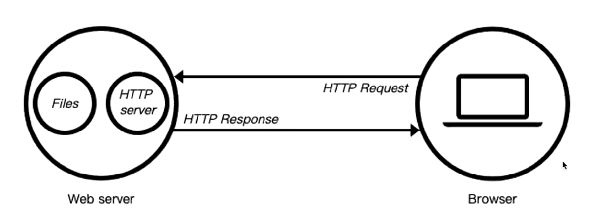
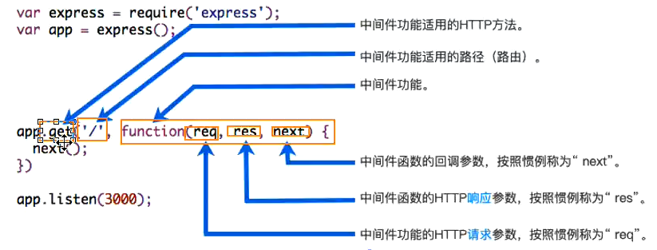
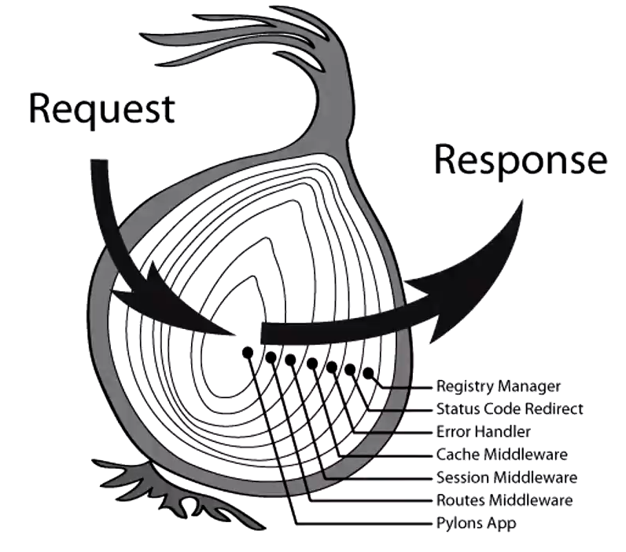

## Nodejs-应用

1. http开发web服务器：

   * web服务器：

     * 客户端通过http请求向服务器获取资源，提供资源的就是web服务器
     * 
     * 开源服务器：Nginx、Apache（静态）、Apache Tomcat（动态）、Nodejs

   * http模块：

     * 创建服务器`const server = http.createServer((req, res) => {})`

     * req：request请求对象，包含请求相关信息

     * res：response响应对象，包含我们返回给客服端的信息

     * server通过listen方法开启一个服务器，并在某一个主机和端口上监听网络请求

     * 端口port：不穿会默认分配，可写入环境变量中

     * 主机host：

       * localhost：本质上是一个域名，会被解析成127.0.0.1，在同一个网段下的主机中，通过ip地址是不能访问的
       * 0.0.0.0：监听ipv4上所有地址，再根据端口找不同的应用程序，在同一个网段下的主机中，通过ip地址是可以访问的

     * request和response对象分析：

       * request对象中封装了客户端给服务端传来的所有信息

       * ```js
         const http = require('http');
         const url = require('url')
         const qs = require('querystring')
         
         const { pathname, query } = url.parse(req.url)
         //GET
         if (pathname === '/login') {
             const { username, password } = qs.parse(query)
             console.log(username, password)
         }
         //POST
         if(pathname === '/signin') {
             if(req.method === 'POST') {
                 req.on('data', (data) => {
                     const { username, password } = JSON.parse(data.toString())
                     console.log(username, password)
                 })
             }
         }
         //headers
          {
           'content-type': 'application/json', 
            //请求携带的数据格式：text/plain文本 application/xmlxml类型 mulipart/from-data文件
           'user-agent': 'PostmanRuntime/7.29.2', //用户代理（客户端相关信息）
           accept: '*/*', //接受的文件格式
           'postman-token': 'b1f115e3-c1c1-4c19-a686-db472f055f85',
           host: 'localhost:8000',
           'accept-encoding': 'gzip, deflate, br', //告知服务器客户端支持的压缩格式，gzip压缩生成.gz文件
           connection: 'keep-alive', //http请求保持连接，默认为5s
           'content-length': '56' //文件长度
         }
         ```

       * response对象中封装了服务端响应给客户端的信息

       * ```js
         res.end('hello world')
         //等于
         res.write('hello world')
         res.end()
         //设置状态码
         res.statusCode = 400
         res.writeHead(200, {
                 'Content-Type': 'text/plain;charset=utf-8'
         })
         //设置请求头
         res.setHeader('Content-Type', 'application/json;chartset-utf-8') 
         ```

     * Http状态码（用来表示http响应状态的数字代码）：

       * | 状态代码 | 状态描述              | 说明                                                         |
         | -------- | --------------------- | ------------------------------------------------------------ |
         | 200      | ok                    | 客户端请求成功                                               |
         | 400      | bad request           | 客户端有语法错误，服务器不能理解                             |
         | 401      | Unauthorized          | 请求未经授权，这个状态码必须和WWW-Authenticate报头域一起使用 |
         | 403      | Forbidden             | 服务器收到请求，但拒绝提供服务，服务器通常会在响应正文中给出不提供服务的原因 |
         | 404      | Not found             | 请求的资源不存在，比如输入错误的url                          |
         | 500      | Internal Server Error | 服务器发生不可预期的错误，导致无法完成客户请求               |
         | 503      | Service Unavailable   | 服务器在当前不能处理客户端的请求，在一段时间之后，服务器可能会恢复正常 |

     * 案例：文件上传

       * ```js
         //图片文件格式必须设置成二进制
         req.setEncoding('binary')
         
         //获取content-type中的boundary的值
         let boundary = req.headers['content-type'].split('; ').replace('boundary=', '')
         
         //记录当前数据信息
         const fileSize = req.headers['content-length']
         let curSize = 0
         let body = ''
         
         //监听当前数据上传进度
         req.on('data', data => {
             curSize += data.length
             res.write('文件上传进度', `${curSize/fileSize * 100}%\n`)
             body += data
         })
         
         //处理上传完毕数据结构
         req.on('end', () => {
             //切割数据
             const payload = qs.parse(body, '\r\n', ':')
             //获取最后的类型（image/png）
             const fileType = payload['Content-type'].subString(1)
             //获取要截取的长度
             const fileTypePosition = body.indexOf(fileType) + fileType.length
             let binaryData = body.subString(fileTypePosition)
             binaryData = binaryData.replace(/^\s\s*/, '')
             
             const finalData = binaryData.subString(0, binaryData.indexOf('--' + boundary + '--'))
             
             fs.writeFile('./boo.png', finalData, 'binary', err => {
                 if(err) {
                     console.log(err)
                     res.end('上传失败~')
                 }
                 res.end('上传完成！')
             })
         })
         ```

     * http模块发送网络请求：

       * ```js
         const http = require('http')
         
         //http发送get请求
         http.get('http://localhost:8888', res => {
             res.on('data', data => {
                 console.log(data.toString())
             })
             
             res.on('end', () => {
                 console.log('获取到了网络请求')
             })
         })
         
         //http发送post请求
         http.request({
             method: 'POST',
             hostname: 'localhost',
             port: 8888
         }, res => {
             res.on('data', data => {
                 console.log(data.toString())
             })
             
             res.on('end', () => {
                 console.log('获取到了所有结果')
             })
         })
         
         req.end() //使用request方法发送网路请求必须要调用end方法，否则会堵塞线程
         ```

2. express框架：

   * 认识中间件：

     * express本质上是一系列中间件函数的调用

     * 中间件的定义：

       * 中间件的本质是传递给express的**回调函数**
       * 此函数接受三个参数（request、response、next：express中定义的用于执行下一个中间件的函数）

     * 中间件可执行的任务：

       * 执行任何代码
       * 更改request和response对象（req.body、req.files...）
       * 结束请求-响应周期（返回数据）
       * 调用栈中的下一个中间件

     * 如果当前中间件功能没有结束请求-响应周期，则必须调用next()将控制权传递给下一个中间件，否则请求将被挂起

     * express应用中间件的方式：`app.use/method；router.use/method`

     * 中间件分类:

       ```js
       //1.普通中间件
       app.use((req, res, next) => {
           console.log('注册了一个普通中间件')
           next() //会继续查找下一个能匹配的中间件
       })
       //2.路径中间件
       app.use('/home', (req, res, next) => {
           console.log('注册了一个路径中间件')
           next() //会继续查找下一个能匹配的中间件
       })
       //3.路径和方法匹配的连续中间件
       app.get('/bar', (req, res, next) => {
           console.log('注册一个路径和方法匹配中间件01')
           next() //会继续查找下一个能匹配的中间件
       }, (req, res, next) => {
           console.log('注册一个路径和方法匹配中间件02')
           next() //会继续查找下一个能匹配的中间件
       })
       ```

     * 

   * 常见的客户端发送请求的方式：

     * 方式一：通过get请求中的URL的params（适用于带id查询：app.get('/products/:id'))
     * 方式二：通过get请求中的URL的query（适用于解析url拼接的参数）
     * 方式三：通过post请求中的req.body的json格式（注册中间件;：express.json()）
     * 方式四：通过post请求中的req.body的x-www-form-urlencoded格式（注册中间件：express.urlencoded({extends: true})）
     * 方式五：通过post请求中的from-data格式（注册局部第三方中间件：multer）

   * express路由

     * 对于一些可以看作一个整体的逻辑，应该集中处理，比如对users相关处理：
   
       * 获取用户列表
       * 获取用户信息
       * 创建一个新用户
       * 删除一个用户
       * 更新一个用户
   
     * 使用express.Router来创建一个路由处理系统
   
     * 一个Router实例拥有完整的中间件和路由系统
   
     * ```js
       //users.js
       const express = require('express')
       const Router = express.Router();
       
       Router.get('/', (req, res) => {
           res.json(['wall', 'handson'])
       })
       
       Router.get('/:id', (req, res) => {
           res.json(`id: ${req.params.id}`)
       })
       
       Router.post('/', (req, res) => {
           res.json('post json')
       })
       
       module.exports = Router
       
       //index.js
       ...
       const userRouter = require('./routers/users')
       app.use('/users', userRouter)
       ```
   
   * express部署静态服务器
   
     * express可以部署已经打包的好的资源到静态服务器上：`app.use(express.static('./build'))`
   
   * express案例：
   
     ```js
     const fs = require('fs')
     const path = require('path')
     //express本质是一个函数，且返回一个函数
     const express = require('express')
     const multer = require('multer')
     const morgan = require('morgan')
     
     const userRouter = require('./routers/users')
     const uploadRouter = require('./routers/upload')
     const testRouter = require('./routers/test')
     
     // 定义错误常量
     const USERNAME_DOES_NOT_EXIST = "USERNAME_DOES_NOT_EXIST"
     const USERNAME_ALREADY_EXSIT = "USERNAME_ALREADY_EXSIT"
     
     // 定义文件存储位置及文件名称
     const storage = multer.diskStorage({
         destination: (req, file, cb) => {
             cb(null, './uploads/')
         },
         filename: (req, file, cb) => {
             cb(null, Date.now() + path.extname(file.originalname))
         }
     })
     const upload = multer({
         storage
     })
     
     //创建app服务器
     const app = express()
     
     //全局注册解析json格式数据的自定义中间件
     // app.use((req, res, next) => {
     //     if(req.headers['content-type'] === 'application/json') {
     //         //监听请求数据
     //         req.on('data', (data) => {
     //             req.body =JSON.parse(data.toString())
     //         })
     //         //监听请求结束
     //         req.on('end', () => next())
     //     } else {
     //         next()
     //     }
     // })
     
     //全局注册解析json第三方中间件
     app.use(express.json())
     
     //全局注册解析application/x-www-form-urlencoded第三方中间件
     //{extended: true}：对urlencoded进行解析时，它使用的是第三方库qs
     //{extended: false}：对urlencoded进行解析时，它使用的是Node内置模块:queryString
     app.use(express.urlencoded({ extends: true }))
     
     //创建一个日志写入流
     const logPath = path.join(__dirname, 'logs')
    if (!fs.existsSync(logPath)) { fs.mkdirSync(logPath, err => console.log(err)) }
     const writerStream = fs.createWriteStream(`${logPath}/express.log`, {
         flags: 'a+'
     })
     
     //全局注册打印日志的第三方中间件
     app.use(morgan('combined', { stream: writerStream }))
     
     //注册userRouter接口路由
     app.use('/users', userRouter)
     //注册uploadRouter接口路由(文件上传)
     app.use('/upload', upload.array('file'), uploadRouter)
     //注册testRouter接口路由(多种数据格式测试)
     app.use('/test', testRouter)
     
     //禁止将multer注册为全局中间件
     app.post('/login', upload.any(), (req, res, next) => {
         const isLogin = false
         if (isLogin) {
             res.json(req.body)
         } else {
             next(new Error(USERNAME_DOES_NOT_EXIST))
         }
     })
     
     app.post('/register', (req, res, next) => {
         const isRegister = false
         if (isRegister) {
             res.json('register success')
         } else {
             next(new Error(USERNAME_ALREADY_EXSIT))
         }
     })
     
     //集中处理错误
     app.use((err, req, res, next) => {
         let status = 400
         let message = ""
         switch (err.message) {
             case USERNAME_DOES_NOT_EXIST:
                 message = 'username does not exist'
                 break
             case USERNAME_ALREADY_EXSIT:
                 message = 'username already exist'
                 break
             default:
                 message = 'not found'
         }
     
         res.status(status)
         res.json({
             errCode: status,
             errMessage: message
         })
     })
     
     // 开启监听
     app.listen(8000, err => {
         if (err) return
         console.log('listening...')
     })
     ```
   
3. koa框架：

   * koa中间件：koa注册只能通过use方法注册中间件`app.use((ctx, next) => {})`

   * koa很多api都使用第三方库，比如：koa-router、koa-bodyparser、koa-static、koa-multer...

   * koa路由的使用：

     * 安装第三方提供路由的库：koa-router

     * 封装一个routers/users.js的路由文件

       ```js
       const Router = require('koa-router')
       
       const router = new Router({prefix: '/users'})
       
       router.get('/', (ctx, next) => {
           ctx.response.body = 'hello koa'
       })
       
       module.exports = router
       ```

     * 在app中将router.routes()注册为中间件

     * 使用userRouter.use(allowedMethods())方法可以判断请求的method是否正确

   * koa响应数据：

     * 响应数据类型：String、Object|Array、Buffer、Stream、null
     * 设置状态码：response.status，如果未设置，koa会自动设置为200/204
     * **`ctx.body == ctx.response.body`前者对后者进行了代理（request和response部分属性）**

   * koa静态服务器

     * ```js
       const staticAssets = require('koa-static')
       ...
       app.use(staticAssets('./build'))
       ```

   * express和koa对比
   
     * express是完整和强大的，其中内置了非常多好用的功能
   
     * koa是简洁自由的，只包含了最核心的功能，不会对我们使用第三方中间件进行限制，只有最基本的中间件注册方式app.use(callback)
   
     * 两者的核心都是中间件，区别是中间件的执行机制不同，比如某个中间件包含异步操作
   
     * koa的next()函数返回一个promise，所以可以通过async/await等到异步操作有结果之后再执行后面的代码    
   
     * ```js
       const Koa = require('koa')
       const app = new Koa()
       const middleware1 = async (ctx, next) => {
             ctx.message = 'aaa'
             await next()
             ctx.body = ctx.message  //aabbwall
         }
       
         const middleware2 = async (ctx, next) => {
             ctx.message += 'bbb'
             await next()
         }
       
         const middleware3 = async (ctx, next) => {
             const ajax = () => {
                 return new Promise((resolve, reject) => {
                     setTimeout(() => {
                         resolve('wall')
                     }, 0)
                 })
             }
             const result = await ajax()
             ctx.message += result
         }
       
         app.use(middleware1)
         app.use(middleware2)
         app.use(middleware3)
       
         app.listen(8000, (err) => {
             console.log('listening')
         })
         //tips：中间件函数调用是异步调用
       ```
     
   * 洋葱模型：
   
     * 中间件处理代码的过程
     * response返回body执行
     * 
   
     
