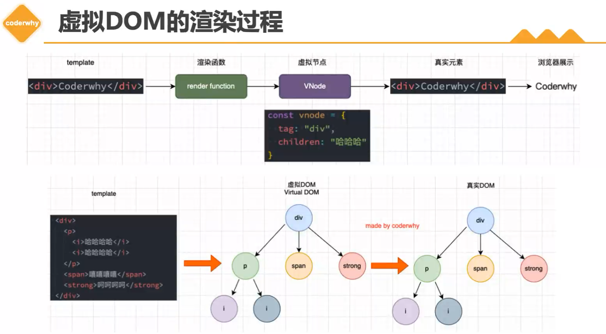
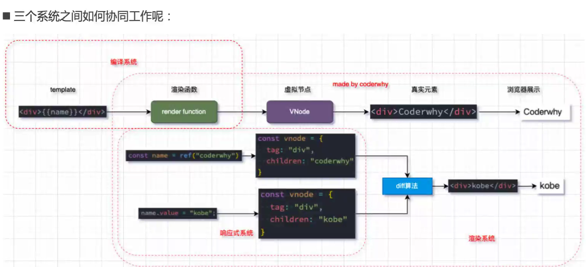
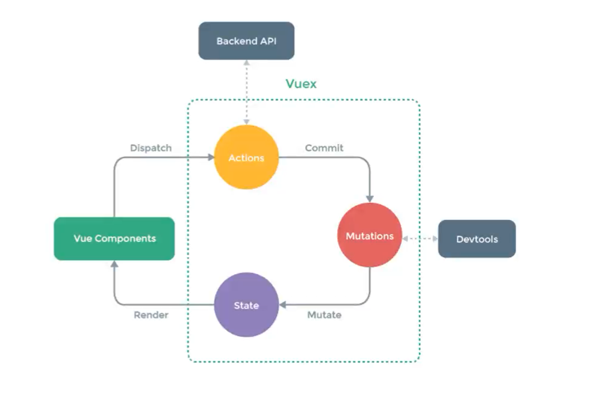

## Vue进阶

1. setup函数

   * props：父组件传递过来的参数

   * context：包含三个属性attrs、slots、emit

     * attrs：所有的非props的attribute
     * slots：父组件传递过来的插槽（在渲染函数时会用到）
     * emit：组件发出事件

   * return：setup返回值是一个对象，可以在模板中被使用，可以替代data选项

     ```vue
     export default {
     	setup () {
     		...
         return {}
       }
     }
     ```

   * 在setup中this并没有指向当前实例，因为setup调用发生在data、computed、methods等属性被解析之前，所以他们无法在setup中被捕获

2. Reactive Api ：为setup中定义的数据提供响应式特性（数组、对象参数）

   * 当我们使用reactive函数处理我们数据之后，数据再次使用就会进行依赖收集
   * 当数据发生改变时，所有收集到的依赖都会进行对应的响应式操作（比如页面更新）
   * 在options api中的data函数，也是交给reactive函数进行响应式处理

3. Ref Api：为setup中定义的数据提供响应式特性（基本数据类型）

   * reactive api对传入的数据类型是有限制，必须是一个对象或者数组
   * 可以传入任意类型数据，在模板中使用会自动解构

4. Readonly Api

   * readonly会返回原生对象的只读代理，这个proxy中的set方法被劫持，并不能对其修改
   * 可以用来包裹ref或reactive返回的响应式数据，用来给子组件传props
   * 一般用来传递引用数据类型

5. Reactive其他的api

   * isProxy：检查对象是否由reactive或readonly创建的proxy
   * isReactive：检查对象是否由reactive创建的响应式代理，该代理是readonly建的，但包裹了由reactive创建的另一个代理，返回true
   * isReadonly：检查对象是否由readonly创建的只读代理
   * toRaw：返回reactive或readonly代理的原始对象（不推荐保留原始对象的持久引用）
   * shallowReactive：创建一个响应式代理，他跟踪自身property的响应式，**但不执行嵌套对象深层响应式转换**（深层还是原生对象，{name: 'wall', age: 18, **obj: {name: 'zz', age: 19}**}）
   * shallowReadonly：创建一个proxy，使其自身的property为只读，但不执行嵌套对象的深度只读转换

6. toRefs/toRef：将reactive对象中所有属性都转成ref对象（toRef是将一个属性进行转换）

   * 如果对reactive返回的对象进行解构获取值，那么无论是修改**解构后的变量**，还是修改**reactive返回的state对象**，**数据都不在是响应式的**
   * 通过**toRefs和toRef函数对reactive对象进行包裹**，那么**返回的变量将是一个ref对象**
   * 这种做法相当于在**state.name和ref.value之间建立了连接**，**任何一个修改都会引起另外一个的变化**

7. Ref其他的api

   * unRef：获取一个ref引用中的value（对ref进行解包）

     * 如果参数是一个ref，则返回内部值，否则返回参数本身

     * `val = isRef(val) ?  val.value : val`

   * isRef：判断值是否为一个ref对象

   * shallowRef：创建一个浅层的ref对象

   * triggerRef：手动触发和shallowRef相关联的副作用

8. customRef：创建一个自定义的ref，并对其**依赖项跟踪**和**更新触发进行显示控制**

   * 他需要一个工厂函数，该函数接受track和trigger函数作为参数

   * 并且应该返回一个带get和set的对象

     ```js
     import { customRef } from 'vue'
     
     let timer = null
     
     export default function (value) {
         return customRef((track, trigger) => {
             return {
                 get() {
                     track()
                     return value
                 },
                 set(newValue) {
                     clearTimeout(timer) //输入间隔小于1s清除上一次定时器
                     timer = setTimeout(() => {
                         value = newValue
                         trigger()
                     }, 1000)
                 }
             }
         })
     }
     ```

9. computed Api：计算属性hooks函数，返回一个ref对象

   ```js
   const count = ref(3)
   const refCount = ref(0)
   
   //用法一：直接传get函数
   const fullCount = computed(() => count.value + refCount.value)
   
   //用法二：传入一个对象，包含set和get函数
   const fullCount = computed({
       get() {
           return count.value + refCount.value
       },
       //fulaCount值改变时调用set函数
       set(newValue) {
           count.value = newValue
           refCount.value = newValue
       }
   })
   
   const change = () => {
       fullCount.value = 2
   }
   ```

10. watch api：侦听器hooks函数，用于侦听data和props数据

    * watchEffect：用于自动收集响应式数据的依赖

      * watchEffect清除副作用：在侦听器中发送网络请求，当请求还没达到时再次发送，这个时候需要清除上次的副作用（取消上次网络请求）
      * 当副作用即将重新执行时，或者侦听器被停止时，会执行onInvalidate函数传入的回调函数

    * watch：需要手动侦听数据源

      * 基本等同于options api中的watch，需要侦听特定的数据源，并在回调函数中执行副作用
      * 默认情况下是惰性的，只有被侦听的源发生变化才会执行回调
      * 可以访问到侦听状态变化前后的值

      ```js
      const refCount = ref(0)	
      
      //watchEffect用法
      const stop = watchEffect((onInvalidate) => {
          const timer = setTimeout(() => console.log('success'), 2000)
      
          onInvalidate(() => {
              clearTimeout(timer)
              console.log('在下一次侦听之前, 清除副作用')
          })
          console.log(refCount.value)
      })
      
      const add = () => {
          refCount.value++
          if (refCount.value > 5) {
              //停止侦听
              stop()
          }
      }
      
      //watch用法一：传入一个getter函数，返回一个reactive对的属性值
      watch(() => state.age, (newValue, oldValue) => {
          console.log(newValue, oldValue) 
      })
      
      //watch用法二：传入一个reactive对象（解构赋值变成普通对象）
      watch(() => ({ ...state }), (newValue, oldValue) => {
          console.log(newValue, oldValue) //object
      }, {
          deep: true,
          immediate: true
      })
      
      //watch用法三：传入一个ref对象
      watch(refCount, (newValue, oldValue) => {
          console.log(newValue, oldValue)
      })
      
      //watch用法四：侦听多个数据源
      watch([() => ({...state}), refCount], ([newState, newCount], [oldState, oldCount]) => {
          console.log(newState, newCount, oldState, oldCount)
      })
      ```

    * 在setup中使用模板的ref

      ```vue
      <template>
      	<h2 ref="title">xx</h2>
      </template>
      
      import { ref, watchEffect } from 'vue'
      
      export default {
      	setup() {
      		const title = ref(null)
      		
      		watchEffect(() => {
      			console.log(title.value)
      		}, {
      			flush: 'post' //等待组件挂载完毕后执行侦听
      		})
      
      		return {
      			title
      		}
      	}
      }
      ```

11. 生命周期

    * 对于beforeCreated和created函数，直接在setup中进行操作
    * 常见：onMounted、onUpdated、onUnmounted等，且每一个函数都可以被重复调用

12. 函数渲染

    * 推荐使用**模板语法**创建html，**渲染函数**更加灵活，可以使用jsx

    * vue在生成dom之前，会将我们的节点转换成vnode，vnode组合在一起形成一个树结构（虚拟dom）

    * 模板语法生成的html最终也是使用渲染函数生成对应的vnode，所以可以直接使用渲染函数生成vnode

      ```react
      import { ref, h } from 'vue'
      
      //父组件
      export default {
          setup() {
              
              const counter = ref(0)
              
              //return h('h2', null, counter.value)
              return () => (
              	<div>{counter.value}</div>
                  <button onClick="counter.value ++">+</button>
                  <HelloWorld>
                  	{{default: props => <button>-</button>}}
                  </HelloWorld>
              )
          }
      }
      
      //子组件
      export default {
          setup(props, ctx) {
              
              return () => (
              	<div>
                  	<h2>HelloWorld</h2>
                      {ctx.slots.default ? slots.default() : <span>hhhh</span>}
                  </div>
              )
          }
      }
      ```

13. 自定义指令

    * 某些情况需要对dom进行一些底层操作，这个时候就会用到自定义指令

      ```vue
      <template>
      	<div>
              <input type="text" v-focus.a="b"/>
          </div>
      </template>
      
      export default {
      	//自定义局部指令
      	directive: {
      		focus: {
      			mounted(el, binding, vnode, preVnode) {
      				el.focus()
      				console.log(binding.value, binding.modifiers) //b  {a: true} 参数和修饰符
      			}
      		}
      	}
      }
      
      //自定义全局指令
      app.directive('focus', {
      	mounted(el, binding, vnode, preVnode) {
              el.focus()
          }
      })
      ```

14. vue插件

    * 通常向vue全局添加一些功能的时候，会采用插件的模式，有两种编写模式

      * 对象模式：包含一个install函数，函数会在安装时执行
      * 函数类型：该函数会在安装插件时自动执行

    * 插件完成的功能没有限制

      * 添加全局方法或者全局property，通过把他们添加到config.globalProperties
      * 添加全局资源：指令、过滤器、过渡等
      * 通过全局mixin来添加一些组件选项
      * 封装自己的api库

      ```js
      //plugin.object.js
      export default {
          install(app) {
              //添加全局属性
              app.config.globalProperties.$name = 'wall'
              app.component({})
              app.directive('focus', {})
          }
      }
      
      //main.js
      import pluginObject from './plugin.object.js'
      
      //注册插件
      app.use(pluginObject)
      ```
    
15. vue源码解析

    * 虚拟dom的渲染过程：template——>（rander函数）vnode——>html元素

      

    * vue源码的三大核心

      * Compiler：编译系统

      * Runtime：renderer模块，渲染模块

      * Reactivity：响应式系统

        

    * 实现一个mini-vue（详见具体代码）

16. 路由

    * 后端路由概念：
      * 服务器直接渲染好对应的html页面，客户端通过url请求网页进行展示
      * 每个页面都有自己对应的网址（url），url发送到服务器，服务器会通过正则对该url进行匹配并处理
      * controller进行各种处理之后，最终生成html或数据返回给前端
      * 有利于seo搜索引擎优化
    * 后端路由的缺点：
      * 后端人员需要编写和维护整个页面模块
      * html代码和数据逻辑混合在一起，编写和维护很难
    * 前后端分离：
      * 每次请求涉及到静态资源（html、js、css）都会从静态服务器获取，前端进行渲染
      * 客户端的每一次请求，都会从静态服务器请求文件（通过哈希值或者history模式阻止请求）
      * 后端服务器只负责提供api
    * SAP开发
      * 前端映射关系：路径——>组件
    * 前端路由模式
      * 哈希模式：`#home`
      * history模式：`/home`

17. VueRouter

    * vue-router是基于路由和组件，路由用于设定访问路径，将路径和组件映射起来，在spa中页面的路径的改变就是组件的切换

    * 内置组件

      * `<router-view />`组件页面占位
      * `<router-link to="/home" active-class="active" exact-active-class="exact-active" replace><router-link />`
        * to：页面跳转、active-class：点击样式、exact-active-class：精准匹配样式、replace：无法返回

    * 路由懒加载：

      ```js
      const routes = [
          { path: '/home', component: () => import('../pages/home.vue')} //import函数返回promise
      ]
      ```

    * route的属性

      * name：路由的名称
      * meta：自定义数据

    * 动态路由匹配

      ```js
      const routes = [
          { path: '/home/:user/:id', component: () => import('../pages/home.vue')}
      ]
      ```

    * notfound页面

      ```js
      const routes = [
          { path: '/pathMatch(.*)', component: () => import('../pages/NotFound.vue')}
      ]
      ```

    * 路由嵌套
    
      ```js
      const routes = [
      	{
              path: '/home',
              name: 'home',
              component: () => import('../pages/home.vue'),
              children: [
                  {
                      path: '',
                      redirect: "/home/homemsg"
                  },
                  {
                      path: 'homemsg',
                      component: () => import('../pages/homeMsg.vue')
                  },
                  {
                      path: 'aboutmsg',
                      component: () => import('../pages/aboutMsg.vue')
                  }
              ]
          }
      ]
      ```
    
    * router-link
    
      ```vue
      //1.默认插槽
      <router-link to="/home">
      	<button>Home</button> //html
          <Navbar></Navbar> //组件
      </router-link>
      //2.作用域插槽
      <router-link to="home" v-slot="{ href, route, navigate, isActive, isExactActive }">
      	<p @click="navigate">跳转home</p> //触发导航的函数
          <div>
              <p>href: {{href}}</p> //解析后的url
              <p>route: {{route}}</p> //解析后规范化的route对象
              <p>isActive: {{isActive}}</p> //是否匹配状态
              <p>isExactActive: {{isExactActive}}</p> //是否精准匹配状态
          </div>
      </router-link>
      
      <script setup>
      	import Navber from './navbar.vue'
      </script>
      ```
    
    * router-view
    
      ```vue
      //页面切换动画(作用域插槽)
      <router-view v-slot="props">
      	<transition name="switch">
          	<component :is="props.Component"></component> //切换组件的过程用动态组件包裹
          </transition>
      </router-view>
      
      <style>
          .switch-active {
              color: blue;
          }
          
          .switch-enter-from,
          .switch-leave-to {
              opacity: 0;
          }
          
          .switch-enter-active,
          .switch-leave-active {
              transition: opacity 1s ease;
          }
      </style>
      ```
    
    * 动态添加/删除路由
    
      ```js
      const routes = [
          {
              path: '/home',
              name: 'home'
              component: () => import('./pages/Home.vue'),
              children: []
          }
      ]
      
      const categoryRoute = {
          path: '/category',
          name: 'category'
          component: () => import('./pages/Category.vue')
      }
      
      const router = createRouter({
          routes,
          history: createWebHistory()
      })
      
      router.addRoute(categoryRoute) //顶层添加路由
      
      router.addRoute('home', categoryRoute) //添加二级路由
      
      //替换路由
      router.addRoute({path: '/category', name: 'category', component: () => import('./pages/Home.vue')})
      
      router.removeRoute('category') //删除路由
      
      router.hasRoute('category') //检查路由是否存在
      
      router.getRoutes() //获取一个包含所有路由的数组
      ```
    
    * 导航守卫
    
      ```js
      //to: 即将跳转到的route对象
      //from: 跳转过来的route对象
      /*返回值：
      	1.false：不进行导航
          2.undefind或者不写：进行默认导航
          3.字符串：路径，跳转到对应路径中
          4.对象：类似于router.push({path: '/login', query: ...})*/
      
      router.beforeEach((to, from) => {
              if (to.path !== '/login') {
                  const token = window.localStorage.getItem('token')
                  if (!token) {
                      return '/login'
                  }
              }
      })
      ```
    
18. vuex状态管理

    * 状态管理：对保存在应用程序中的一些数据进行管理

    * vuex基本思想：
      * 当程序变得复杂时，管理不断变化的state是非常困难的，状态之间会相互依赖，因此我们可以将组件内部的状态抽离出来，以一个单例的形式进行管理
      * 在这种模式下，所有组件构成一个巨大的组件树
      * 不管在树的什么位置，任何组件都可以获取状态或者触发行为
      * 通过定义和隔离状态管理中的各个概念，并通过强制性规则来维护试图和状态的独立性
      
    * 

    * 单一状态树

      * 用一个对象就包含了全部的应用层级状态
      * 每个应用仅仅包含一个store实例
      * 单状态树和模块化并不冲突
      * 单一状态树能让我们以最直接的方式找到某个状态的片段，而且在之后的维护和调试过程中，也可以非常方便管理和维护

    * vuex映射

      ```js
      import { mapState, useStore } from 'vuex'
      import { computed } from 'vue'
      
      export default {
          computed: {
              //将所有的state映射到计算属性中
              ...mapState(['name', 'counter']) //数组写法
              ...mapState({
              	sCounter: state => state.counter,
              	sName: state => state.name
          	}) //对象写法
          }
      	//composition api
      	setup() {
              const store = useStore()
              
              const sCounter = computed(() => store.state.counter)
              
              //封装mapState
              const storeStateFns = mapState(['name', 'counter'])
              const storeState = {}
              Object.keys(storeStateFns).forEach(fnKey => {
                  const fn = storeStateFns[fnKey].bind({$store: store}) //this绑定store对象
                  storeState[fnKey] = computed(fn)
              })
              
              return {
                  sCounter,
                  ...storeState
              }
          }
      }
      ```

    * getters：

      ```js
      const store = createStore({
          state() {
              return {
      			arr: [0, 1, 2, 3],
                  disCount: 0.9
              }  
      	},
          getters: {
              totleArr(state, getters) {
                  return state.arr.reduce((pre, cur) => {
                      return pre + cur * getters.disCountArr
                  })
              },
              disCountArr(state) {
                  return state.disCount * 0.6
              }
          }
      })
      ```

    * mutations:

      ```js
      //组件
      export default {
          this.$store.commit('increment', { value: 20 })
          this.$store.commit({
              type: 'increment',
              value: 20
          }) //另一种提交风格
      }
      
      //store.js
      const store = createStore({
          state() {
              return {
                  counter: 10
              }
          },
          mutations: {
              increment(state, payload) {
                  return state.counter + payload
              }
          }
      })
      ```

    * actions:

      * actions提交的是mutation，而不是直接变更状态
      * actions可以包含任何异步操作

      ```js
      //component
      import { useStore } from 'vuex'
      const store = useStore()
      const add = () => {
          store.dispath({
              type: 'increment'
          })
          //store.dispath('increment')
      }
      //store.js
      mutations: {
          increment(state) {
              state.counter ++
          }
      },
      actions: {
          increment(context) {
              setTimeout(() => {
                  context.commit('increment')
              }, 1000)
          }
      }
      ```

    * mudule: 状态管理组件化

      ```vue
      //user.js
      export default const userModule = {
      	//独立命名空间
      	namespaced: true,
          state() {
              return {
      			count: 10
      		}
          },
          mutations: {
              increment() {
      			state.count ++
      		}
          },
          getter: {
              countPlus(state) {
      			return state.count * 2
      		}
          },
          actions: {
              
          }
      }
      //index.js
      import { createStore } from 'vuex'
      import user from './userModule.js'
      
      const store = createStore({
          state() {
              
          },
          ...
          modules: {
              user
          }
      })
      //组件
      <template>
      	<div>{{$store.state.user.count}}</div>
      	<div>{{$store.getters['user/countPlus']}}</div>
      	<button @click="$store.commit('user/increment')">+</button>
      </template>
      ```

19. nexttick: 将回调推迟到下一个dom更新周期之后执行，在更改了一些数据以等待dom更新后立即使用它

    * vue对任务的调度是以微任务队列的形式进行的，watch、组件更新...

    * ```vue
      <template>
      	<div ref="title">{{data}}</div>
      	<button @click="add"></button>
      </template>
      
      
      <script setup>
      	import { onMounted, ref } from 'vue'
      
          const data = ref('hhhhhhh')
          const title = ref(null)
          
          const add = () => {
              data.value += 'hhhhhhh'
          }
          
          nexttick(() => {
              //在dom更新之后执行
              console.log(title.value.offsetHeight)
          })
      </script>
      ```

    
