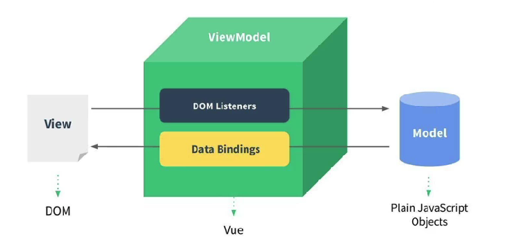

## Vue-随记

1. 原生开发和vue的区别
   * 原生开发属于命令式编程，关注的是每一步执行步骤，how to do
   * vue开发属于声明式编程，将数据和方法提前声明好，what to do
   * 常用编程范式种类：命令式、声明式、函数式、面向对象...
   
2. MVVM、MVC模型（软件体系）：
   * MVC：Model-View-Controller的简称，是一种非常流行的框架架构模式
   * MVVM：Model-View-Viewmodel的简称，vue的框架架构模式
   * 
   
3. methods中this的绑定

   * 不能使用箭头函数的原因

     * 官方解释：因为箭头函数绑定了父级作用域的上下文，所以this不会按照期望指向组件实例，this.xx将会是undefined

   * 使用普通函数this的指向

     * Vue源码中对methods中所有函数进行了遍历，并且通过bind绑定了this

     * 根据this绑定规则决定this指向，详见：[前端面试之彻底搞懂this指向 (qq.com)](https://mp.weixin.qq.com/s/hYm0JgBI25grNG_2sCRlTA)[前端面试之彻底搞懂this指向 (qq.com)](https://mp.weixin.qq.com/s/hYm0JgBI25grNG_2sCRlTA)

4. 动态绑定属性名称

   * 绑定单个：`:[attr]="value"`
   * 绑定多个：`v-bind="{name: 'wall', src: 'http://xx.com'}"`

5. v-on的用法

   * 可以绑定函数、表达式、对象(绑定多个事件)

   * ```vue
     <div @click="add"></div>
     <div @click="count ++"></div>
     <div v-on="{click: add, mousemove: move}"></div>
     ```

   * 

6. v-show不能和template结合使用

7. Vue将被监听的数组的变更方法进行了包裹，当这些方法引起数组改变会触发响应式

   * `push、pop、shift、unshift、splice、sort、reverse`

8. v-for中key的作用

   * VNode：虚拟节点，本质是一个JavaScript对象，vue中组件和元素都会转化为一个个vnode
   * template——>vnode(vdom)——>dom
   * key属性主要用在vue的虚拟dom算法，在新旧nodes对比时辨识VNodes
     * 如果不使用key，vue会使用一种**最大限度减少动态元素**并且尽可能尝试就地**修改/复用相同类型元素**的算法
     * 使用key，会基于key的变化**重新排列元素顺序**，并且移除销毁key不存在的元素
     * key必须是唯一且不变的
   
9. 计算属性会基于他们的依赖关系进行缓存，只有当数据发生变化时，才会重新计算

   * ```js
     export default {
         computed: {
         	fullName: {
                 get() {
                     //直接调用计算属性默认调用get方法
                     return xxx
                 },
                 set(value) {
                     //用于对计算属性修改
                     console.log(value) //wall
                 }
         	} 
     	},
         methods: {
             setComputed() {
                 this.fullName = 'wall'
             }
         }
     }
     ```

10. 侦听器watch：一般用于侦听data和props变化

    ```js
    export default {
        data() {
            return {
                res: 'hello world'
            }
    	},
        watch: {
            //变化后的新值，变化前的旧值
            res(newValue, oldValue) {
                console.log(newValue, oldValue)
            }
            //深度侦听
            res: {
                handler(newValue, oldValue) {
                    console.log(newValue, oldValue)
                },
                deep: true, //深度侦听（用于侦听对象属性值的修改）
                immediate: true //立即执行
            }
        }
        //$watch
        created() {
            this.$watch('res', (newValue, oldValue) => {
                console.log(newValue, oldValue)
            })
        }
    }
    ```

11. v-model的使用

    * v-model的本质：

      ```vue
      <template>
      	// 1.绑定value属性值；2.监听value值的变化，并将最新值绑定到属性中
      	<input type="text" :value="msg" @input="msg = $event.target.value" />
      	<input type="text" v-model="msg" />
      </template>
      ```

    * v-model的修饰符：

      * lazy：默认情况下，v-model在进行双向绑定时，绑定的是input事件，每次输入都会同步；如果加上lazy修饰符那么会将绑定的事件切换为change事件，只有在提交时（回车）才会触发
      * number：将输入的内容转换为数字类型，不能转换的会跳过
      * trim：将输入的内容首尾空白符过滤

12. Vue的组件化（初级）

    * 注册全局组件：注册的组件可以在任何的组件模板中使用

      ```js
      const app = Vue.createApp({
      	template: `<div>root comp</div>`
      })
      //注册全局组件
      app.component('component-a', {
      	template: `<h1>child comp1</h1>`
      })
      app.mount('#app')
      //组件注册可以采用驼峰式和短横线式，但组件使用要求采用短横线式
      ```

    * 注册局部组件：只能在当前注册的组件中使用

      ```js
      const componentA = {
      	template: `<h1>comp A</h1>`
      }
      const app = Vue.createApp({
      	template: `<div>root comp</div>`,
      	//注册局部组件
      	components: {
      		componentA
      	}
      })
      app.mount('#app')
      ```

13. 组件间的通信

    * 父子组件通信

      * 父==>子：通过props属性

        ```vue
        //父
        <Father :msg="list"></Father>
        
        //子
        export default {
        	props: {
        		msg: {
        			type: Array,
        			default() {
        				return []
        			}
        		}
        		//自定义验证函数(匹配以下字符串中的其中一个)
        		validator(value) {
        			return ['a', 'b', 'c'].includes(value)
        		}
        	}
        }
        
        //tips1：当父组件传过来的数据类型为引用类型，default属性应该是一个函数，为了防止组件复用修改props默认值
        //tips2：对于驼峰式属性名，在传值时推荐采用短横线分割（productsList-->products）
        ```

      * 子==>父：通过$emit触发事件

        ```vue
        //父
        <Father @add="add" @remove="remove"></Father>
        
        //子
        export default {
        	emits: ['add', 'remove'],
        	emits: {
        		add(count) {
        			if(count > 0) return true
        		}
        	},
        	methods: {
        		increment() {
        			this.$emit('add', '+1')
        		},
        		decrement() {
        			this.$emit('remove', '-1')
        		}
        	}
        }
        
        //tips：当需要对传递的参数进行验证时，注册事件时采用object写法
        ```

      * 非props的attribute（class、id、style）：

        * 会默认继承到子组件的根元素，可以设置inheritAttrs: false禁止继承
        * 可以通过$attrs来访问所有的非props的attribute，`<h2 :class="$attrs.active"></h2>`
        * 对于多个根节点的attribute如果没有显示绑定，必须手动指定绑定到其中一个元素上

    * 非父子组件通信

      * Provide/Inject：用于非父子组件之间共享数据（不常用）

        ```js
        //父
        import { computed } from 'vue'
        
        export default {
        	provide: {
        		name: 'wall',
        		age: 18
        	},
        	//如果要在provide中绑定this，vue组件实例在调用provide方法时会绑定this（默认使用函数写法）
        	provide() {
        		return {
        			name: 'wall',
        			age: 18,
        			length: computed(() => this.list.length) //使用computed函数对属性进行响应式处理
        		}
        	}
        }
        
        //孙
        export default {
        	inject: ['name', 'age']
        }
        ```

      * 全局事件总线（mitt库）：适合兄弟组件间传递数据

        ```js
        import emitter from './tools/eventbus'
        //组件一
        export default {
        	created() {
        		emitter.emit('topAdd', '+1') //发射
        	}
        }
        
        //组件二
        export default {
        	created() {
        		emitter.on('topRemove', info => console.log(info)) //监听
        		emitter.on('*', (type, info) => console.log(type, info)) //监听所有事件
        		emitter.all.clear() //取消监听所有
        		emitter.off('topAdd', callback) //callback需要先声明
        	}
        }
        ```

    * 插槽slot

      * 插槽的使用过程就是抽取共性、保留不同
      
      * 将共同的元素内容、内容保留在组件内进行封装
      
      * 将不同的元素使用slot作为占位，让外部决定是什么元素
      
      * 插槽的内容取决于父组件如何使用
      
        ```vue
        //父组件
        <template>
        	<Child>
            	<h1>this is slot</h1>
            </Child>
        </template>
        
        //子组件
        <template>
        	<slot></slot>
        </template>
        ```
      
      * 插槽的默认内容：`<slot><i>default content</i></slot>`
      
      * 具名插槽
      
        ```vue
        //父组件
        <template>
        	<Child>
            	<template v-slot:left>left</template>
        		<template v-slot:top>top</template>
        		<template #right>right</template> //(v-slot:)语法糖：#
            </Child>
        </template>
        
        //子组件
        <template>
        	<div>
            	<slot name="left"></slot>
                <slot name="top"></slot>
                <slot name="right"></slot>
            </div>
        </template>
        ```
      
      * 动态插槽
      
        ```vue
        //父组件
        <template>
        	<Child :dynamicSlot="dynamicSlot">
            	<template #[dynamicSlot]>dynamicValue</template>
            </Child>
        </template>
        
        export default {
        	data() {
        		return {
        			dynamicSlot: dynamicValue
        		}
        	}
        }
        
        //子组件
        <template>
        	<div>
            	<slot :name="dynamicSlot"></slot>
            </div>
        </template>
        
        export default {
        	props: {
        		dynamicSlot: String
        	}
        }
        ```
      
      * 作用域插槽
      
        ```vue
        //父组件
        <template>
        	<Child :list="list">
            	<template v-slot="slotProps">
        			<span>{{slotProps.name}}--{{slotProps.index}}</span>
        		</template>
            </Child>
        	//独占默认插槽的缩写
        	<Child :list="list" v-slot="slotProps">
                <span>{{slotProps.name}}--{{slotProps.index}}</span>
            </Child>
        </template>
        
        export default {
        	data() {
        		return {
        			list: ['a', 'b', 'c']
        		}
        	}
        }
        
        //子组件
        <template>
        	<template v-for="(item, index) in list">
        		<slot :item="item" :index="index"></slot>
                //子组件还是一个插槽占位，父组件根据子组件遍历内容渲染占位元素
        	</template>
        </template>
        
        export default {
        	props: {
        		list: {
        			type: Array,
        			default: () => []
        		}
        	}
        }
        ```
    
14. 动态组件：component

    * ```vue
      <template>
      	<button v-for="item in btList" :key="item"
                  @click="swtichItem(item)"
                  :class="{active: current === item}">
              {{item}}
          </button>
      	
      	//动态组件
      	<component :is="current"></component> 
      </template>
      
      export default {
      	components: {
      		A,
      		B,
      		C
      	},
      	data() {
      		return {
      			btList: ['A', 'B', 'C'],
      			current: 'A'
      		}
      	},
      	methods: {
      		swtichItem(item) {
      			this.current = item
      		}
      	}
      }
      ```

15. 内置组件：keep-alive，用于组件切换时继续保持组件状态，而不是销毁

    * ```vue
      //缓存组件状态
      //include: 需要缓存的组件；exclude: 不需要缓存的组件；max: 最大缓存组件个数
      <template>
      	<keep-alive :include="['a', 'b']" :exclude="['c', 'd']" max="10">
          	<Child></Child>
          </keep-alive>
      </template>
      ```
    
16. 异步组件的使用

    * webpack的代码分包
      * 默认情况下，在构建整个组件树的过程中，因为组件之间是通过模块化直接依赖的，webpack就会将所有组件模块打包到一个文件中（app.js）
      * 随着项目不断增大，app.js文件内容过大的话，会造成首屏渲染变慢，这个时候就需要分包

    * ```vue
      //通过import函数导入的模块，后续webpack对其进行打包的时候会进行分包操作
      //import函数返回一个promise对象
      import("./components/Child.vue").then(res => {
      	res.fn()
      })
      
      //异步组件
      import { defineAsyncComponent } from 'vue'
      
      //工厂函数写法
      const asyncChild = defineAsyncComponent(() => import('./components/Child.vue'))
      
      //对象写法（少用）
      const asyncChild = defineAsyncComponent({
      	loader: () => import('./components/Child.vue'),
      	loadingComponent: Loading //加载占位组件,
      	errorComponent: Error,
      	delay: 2000,
      	onError: (err, retry, fail, attempts) => {}
      })
      ```

    * 异步组件和suspense：suspense是一个内置的全局组件，该组件有两个插槽

      * default：如果可以显示，那么显示default的内容
      * fallback：如果不能显示，那么会显示fallback里面的内容

      ```vue
      <suspense>
      	<template #default>
          	<async-child></async-child>
          </template>
          <template #fallback>
          	<loading></loading>
          </template>
      </suspense>
      ```

17. $refs：用于在组件中获取元素对象或子组件实例

    ```vue
    <template>
    	<div ref="title">element</div>
    	<Child ref="chileCpn"></Child>
    </template>
    
    export default {
    	methods: {
    		getRef() {
    			//获取元素
    			this.$refs.title
    			//获取子组件
    			this.$refs.childCpn.msg
    			//获取根元素
    			this.$refs.childCpn.$el
    		}
    	}
    }
    ```

18. $parent和$root：在组件中获取到父组件和根组件

19. 组件生命周期

    * 每个组件都会经历创建、挂载、更新、卸载的过程
    * 有时候需要在某个阶段添加一些代码逻辑（比如组件创建完成之后请求服务器数据），这个时候就需要生命周期钩子函数
    * 
    * 缓存组件keep-alive的生命周期
      * 对于缓存组件来说，再次进入、退出组件是不会执行created和unmouted等生命周期函数
      * 此时想监听到组件的创建和卸载就需要activated和deactivated这两个钩子函数

20. 组件的v-model（可绑定多个v-model）

    ```vue
    //基础原理
    //父组件
    <template>
    	<Child :modelValue="msg" @update:model-value="msg = $event"></Child>
    </template>
    
    export default {
    	data() {
    		msg: 'hello v-model'
    	}
    }
    
    //子组件
    <template>
    	<input type="text" :value="modelValue" @input="valueClick"/>
    </template>
    
    export default {
    	props: {
    		modelValue: String
    	},
    	emits:['update:model-value']
    	methods: {
    		valueClick(e) {
    			this.$emit('update:model-value', e.target.value)
    		}
    	}
    }
    ```

    ```vue
    //绑定多个
    //父组件
    <template>
    	<child v-model:value="value" v-model:title="title"></child>
    </template>
    
    export default {
    	data() {
    		value: 'hello',
    		title: 'world'
    	}
    }
    
    //子组件
    <template>
    	<input type="text" v-model="getValue" />
    	<input type="text" v-model="getTitle" />
    </template>
    
    export default {
    	props: {
    		value: String,
    		title: String
    	},
    	emits: ['update:value', 'update:title']
    	computed: {
    		getValue: {
    			set(value) {
                	this.$emit('update:value', value)
               	},
    			get() {
    				return this.value
    			}	
    		},
    		getTitle: {
    			set(value) {
    				this.$emit('update:title', value)
    			},
    			get() {
    				return this.title
    			}
    		}
    	}
    }
    ```

21. transition内置组件

    * 条件渲染：v-if或v-show
    * 动态组件
    * 组件根节点
    * 实现原理：当插入或删除包含在transition组件中的元素时
      * 自动嗅探目标元素是否应用了css过渡或动画，如果是在恰当的时机添加或删除css类名
      * 如果transition组件提供了JavaScript钩子函数，这些钩子函数会在适当的时机调用
      * 如果没找到JavaScript钩子函数并且也没有检测到css过渡动画，dom插入、删除操作会立即执行

    ```vue
    <template>
    	<button @click="isshow = !isshow">toggle</button>
    
    	<transition name="transform" mode="in-out" appear>
        	<h2 v-if="isshow">hello</h2>
            <h2 v-else>world</h2>
        </transition>
    </template>
    
    export default {
    	data() {
    		return {
    			isshow: true
    		}
    	}
    }
    
    <style scoped>
        .transform-enter-from,
        .transform-leave-to {
            opacity: 0;
        }
        
        .transform-enter-to,
        .transform-leave-from {
            opacity: 1;
        }
        
        .transform-enter-active,
        .transform-leave-active {
            transition: opacity 1s ease;
        }
    </style>
    ```

22. animate.css学习

    ```vue
    <template>
    	<button @click="isshow = !isshow">toggle</button>
    	//方式一：定义动画
    	<transition name="transform" mode="in-out" appear>
        	<h2 v-if="isshow">hello</h2>
        </transition>
    	方式二：直接使用过渡类名
    	<transition name="transfrom" mode="in-out" appear 
                    enter-active-class="animate__animated animate__bounce"
                    leave-active-class="animate__animated animate__bounce">
        	<h2 v-if="isshow">hello</h2>
        </transition>
    </template>
    
    export default {
    	data() {
    		return {
    			isshow: true
    		}
    	}
    }
    
    <style scoped>
       .transform-leave-active{
        	animation: fadeOutDown 0.5s ease-out;
    	}
    
    	.transform-enter-active {
        	animation: fadeInDown 0.5s ease-out;
    	}
    </style>
    ```

23. gasp动画库学习：通过JavaScript为css、svg、canvas等设置动画

    ```vue
    //数字滚动效果
    <template>
    	<input type="number" step="100" v-model="counter" />
    	<h2>{{getCounter}}</h2>
    </template>
    
    import gsap from 'gsap'
    
    export default {
    	data() {
    		return {
    			counter: 0,
    			showNum: 0
    		}
    	},
    	computed: {
    		getCounter() {
    			return this.showNum.toFixed(0)
    		}
    	},
    	watch: {
    		counter(newValue) {
    			gsap.to(this, {duration: 1, showNum: newValue})
    		}
    	}
    }
    ```

24. transition-group内置组件：列表渲染

    ```vue
    //当列表发生变化时，会出现动画效果
    <template>
    	<transition-group tag="ul" name="ul">
                <li v-for="i in list" key="i">
                    <span>{{i}}</span>
                </li>
         </transition-group>
    </template>
    
    ...
    
    <style scoped>
    .ul-enter-active  {
        animation: fadeInDown 0.5s ease-out;
    }
    
    //列表其他元素也会有动画效果
    .ul-move {
        transition: transform 0.5s ease;
    }
    
    .ul-leave-active {
        position: absolute;
    }
    </style>
    ```
    
25. Mixin：对于组件之间相同代码逻辑，可以使用mixin进行抽取

    * 如果mixin选项和组件对象中选项发生了冲突
      * data函数：保留组件自身数据
      * 生命周期钩子：钩子函数会被合并到数组中，都会被调用
      * 对象选项（computed、methods）：合并，但如果key值相同，会取组件对象的键值对
      * extends：继承其他组件的options对象

    ```js
    import { demoMixin } from './demoMixin.js' 
    export default {
    	mixins: [demoMixin],
    	...
    }
        
    //全局混入
    import { createApp } from 'vue'
    import App from './App.vue'
    
    const app = createApp(App)
    app.mixin({
        data() {
            return {}
        }
        ...
    })
    app.mount('#app')
    ```

26. options api的弊端

    * 当实现某一个功能时，**对应的代码逻辑会被拆分到各个属性中**
    * 当组件变得更大、更复杂时，逻辑关注点的列表就会变得很长，**同一个功能的逻辑就会拆分的很分散**
    * 这是难以理解且难以阅读的


