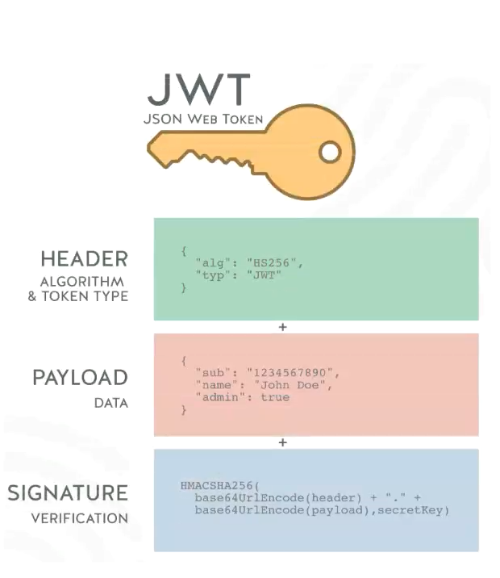

## HTTP基础 

1. Cookie，小型文本文件，某些网站用于辨别用户身份而储存在用户本地终端上的数据，通常由服务器设置并返回给客户端

   * 浏览器会在特定的情况下携带cookie来发送请求，我们可以通过cookie来获取一些信息

   * 按储存位置不同划分为：内存cookie（浏览器关闭自动清理，无过期时间）和硬盘cookie（需手动清理，有过期时间）

   * cookie的生命周期：

     * 默认情况下的cookie是内存cookie，会在浏览器关闭时删除
     * 可以通过设置expires（`Date.UTCStrng()`）和max-age（`max-age=60*60`）属性来设置过期时间

   * cookie的作用域;

     * Domain：指定哪些主机可以接受cookie，如果不指定那默认是origin，不包括子域名
     * Path：设置哪些路径可以接受cookie，path=/docs

   * 服务器设置cookie

     ```js
     //登录接口
     router.post('/login', (ctx, next) => {
         //设置cookie
         ctx.cookie.set('name', 'wall', {
             maxAge: 10 * 1000
         })
         ctx.body = `设置cookie`
     })
     
     //验证接口
     router.get('/test', (ctx, next) => {
         //获取cookie
         const cookieValue = ctx.cookie.get('name')
         ctx.body = `你设置的cookie为${cookieValue}`
     })
     ```

2. session：

   ```js
   const session = Session({key: 'sessionid', maxAge: 10 * 1000, signed: true})
   app.keys = ['miyao'] //加密签名
   app.use(session)
   
   //登录接口
   router.post('/login', (ctx, next) => {
   	const value = {id: 1, name: 'wall'}
       ctx.session.user = value //设置session
       ctx.body = `你设置的session为${value}`
   })
   
   //验证接口
   router.get('/test', (ctx, next) => {
       ctx.body = `你的session为${ctx.session.user}`
   })
   ```

3. cookie和session的缺点：

   * cookie会被附加在每个http请求中，无形中增加了流量
   * cookie是明文传递，安全性低
   * cookie大小限制是4kb，对于复杂需求不够用
   * 对于浏览器之外的其他系统（比如iOS和Android）需要手动设置cookie和session
   * 分布式服务器集群不好保证其他系统能正确解析session

4. token，令牌，在验证用户账号和密码正确的情况下，给用户颁发一个令牌，这个令牌作为后续用户访问一些接口或者资源的凭证，我们可以根据这个凭证来判断用户是否有权限访问

5. JWT实现Token机制（组成）：

   * header：alg（采用的HS256加密算法）、typ（jwt固定值）、base64进行编码

   * payload：

     * 携带的数据，比如可以将用户id和name放到payload
     * 默认也会带iat（issued at），令牌签发时间
     * 我们也可以设置过期时间：exp（expiration time）
     * 会通过base64进行编码

   * signature

     * 设置一个secretKey，通过将前后两个结果合并后进行HMACSHA256的算法
     * HMACSHA256(base64Url(header) +  . + baseUrl(payload), secretKey)
     * secretKey暴露是一件很危险的是，可以用来加解密token

     

   * ```js
     //token实现
     const jwt = require('jsonwebtoken')
     
     const SECRET_KEY = 'wall'
     
     router.post('/login', (ctx, next) => {
         const user = {id: 1, name: 'zz'}
         const token = jwt.sign(user, SECRET_KEY, {expiresIn: 10 * 1000})  /设置token
         
         ctx.body = token
     })
     
     router.get('/test', (ctx, next) => {
         const auth = ctx.headers.authorization
         const token = authorization.replace('Bearer ', '')
         try {
             const res = jwt.verify(token, SECRET_KEY)  //验证token
             ctx.body = res
         } catch(err) {
             ctx.body = res
         }
     })
     ```

   * 非对称加密：

     * 对于分布式系统，每一个子系统都要获取到密钥进行解密token，但同时也具备了发布token的能力，这是很不安全的
     * 采用非对称加密，私钥（private key）用于加密发布token，公钥（public key）只能用于解密token
     * 利用openssr生成公钥和私钥
     * 需要指定加密算法

   